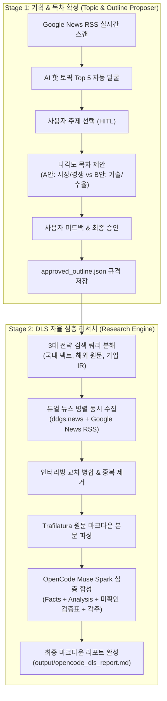

# Dynamic Research (자율 리서치 AI 에이전트)

> **Dynamic Live Search (DLS)** 기반 실시간 웹 심층 리서치 및 리포트 자율 생성 플랫폼

[](https://www.python.org/downloads/)
[]()
[]()
[]()

---

## 📌 1. 프로젝트 개요

본 프로젝트는 사전 구축된 벡터 데이터베이스(Vector DB) 없이, **실시간 개방형 웹(Open Web)과 최신 언론사 1차 보도를 에이전트가 자율적으로 탐색·파싱·합성**하여 고품질 심층 리포트를 생성하는 자율 리서치 시스템입니다.

### 🌟 핵심 차별점
- **Zero Pre-indexing**: 복잡한 벡터 DB 구축 없이 초 단위 최신 웹 데이터 즉시 반영
- **Outline-First Human-in-the-Loop (HITL)**: 사람이 직접 주제를 고민하지 않아도 AI가 실시간 뉴스를 스캔하여 핫 토픽과 다각도 목차(A/B안)를 선제 제안하고, 사람이 방향타를 잡은 뒤 리서치 착수
- **뉴스 전용 듀얼 수집기 (Dual News Collector)**: DuckDuckGo News + Google News RSS를 1초 만에 병렬 동시 수집하여 신뢰도 높은 언론사 원문 확보
- **100% 무료 기본 LLM 탑재**: OpenCode REST API 및 CLI를 통합하여 **Meta Muse Spark (`opencode/muse-spark-1.3-contributor-free`)**를 기본 엔진으로 채택 (토큰 비용 0원)

---

## 🏗️ 2. 핵심 아키텍처



---

## 💻 3. 사전 준비 및 환경 설정

### 1) 환경 활성화 및 의존성 설치
```bash
# 가상환경 활성화 (프로젝트 루트)
source .venv/bin/activate

# 패키지 설치
pip install -r requirements.txt
```

### 2) LLM 엔진 환경 (OpenCode 기본 탑재)
* **OpenCode Muse Spark (기본 권장, 토큰 비용 0원)**:
  * OpenCode 웹/서버(`opencode --port 36629` 등)가 실행 중이면 **자동으로 포트를 실시간 감지하여 REST API로 연결**합니다.
  * 서버가 꺼져 있어도 내부적으로 `opencode run` CLI 모드로 자동 전환(Fallback)되어 중단 없이 동작합니다.
* **선택 사항 (환경변수 `.env` 등록 시 지원)**:
  * Google Gemini: `GEMINI_API_KEY="your_key"`
  * Groq (Llama 3.3 70B): `GROQ_API_KEY="your_key"`
  * Local Ollama: 로컬에 `ollama run qwen3.8:27b` 설치 시 지원

---

## 📖 4. 전체 사용법 매뉴얼 (Quick Start)

### 🚀 Step 1. AI 실시간 주제 추천 및 목차 확정
사람이 주제를 떠올리지 않아도 AI가 오늘자 최신 뉴스를 분석해 주제를 추천합니다:

```bash
# 1) 실시간 뉴스 기반 핫 토픽 추천 모드
python scripts/run_topic_outline.py --mode discover

# 2) 관심 있는 키워드를 힌트로 주어 추천받기
python scripts/run_topic_outline.py --topic "반도체 유리 기판 패키징 엔비디아"

# 3) 원하는 주제를 직접 지정하여 다각도 목차만 제안받기
python scripts/run_topic_outline.py --mode direct --topic "마이크론 12단 HBM3E 엔비디아 퀄 승인 및 양산 일정"
```

* **진행 흐름**:
  1. 터미널에 실시간 핫 토픽 5개가 뜨면 번호(1~5) 선택 또는 엔터(1번 기본).
  2. 선택된 주제에 대해 **[제안 A] 시장·경쟁 구도 중심**과 **[제안 B] 기술·수율 검증 중심** 목차가 핵심 질문들과 함께 출력됩니다.
  3. 승인할 안(`A` 또는 `B`)을 누르거나 추가 수정 요청을 입력하면 `temp/latest_approved_outline.json` 파일로 자동 확정 저장됩니다.

---

### 📝 Step 2. 확정된 목차로 DLS 심층 리포트 생성
확정된 아웃라인을 바탕으로 듀얼 뉴스 수집 및 리포트 합성을 수행합니다:

```bash
# 1) Step 1에서 확정된 최신 목차로 즉시 리서치 착수 (가장 권장)
python scripts/run_local_dls.py --outline temp/latest_approved_outline.json

# 2) 목차 없이 단독으로 특정 주제 리서치 수행
python scripts/run_local_dls.py --topic "삼성전자 HBM4 양산 일정"

# 3) 수집 뉴스 원문 개수 지정 (기본 8개)
python scripts/run_local_dls.py --max_pages 6
```

---

### 🔄 Step 3. 다른 LLM 엔진으로 전환 실행 (비교 분석)
기본 엔진(OpenCode Muse Spark) 외에 다른 모델로 실행하고 싶을 때 `--provider` 옵션을 사용합니다:

```bash
# Google Gemini Flash로 실행
python scripts/run_local_dls.py --provider gemini

# 로컬 M3 Max Ollama (qwen3.8:27b)로 실행
python scripts/run_local_dls.py --provider ollama --model qwen3.8:27b

# Groq Llama 3.3 70B 초고속 클라우드로 실행
python scripts/run_local_dls.py --provider groq
```

---

### ⚡ Step 4. 원스톱 LangGraph 통합 파이프라인 (`src/main.py`)
주제 탐색부터 리포트 완성까지 전체 LangGraph 상태 머신으로 엮어 실행할 수 있습니다:

```bash
# 실시간 대화형 원스톱 파이프라인
python src/main.py --mode discover

# 자동 승인 배치 테스트 모드
python src/main.py --mode direct --topic "차세대 반도체 패키징" --auto-approve
```

---

## 📊 5. 최종 리포트 마크다운 5대 규격

생성되는 모든 리포트(`output/*.md`)는 검증과 추적성을 위한 표준 규격을 준수합니다:

1. **YAML Frontmatter**: 작성일자, 사용된 LLM 모델, 실제 분해된 `search_queries`, 수집 출처 수 기록
2. **1. 확인된 사실 (Facts)**: 날짜, 용량, 수치 중심 팩트 불릿과 모든 문장 끝 인라인 출처 번호 각주(`[^1]`) 매핑
3. **2. 에이전트 해석 (Analysis)**: 공급망 영향 및 기업 간 경쟁 구도에 대한 심층 다각도 분석
4. **3. 미확인 주장 및 향후 검증 과제 (Unverified Table)**: 기사 간 상충·과장 보도와 공식 IR 확인 필요 사항을 마크다운 표로 비교 정리
5. **휴먼 피드백 Callout (`> [!NOTE]`) & 출처 URL 매핑**: 전문가 직접 검토란과 본문 하단 클릭 가능한 원문 기사 URL 완결

---

## 🧪 6. 테스트 실행 (Testing)

모든 모듈의 단위 테스트 및 통합 파이프라인 테스트:

```bash
pytest tests/
```
* **결과**: `13 passed in ~5s` (프로바이더 어댑터, 마크다운 파서, LangGraph 상태 전이, 토픽 그래프 전수 통과)

---

## 📂 7. 디렉토리 구조 및 주요 산출물

```
c_1003_dynamic_research/
├── config/
│   └── settings.yaml                      # 전역 설정 (기본 LLM: OpenCode, 검색 엔진 등)
├── docs/                                  # 시스템 설계서 및 공식 가이드
│   ├── opencode_muse_spark_integration_20261004.md  # OpenCode API & Muse Spark 연동 문서
│   ├── dual_news_collector_design_20261004.md       # 듀얼 뉴스 수집기 설계서
│   ├── topic_outline_agent_design_20261004.md       # AI 주제 발굴 및 목차 제안 설계서
│   ├── dls_design_20261003.md                       # DLS 상세 아키텍처
│   └── summary_20261004.md                          # 종합 진척 현황 및 인덱스
├── output/                                # 최종 생성된 고품질 마크다운 리포트
│   ├── opencode_dls_report.md             # OpenCode Muse Spark 생성 리포트
│   ├── gemini_dls_report.md               # Gemini Flash 생성 리포트
│   └── local_dls_report.md                # Local Ollama 생성 리포트
├── scripts/
│   ├── run_topic_outline.py               # AI 주제 발굴 & 목차 제안 인터랙티브 러너
│   └── run_local_dls.py                   # DLS 자율 뉴스 리서치 실행 스크립트
├── src/
│   ├── graphs/                            # LangGraph 워크플로우 정의
│   ├── nodes/                             # 검색, 스크랩, 토픽, 목차 노드 구현체
│   ├── providers/                         # LLM(OpenCode/Gemini/Ollama), 검색, RSS, 파서
│   └── main.py                            # 메인 통합 엔트리포인트
└── temp/
    └── latest_approved_outline.json       # 사람이 승인한 최신 아웃라인 규격 파일
```


---

## 🌐 8. Streamlit 웹 인터페이스 (DLS Deep Research Studio)

CLI 환경 외에도 직관적인 웹 대시보드를 통해 리서치 전 과정을 시각적으로 제어할 수 있습니다.

```bash
streamlit run web/app.py
```

### 4대 탭 기능 구성:
1. **💡 토픽 발굴 & 목차 생성기**: 구글 뉴스 RSS 실시간 스캔, 복수 관점 목차(Outline A vs Outline B) 생성 및 수정/승인
2. **🚀 DLS 심층 리서치 파이프라인**: 승인된 목차 파일(`latest_approved_outline.json`) 연동 및 원클릭 자율 리서치 실행
3. **📊 A/B 엔진 벤치마크**: Baseline(프롬프트 스터핑)과 LlamaIndex(문장 청킹 & 재순위화) 실시간 비교 평가
4. **📑 완성된 리포트 열람실**: 생성된 마크다운 리포트 인터랙티브 뷰어 및 다운로드 지원

---

## 🔬 9. LlamaIndex vs Baseline A/B 벤치마크 러너

LlamaIndex 기반 문장 단위 분할(`SentenceSplitter`) 및 동적 재순위화 엔진과 기존 직접 주입(Prompt Stuffing) 방식의 성능, 지연시간, 인용 정확도를 비교 평가합니다:

```bash
# 기본 벤치마크 실행 (OpenCode Muse Spark 무료 LLM 기반)
python scripts/benchmark_runner.py --max_docs 3

# 특정 주제 및 질문 지정 실행
python scripts/benchmark_runner.py   --topic "마이크론 12단 HBM3E 엔비디아 공급 및 양산"   --question "마이크론의 12단 HBM3E 공급 시점과 엔비디아 납품 관련 최신 팩트는?"
```

* **산출물**: `output/benchmark_report.md` (정량 매트릭스 표 및 정성 분석 보고서 자동 생성)

---

## ⏰ 10. 데일리 자동 리서치 스케줄러 (Daily Scheduler)

매일 구글 뉴스 RSS와 산업 키워드를 감지하여 가장 시급한 핵심 이슈를 스스로 선정한 뒤, 자동으로 심층 리포트를 생성·아카이빙하는 데몬입니다:

```bash
# 1회 즉시 실행 모드 (테스트 및 크론탭 연동용)
python scripts/daily_scheduler.py --run-once --max_pages 3

# 24시간 상시 가동 백그라운드 데몬 모드
nohup python scripts/daily_scheduler.py --interval-hours 24 > scheduler.log 2>&1 &
```

* **산출물 저장소**: `output/daily_reports/daily_report_<주제>_<타임스탬프>.md`
* **실행 이력 추적**: `output/daily_reports/scheduler_history.json`
