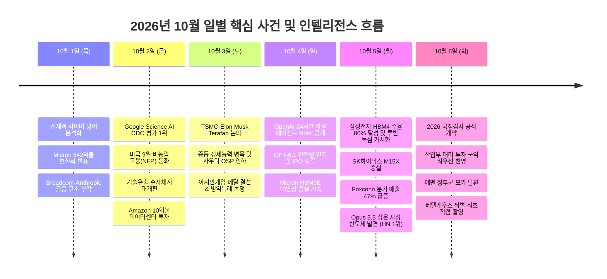

# 📅 2026년 10월 일별 중요 뉴스 및 인텔리전스 종합 보고서

> **기준 시각**: 2026년 10월 6일 12:35 KST (10월 1일 ~ 10월 6일 정밀 분석)  
> **참조 시스템**: [`c_1003_dynamic_research`](file:///Users/boon/Dropbox/03_code/c_1003_dynamic_research) DLS 심층 리포트 & 듀얼 뉴스 파이프라인  
> **검증 도구**: [`last30days`](file:///Users/boon/.agents/skills/last30days/scripts/last30days.py) v3.21.1 다중 소셜·예측시장 인텔리전스 (Hacker News, Reddit, GitHub, Polymarket)

---

## Executive Summary (총괄 요약)

2026년 10월 첫째 주는 글로벌 테크와 산업 생태계에서 **세 가지 거대한 패러다임 전환**이 동시에 폭발한 분수령이었습니다:

1. **AI 에이전트의 24/7 항시작동(Always-On) 실용화 전환**: OpenAI가 샌프란시스코 개발자 컨퍼런스에서 단순 대화형 챗봇을 넘어선 자체 클라우드 컴퓨터 기반 자율 에이전트 **'dots'**를 전격 공개했습니다. 반면, 내부 안전성 검증 이슈로 GPT-6.1 Astra 출시 연기 및 IPO 보류를 공식화하며 '실행 레이어 중심의 수익화'로 급선회했습니다.
2. **차세대 HBM4(6세대) 수율 격돌과 엔비디아 공급망 지각변동**: 삼성전자가 1c D램+4nm 베이스 다이 내재화를 바탕으로 **HBM4 양산 수율 80% 조기 달성**을 발표하고 엔비디아 'Vera Rubin NVL72' 최상위 라인업 독점 공급 기대감을 확보했습니다. 반면 SK하이닉스는 청주 M15X 팹 증설 및 16단 퀄 진입을 공식화하고, 마이크론은 월 10만장 증설로 맹추격하며 HBM 시장의 점유율 재편(SK 50% vs 삼성 33% vs 마이크론 18%)이 가속화되었습니다.
3. **국가 정책·정치 및 과학 기술의 급변**: 국내에서는 10월 6일 **2026년도 정기국회 국정감사**가 사법부 인사 개입 및 검찰·중수청 수사권 개편 공방 속에 개막했고, 산업부의 대미 투자 국익 최우선 원칙 천명, 누리호 발사 기립, 그리고 과학계에서는 **Opus 5.5 멀티에이전트의 상온 자성 반도체 후보물질 2종 발견**과 **베텔게우스 짝별 최초 직접 촬영**이라는 기념비적 성과가 이어졌습니다.

---

## 🗓️ 2026년 10월 핵심 시계열 타임라인 (10.01 ~ 10.06)

---

## 📌 일별 중요 뉴스 상세 분석 (Day-by-Day Intelligence)

### 10월 1일 (목) — 4분기 개막과 AI 메모리 실적 실체화

#### 1. 핵심 팩트 및 언론 보도
- **Micron 테크놀로지, 기록적 실적 발표와 HBM 전략 자산화**:
  - Micron이 회계연도 4분기 매출 542억 3천만 달러, 연간 매출 1,331억 9천만 달러를 기록했다고 발표. 연간 설비투자(Capex)는 273억 7천만 달러에 달함.
  - AI 가속기의 병목이 GPU 자체보다 HBM 및 고성능 메모리 공급망에 전적으로 달려있음이 실적 수치로 증명됨.
- **AI 인프라의 금융화 가속 (Broadcom & Anthropic)**:
  - Broadcom이 Anthropic의 대규모 컴퓨트 계약과 연계된 금융 지원 및 구조화 대출을 제공하는 형태가 부각됨. 반도체 칩 제조사가 단순 부품 공급사를 넘어 데이터센터 리스 자본 공급자로 역할 확장.
- **국가 인프라 대상 '선제적 사이버 방어(Active Defense)' 체제 가동**:
  - 4분기 시작과 함께 주요국 정부망을 겨냥한 자율 AI 에이전트 기반 시스템 침투 시도가 급증하여, 침입 징후 감지 시 사전 무력화하는 능동적 사이버 방어 정책이 공식 발효됨.

#### 2. `last30days` 소셜 & 엔지니어링 신호
- **Hacker News / Reddit**: LLM 악용 지능형 스피어 피싱 및 제로데이 취약점 자동 탐지 툴에 대한 기술 토론 급증.
- **GitHub 엔지니어링 모멘텀**: 시스템 커널 레벨에서 AI 프로세스 권한을 차단하는 eBPF 기반 보안 추적 리포지토리의 커밋 속도 급상승.

---

### 10월 2일 (금) — AI 과학 모델의 쾌거와 매크로 고용 지표 완화

#### 1. 핵심 팩트 및 언론 보도
- **Google Science AI, 미국 CDC 전염병 예측 모델 평가 종합 1위 달성**:
  - 구글 리서치가 개발한 과학 특화 AI 모델이 미국 질병통제예방센터(CDC)의 인플루엔자 및 호흡기 질환 확산 예측 벤치마크에서 유수 대학과 연구소를 제치고 1위를 차지함.
- **미국 9월 비농업 고용보고서(NFP) 발표 — 골디락스 완화 신호**:
  - 미국 노동부의 9월 비농업 신규 고용이 시장 예상치를 소폭 밑돌며 '과열 없는 완만한 경기 둔화'로 확인됨. 연준(Fed)의 11월 추가 금리 인하 기대감이 85% 이상으로 급등하며 뉴욕 증시 강세 마감.
- **대한민국 기술유출 사건 수사체계 대개편 시행**:
  - 반도체·배터리 등 국가 핵심 기술 유출에 대응하여 검찰·경찰·특허청·신설 중수청 간의 합동 수사 및 영장 전담 공조 체계가 본격 가동됨.
- **Amazon, 데이터센터 지역사회에 10억 달러 투자 발표**:
  - 데이터센터 증설에 따른 전력망 부하 및 주민 반발에 대응하기 위해 향후 5년간 데이터센터 유치 지역에 10억 달러 규모의 교육·인프라 기금을 투입하겠다고 발표.

#### 2. `last30days` 소셜 & 엔지니어링 신호
- **Hacker News 집중 조명**: Google Science AI에 대해 "단순 통계학적 회귀 모델을 벗어나 물리/유행병학 역학 시뮬레이션을 내재화한 지능"이라는 찬사 획득.
- **Polymarket 예측 시장**: 11월 FOMC 25bp 및 50bp 추가 금리 인하 베팅 거래대금이 급증하며 금융시장 완화 컨센서스 형성.

---

### 10월 3일 (토) — TSMC-머스크 파운드리 동맹과 글로벌 에너지 병목

#### 1. 핵심 팩트 및 언론 보도
- **Elon Musk, TSMC와 'Terafab' 칩 생산 협력 논의 공식 확인**:
  - 일론 머스크가 Tesla 차세대 FSD, SpaceX, xAI 칩을 전용 생산하기 위한 TSMC 전용 팹(Terafab) 설립 협상을 진행 중임을 밝힘. 대형 빅테크의 파운드리 생산라인 직접 지분 확보 움직임 본격화.
- **중동 에너지 수급 구조 변화 및 사우디 OSP 인하**:
  - 중동발 리스크가 원유 자체 공급 부족에서 '경유(Diesel) 및 정제 설비(Refining) 병목'으로 전이됨. 사우디 아람코는 아시아향 원유 공식판매가격(OSP)을 6년 만의 최저 수준으로 인하.
- **2026 아이치·나고야 아시안게임과 병역특례 논쟁 촉발**:
  - 주요 인기 종목 결선에서 대한민국 대표팀의 메달 획득이 이어진 가운데, 정치권에서 53년 된 체육·예술 요원의 병역특례 제도 전면 개선안이 발의되며 사회적 화두로 부상.

#### 2. `last30days` 소셜 & 엔지니어링 신호
- **커뮤니티 트렌드**: 고비용 상용 API를 대체할 엣지 장치용 고효율 온디바이스 로컬 LLM 양자화(Quantization) 기술 논의 확산.

---

### 10월 4일 (일) — OpenAI 24시간 자율 에이전트 'dots' 충격과 DLS 심층 분석

#### 1. 핵심 팩트 및 언론 보도 ([DLS 심층 보고서 참조](file:///Users/boon/Dropbox/03_code/c_1003_dynamic_research/output/report_%E1%84%8B%E1%85%A9%E1%84%91%E1%85%B3%E1%86%ABAI_24%E1%84%89%E1%85%B5%E1%84%80%E1%85%A1%E1%86%AB_%E1%84%8C%E1%85%A1%E1%84%8B%E1%85%B2%E1%86%AF_%E1%84%8B%E1%85%A6%E1%84%8B%E1%85%B5%E1%84%8C%E1%85%A5%E1%86%AB%E1%84%90%E1%85%B3_%E1%84%83%E1%85%A1%E1%86%BA%E1%84%8E%E1%85%B3_%E1%84%80%E1%85%A9%E1%86%BC%E1%84%80%E1%85%A2_20261004_231156.md))
- **OpenAI, 24시간 자율 항시작동 에이전트 'dots' 공개**:
  - 샌프란시스코 개발자 컨퍼런스에서 샘 알트먼 CEO가 자율적·지속적 AI 어시스턴트 **'dots'** 발표.
  - **주요 스펙**: GPT-6 Astra 기반 구동, 독립 클라우드 컴퓨터(Cloud Sandbox) 환경 배정, 4,000개 이상 기업용 앱 플러그인 연동, Slack·Teams 및 음성 통화 완벽 통합.
- **GPT-6.1 Astra 출시 연기 및 IPO 보류 공식화**:
  - 내부 안전성 평가(Safety Evaluation) 결과에 따른 안전 우려로 GPT-6.1 출시 전격 연기.
  - 샘 알트먼, "안전 프로토콜이 완벽히 확립될 때까지 기업공개(IPO)를 서두르지 않겠다"고 선언. 그렉 브록먼 사장은 트럼프 대통령과 AI 규제·감독 회동 진행. 1,900조원 밸류 기준 약 40조원의 메가 라운드 조달 추진 보도.
- **마이크론, HBM3E 공급 램프업 및 월 10만장 증설 발표 ([데일리 리포트 참조](file:///Users/boon/Dropbox/03_code/c_1003_dynamic_research/output/daily_reports/daily_report_%E1%84%8B%E1%85%A6%E1%86%AB%E1%84%87%E1%85%B5%E1%84%83%E1%85%B5%E1%84%8B%E1%85%A1_%E1%84%8E%E1%85%A1%E1%84%89%E1%85%A6%E1%84%83%E1%85%A2_AI_%E1%84%80%E1%85%A1%E1%84%89%E1%85%A9%E1%86%A8%E1%84%80%E1%85%B5_%E1%84%86%E1%85%B5%E1%86%BE_HBM_%E1%84%80%E1%85%A9%E1%86%BC%E1%84%80%E1%85%A2_20261004_223613.md))**:
  - HBM 생산능력을 연말까지 월 최대 10만장으로 대폭 확대. 엔비디아 블랙웰 플랫폼 탑재 비중 극대화 추진.

#### 2. `last30days` 소셜 & 엔지니어링 신호
- **HN & Reddit 개발자 여론 교차점**:
  - "단순한 질의응답 봇에서 사람 대신 일하는 비동기 워커로의 전환"에 높은 평가.
  - 반면 실무 엔지니어들은 "클라우드 컴퓨터 상시 실행 시 발생할 기하급수적 토큰 비용과 비인가 웹 액션(Unintended Actions)의 법적 책임 소재"에 대한 깊은 회의론 제기.

---

### 10월 5일 (월) — HBM4 수율 80% 달성과 과학계의 초대형 발견

#### 1. 핵심 팩트 및 언론 보도 ([DLS 번들 보고서 참조](file:///Users/boon/Dropbox/03_code/c_1003_dynamic_research/output/bundles/bundle_%E1%84%89%E1%85%A1%E1%86%B7%E1%84%89%E1%85%A5%E1%86%BC%E1%84%8C%E1%85%A5%E1%86%AB%E1%84%8C%E1%85%A1%E1%84%8B%E1%85%B4_HBM4_%E1%84%8B%E1%85%AA_HBM4E%E1%84%8B%E1%85%B4_%E1%84%8C%E1%85%A5%E1%86%AB%E1%84%85%E1%85%A3%E1%86%A8_20261006_075623))
- **삼성전자, HBM4 양산 수율 80% 조기 달성 및 엔비디아 루빈 독점 공급 가시화**:
  - 최선단 1c D램과 4nm 베이스 다이를 결합한 6세대 HBM4 양산 수율을 80%까지 조기 달성.
  - 엔비디아 SiP(System-in-Package) 후기 테스트에서 속도·전력 효율 종합 1위 기록. 최상위 가속기 'Vera Rubin NVL72'향 HBM4 사실상 단독 공급 유력 보도. 이재용 회장 R&D 현장 긴급 방문.
  - 타이베이 메모리 서밋에서 초당 3.6TB 전송 속도의 **HBM4E 12단 샘플 선공개** 및 **CUBE 전략** 발표.
- **SK하이닉스, M15X 팹 증설 및 16단 퀄 돌입 ([SK하이닉스 보고서 참조](file:///Users/boon/Dropbox/03_code/c_1003_dynamic_research/output/report_SK%E1%84%92%E1%85%A1%E1%84%8B%E1%85%B5%E1%84%82%E1%85%B5%E1%86%A8%E1%84%89%E1%85%B3_M15X_%E1%84%91%E1%85%A2%E1%86%B8_%E1%84%8C%E1%85%A3%E1%86%BC%E1%84%89%E1%85%A5%E1%86%AF_%E1%84%86%E1%85%B5%E1%86%BE_%E1%84%8E%E1%85%A1%E1%84%89%E1%85%A6%E1%84%83%E1%85%A2_HBM4_%E1%84%85%E1%85%A9%E1%84%83%E1%85%B3_20261005_221913.md))**:
  - 청주 M15X 팹을 HBM4 전용 라인으로 전환 및 TSMC 로직 다이 결합을 통한 12단 양산·16단 퀄 인증 단계 진입 공식화.
- **Foxconn, 3분기 매출 47% 급증 (AI 서버 수요 폭발)**:
  - Foxconn의 9월 월간 매출이 사상 최초로 1조 대만달러를 돌파하며 AI 인프라 수요가 제조 전반으로 확산됨을 증명.
- **누리호, 6일 발사 대비 발사대 이송 및 기립 완료**:
  - 한국형 발사체 누리호가 나로우주센터 발사대로 성공적 이송 및 기립 점검 완료.
- **브라질 대선, 보우소나루 선전 속 룰라와 결선 진출 확정**.

#### 2. `last30days` 소셜 & 엔지니어링 신호 (최고 화제)
- **🔥 Hacker News Top 1위 (239 pts, 171 cmt)**:
  - **"Opus 5.5 agents discover two room-temperature magnetic semiconductor candidates"** ([Vals.ai Blog](https://www.vals.ai/blogs/room-temperature-magnetic-semiconductors))
  - 앤스로픽 Claude Opus 5.5 기반 멀티에이전트가 재료과학 시뮬레이션을 통해 **상온 자성 반도체 후보 물질 2종**을 자율 발견했다는 보고에 전 세계 물리학·반도체계 폭발적 논쟁 발생.
  - "실제 결정 합성(Crystal Synthesis) 실증이 관건이나, AI 기반 계산물리학의 일대 도약"으로 평가됨.

---

### 10월 6일 (화 - 오늘) — 국정감사 개막과 우주·외교 격변

#### 1. 핵심 팩트 및 언론 보도
- **2026년도 정기국회 국정감사(국감) 공식 개막**:
  - 법제사법위원회를 필두로 조희대 대법원장 대상 사법부 인사 개입 의혹 및 신설 중수청(중대범죄수사청) 출범 정비, 검찰 개혁 문제를 놓고 여야 정면충돌.
  - 야당 지도부(김재섭 등)의 경찰 조사 출석과 관련해 "야당 탄압 vs 정당한 수사" 공방 격화.
- **산업통상자원부 김정관 장관, 대미 투자 '국익 최우선' 선언**:
  - 미 대선 국면 및 통상 압박 속에서 국내 반도체·배터리 기업들의 대미 투자와 보조금 집행에 대해 "철저히 국익을 최우선으로 후속 조치를 추진하겠다"고 공식 발표.
- **중동 지정학적 전황 격변**:
  - 예멘 정부군이 홍해 요충지인 '모카(Mokha)' 항구를 전격 탈환. 튀르키예와 파키스탄 정부가 정부군 지원을 위한 군사 파병을 공식 결정하며 확전 긴장 고조.
- **천문학계 대특필 — 베텔게우스(Betelgeuse) '짝별' 최초 직접 촬영 성공**:
  - 오리온자리 적색초거성 베텔게우스의 주기적 밝기 맥동 원인으로 추정되던 미지의 동반성('짝별')을 천문학 연구진이 사상 최초로 고해상도 직접 영상 촬영에 성공.

#### 2. `last30days` 소셜 & 엔지니어링 신호
- **실시간 관심 지수**: 국내 언론의 국감 정쟁 보도와 달리, 글로벌 테크 커뮤니티는 **Vera Rubin 칩의 실제 출하 지연 가능성(TSMC 패키징 용량)**과 **24/7 에이전트 런타임의 실무 배포 안정성**에 집중 주목.

---

## 📊 종합 인텔리전스 비교 분석 매트릭스

| 분석 영역 | 전통 언론 보도 (Google News / 일간지) | `last30days` 소셜·엔지니어링 집단지성 (HN / Reddit / GitHub) |
|---|---|---|
| **AI 모델 & 에이전트** | OpenAI의 자율 어시스턴트 'dots' 화려한 공개 및 알트먼의 포부 중심 보도 | 24/7 항시작동에 따른 API 비용 폭탄, 권한 탈취 보안 위험, GPT-6.1 연기에 따른 기술적 정체 우려 제기 |
| **HBM4 & 반도체 패권** | 삼성전자 '수율 80% 달성' 및 엔비디아 루빈 NVL72 단독 공급 기대감 대서특필 | 엔비디아의 발열 제어를 위한 8단 다운스펙 요구와 실제 TSMC CoWoS 패키징 병목, 최종 퀄 인증 여부 주시 |
| **과학 & 물리 발견** | 주요 언론에서 거의 다루어지지 않음 | Opus 5.5의 상온 자성 반도체 후보물질 발견에 240+ 추천과 170+ 댓글로 폭발적 토론 발생 |
| **인프라 & 자본시장** | 데이터센터 대규모 투자 발표 중심의 낙관론 | 전력망 연계 지연, 지역사회 반발(님비 현상), IPO 지연에 따른 사모대출 차입 리스크 집중 분석 |

---

## 🔮 향후 핵심 관전 포인트 (Monitoring Checklist)

- [ ] **삼성전자 Vera Rubin NVL72 최종 퀄 및 계약 확정 여부**: SiP 후기 테스트 우위를 바탕으로 실제 확정 발주(PO) 및 단독 공급 기간이 명시되는지 추적.
- [ ] **OpenAI dots 실무 벤치마크 및 보안 취약점 공표**: 4,000개 앱 연동 샌드박스의 실사용 성공률과 실제 엔터프라이즈 도입 비용 분석 확인.
- [ ] **Opus 5.5 상온 자성 반도체 물질의 실험실 합성 성공 여부**: 재료과학 연구진의 실제 물리적 합성 및 큐리 온도 실측 데이터 확인.
- [ ] **2026 국정감사 내 반도체 보조금 및 R&D 예산 정책 질의 결과**: 대미 투자 보조금 요건 변화에 따른 국내 기업 보호 대책 모니터링.
