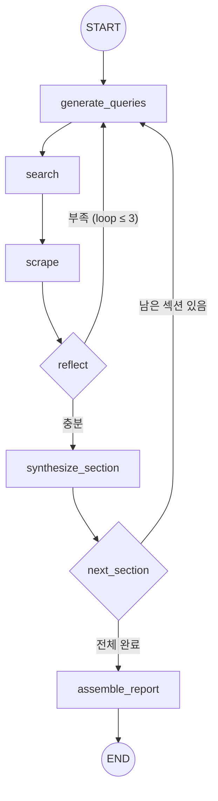

# Dynamic Live Search — 개요 및 설계서

> **작성일**: 2026-10-03  
> **문서 버전**: v1.0  
> **상위 문서**: [요건정의서](file:///Users/boon/Dropbox/03_code/c_1003_dynamic_research/docs/requirements_20261003.md)

---

## 0. 시스템 인풋 / 아웃풋

### 0.1 전체 시스템

```
┌─────────────────────────────────────────────────────────────┐
│                  Dynamic Live Search 시스템                   │
│                                                             │
│   INPUT                              OUTPUT                 │
│   ─────                              ──────                 │
│   • 주제 (topic)                     • 최종 마크다운 리포트    │
│   • 승인된 아웃라인                     (.md 파일)             │
│     (섹션별 질문 + 결론)              • 출처 각주 매핑 포함     │
│   • 설정 (settings.yaml)            • temp/ 중간 결과물       │
│     - 검색엔진 선택                                          │
│     - 파서 선택                                              │
│     - LLM 선택                                              │
│     - 루프 횟수 등                                           │
│                                                             │
└─────────────────────────────────────────────────────────────┘
```

| 구분 | 항목 | 형식 | 설명 |
|:---:|:---|:---:|:---|
| **INPUT** | 주제 (topic) | `str` | 리서치 대상 주제 (예: "마이크론 12단 HBM3E 퀄 승인 분석") |
| | 아웃라인 (outline) | `list[OutlineSection]` | Outline Proposer Agent가 제안 → Human이 승인한 섹션 목록. 각 섹션은 `title` + `question` + `expected_thesis`로 구성 |
| | 설정 (config) | `settings.yaml` | 사용할 Provider(검색/파서/LLM), 검색 파라미터, 저장 경로 등 |
| **OUTPUT** | 최종 리포트 | `.md` 파일 | 아웃라인 슬롯이 채워진 마크다운 보고서. 5대 저장 규격 준수 |
| | 중간 결과물 | `temp/{run_id}/` | 검색 결과, 크롤링 원문, Reflection 로그, 섹션 초안 |

### 0.2 아웃라인 입력 구조

```python
@dataclass
class OutlineSection:
    id: str                    # "section_01"
    title: str                 # "마이크론 12단 HBM3E 퀄 승인 현황"
    question: str              # "엔비디아 퀄 테스트를 통과했는가?"
    expected_thesis: str       # "2026년 Q3에 통과, H2 양산 예정"
    depth: str                 # "brief" | "standard" | "deep"
```

### 0.3 최종 리포트 출력 구조

```markdown
---
# Frontmatter
topic: "마이크론 12단 HBM3E 분석"
created_at: "2026-10-03T22:30:00+09:00"
run_id: "run_20261003_223000"
search_metadata:
  search_queries:
    - "Micron 12-layer HBM3E NVIDIA qualification"
    - "마이크론 HBM3E 엔비디아 퀄테스트"
    - ...
  total_pages_scraped: 12
  reflection_loops: 2
providers:
  search: "tavily"
  scraper: "jina"
  llm: "gemini-2.0-flash"
---

# {리포트 제목}

## 1. {섹션 제목}
### 확인된 사실 (Facts)
- ... [^1]
### 에이전트 해석 (Analysis)
- ...
### 미확인 주장 (Unverified)
- ...

> [!NOTE] 휴먼 피드백 & 직접 집필란
> (빈 슬롯)

## 2. {다음 섹션}
...

## 각주
[^1]: https://...
[^2]: https://...
```

### 0.4 단계별 인풋/아웃풋 흐름

```
INPUT                    STEP                         OUTPUT
─────                    ────                         ──────

topic + section     ──▶  Step 1: 쿼리 분해        ──▶  queries: list[str]
                              (Query Generator)            3~4개 검색어

queries             ──▶  Step 2: 실시간 검색       ──▶  search_results: list[SearchResult]
                              (Search Provider)            URL + 스니펫 + 신뢰도

search_results      ──▶  Step 3: 웹 크롤링         ──▶  scraped_pages: list[ScrapedPage]
                              (Scraper Provider)           마크다운 원문 (temp/ 저장)

section + evidence  ──▶  Step 4: 자기반성          ──▶  is_sufficient: bool
                              (Reflection LLM)             + gap_description
                                                           + sub_queries (부족 시)
                         ↑                    │
                         └── 부족 시 Step 1로 ──┘

section + evidence  ──▶  Step 5: 리포트 합성       ──▶  section_draft: str
                              (Synthesizer LLM)            팩트/해석 분리 + 각주 매핑

all section_drafts  ──▶  최종 조립                 ──▶  final_report.md
                              (Assemble)                   Frontmatter + 전체 리포트
```

---

## 1. Dynamic Live Search란?

### 1.1 정의
Dynamic Live Search(DLS)는 **사전 구축된 벡터 DB 없이**, 질문이 입력되는 시점에 에이전트가 자율적으로 검색 전략을 수립하여 **실시간 웹 데이터를 탐색·추출·합성하는 에이전틱 리서치 패러다임**이다.

### 1.2 핵심 철학
> "DB에 미리 쌓아두지 않고, 필요할 때 가장 신선한 1차 출처(웹)를 직접 방문하여 읽는다."

### 1.3 왜 Vector RAG가 아닌가?

| 비교 항목 | Vector RAG | Dynamic Live Search |
|:---|:---|:---|
| **정보 신선도** | DB 수집 시점 고정 (속보 반영 불가) | 초 단위 실시간 웹 데이터 반영 |
| **인프라 복잡도** | 임베딩 모델 + 청킹 파이프라인 + 벡터 DB | Search API + Web Scraper만 연결 |
| **맥락 보존력** | 300~500자 청킹으로 인과관계 왜곡 위험 | 웹페이지 원문 전체를 마크다운으로 분석 |
| **질문 대응력** | 단순 1회 유사도 검색 (Single-shot) | 쿼리 분해 + 부족 시 재검색 (Multi-hop Loop) |
| **데이터 범위** | 사전 인덱싱된 내부 문서에 국한 | 전 세계 웹 전체 |
| **유지보수 비용** | 문서 업데이트마다 재임베딩 필요 | 제로 (검색 엔진이 인덱싱 수행) |

### 1.4 상용 레퍼런스
- OpenAI Deep Research / SearchGPT
- Perplexity AI
- Google Gemini with Search Grounding

### 1.5 DLS의 포지셔닝 — Tavily vs Perplexity

DLS는 **Perplexity(완성품 시스템)** 에 가깝고, **Tavily는 DLS 내부의 부품**이다.

| 구분 | Tavily | Perplexity | **이 프로젝트의 DLS** |
|:---|:---|:---|:---|
| **본질** | 검색 API (도구/부품) | 에이전틱 리서치 시스템 (완성품) | 에이전틱 리서치 시스템 (완성품) |
| **하는 일** | 쿼리 → URL + 스니펫 반환 | 질문 → 자율 검색 → 각주 달린 답변 | 아웃라인 → 자율 검색 → 각주 달린 리포트 |
| **쿼리 분해** | ❌ 없음 | ✅ 자동 분해 | ✅ 자동 분해 |
| **웹페이지 직접 방문** | △ 옵션 | ✅ Full-page 읽기 | ✅ Full-page 읽기 |
| **Self-Reflection 재검색** | ❌ 없음 | ✅ Multi-hop | ✅ Multi-hop (2~3회) |
| **출처 각주 매핑** | ❌ 없음 | ✅ 인라인 각주 | ✅ 인라인 각주 |
| **최종 합성** | ❌ 원시 데이터만 반환 | ✅ 답변 생성 | ✅ 리포트 생성 |

```
Perplexity ≈ DLS의 "모델" (이런 걸 만들겠다)
Tavily    ≈ DLS의 "부품" (내부 Search Provider 구현체 중 하나)
```

**Perplexity / OpenAI Deep Research와의 차이점**:
- Perplexity: 짧은 Q&A 답변 중심
- OpenAI Deep Research: 긴 리포트 생성
- **이 프로젝트 DLS**: 긴 리포트 + **Human이 아웃라인 설계/승인** + **팩트/해석 3분할 구조**

### 1.6 로컬 LLM 구현 가능성 검토

#### 현재 환경

| 항목 | 사양 |
|:---|:---|
| **하드웨어** | MacBook Pro, Apple M3 Max, 36GB RAM |
| **LLM 런타임** | Ollama (Homebrew 설치) |

#### 설치된 모델

| 모델 | 파라미터 | 양자화 | 크기 | 컨텍스트 | Thinking | Tool Use | 한국어 |
|:---|:---:|:---:|:---:|:---:|:---:|:---:|:---:|
| **qwen3.8:27b** | 27.3B | Q4_K_M | 17GB | 262K | ✅ (multi-level) | ✅ | ✅ 우수 |
| **gemma4:26b** | 25.8B | Q4_K_M | 17GB | 262K | ✅ | ✅ | ✅ 양호 |
| gemma4:e2b | — | — | 7.2GB | — | ✅ | — | △ |
| qwen2.5vl:7b | — | — | 6.0GB | — | — | — | ✅ |
| bge-m3 | — | — | 1.2GB | — | — | — | — (임베딩 전용) |
| nomic-embed-text | — | — | 274MB | — | — | — | — (임베딩 전용) |

#### DLS 단계별 로컬 LLM 적합성 평가

| DLS 단계 | 요구 능력 | qwen3.8:27b | gemma4:26b | 판정 |
|:---|:---|:---:|:---:|:---:|
| **Step 1: 쿼리 분해** | 한/영 전문 검색어 생성 | ✅ 적합 | ✅ 적합 | ✅ **가능** |
| **Step 2: 검색** | API 호출 (LLM 불필요) | — | — | ✅ |
| **Step 3: 크롤링** | 웹 파싱 (LLM 불필요) | — | — | ✅ |
| **Step 4: Self-Reflection** | 정보 갭 분석, 구조화 판단 | ✅ thinking 모드 | ✅ thinking 모드 | ✅ **가능** |
| **Step 5: 리포트 합성** | 긴 마크다운 생성, 각주 매핑, 팩트/해석 분리 | ⚠️ 아래 참조 | ⚠️ 아래 참조 | ⚠️ **조건부** |

#### Step 5 리포트 합성의 제약 사항

| 제약 | 상세 | 영향 |
|:---|:---|:---|
| **생성 속도** | 27B 모델 Q4 양자화 → M3 Max에서 ~15~25 tok/s | 긴 리포트 생성에 **수 분 소요** |
| **컨텍스트 소비** | 여러 웹페이지 원문(각 4,000자) + 아웃라인 → 한 섹션당 20K+ 토큰 | 262K 컨텍스트로 커버 가능하나 **속도 저하** |
| **합성 품질** | 27B Q4는 팩트/해석 분리, 정교한 각주 매핑에서 **70B+ 또는 API 모델 대비 품질 열세** | 중요 리포트는 API 권장 |
| **메모리** | 17GB 모델 + 컨텍스트 → 36GB RAM 중 대부분 사용 | 동시 작업 제한 |

#### 결론 및 권장 구성

| 시나리오 | 권장 LLM | 이유 |
|:---|:---|:---|
| **프로토타입 / 테스트** | `qwen3.8:27b` (로컬 Ollama) | 비용 0원. 쿼리 분해·Reflection은 충분. 합성 품질은 검증 필요 |
| **본격 리서치 리포트** | Gemini API / Claude API | 합성 품질·속도·긴 컨텍스트 처리 모두 우위 |
| **하이브리드 (비용 최적)** | Step 1,4 → 로컬 Ollama / Step 5 → API | 검색어 생성·반성은 로컬, 고품질 합성만 API 사용 |

> **구현 방침**: LLM Provider를 `OllamaLLMProvider`로 추가하여 `settings.yaml`에서 단계별로 다른 LLM을 선택할 수 있게 설계한다.

```yaml
# config/settings.yaml — 하이브리드 구성 예시
providers:
  llm:
    query_generator: { type: "ollama", model: "qwen3.8:27b" }    # 로컬
    reflection:      { type: "ollama", model: "qwen3.8:27b" }    # 로컬
    synthesizer:     { type: "gemini", model: "gemini-2.0-flash" } # API
```

---

## 2. 아키텍처 설계

### 2.1 전체 구조

```
┌─────────────────────────────────────────────────────────┐
│                    LangGraph Orchestrator                │
│                                                         │
│  ┌──────────────┐    ┌──────────────┐                   │
│  │   Query      │───▶│   Search     │                   │
│  │  Generator   │    │   Provider   │◀─── 선택형        │
│  │   (LLM)      │    │  (Tavily/    │     플러그인      │
│  └──────┬───────┘    │  Serper/     │                   │
│         │            │  직접구현)   │                   │
│         │            └──────┬───────┘                   │
│         │                   │ URL 목록                   │
│         │            ┌──────▼───────┐                   │
│         │            │   Scraper    │                   │
│         │            │   Provider   │◀─── 선택형        │
│         │            │  (Jina/      │     플러그인      │
│         │            │  Crawl4AI)   │                   │
│         │            └──────┬───────┘                   │
│         │                   │ 마크다운 원문               │
│         │                   ▼                           │
│         │            ┌──────────────┐                   │
│         │            │  temp/ 저장  │ ← 중간 결과 보존   │
│         │            └──────┬───────┘                   │
│         │                   │                           │
│         │            ┌──────▼───────┐                   │
│  ◀──────┤◀───부족────│  Reflection  │                   │
│  Sub-Query 생성      │    (LLM)     │                   │
│                      └──────┬───────┘                   │
│                             │ 충분                      │
│                      ┌──────▼───────┐                   │
│                      │ Synthesizer  │                   │
│                      │    (LLM)     │                   │
│                      └──────┬───────┘                   │
│                             │                           │
└─────────────────────────────┼───────────────────────────┘
                              ▼
                    최종 마크다운 리포트
```

### 2.2 Provider 인터페이스 및 검색 엔진 구현 전략

#### Q. Tavily, Serper는 어떻게 구현하며, 무료면 만들 필요가 없는가?

1. **"검색 엔진" 자체를 밑바닥부터 만들 필요는 없음**
   - 수십억 개의 웹페이지를 인덱싱하고 랭킹하는 자체 웹 검색 엔진 인프라를 구축하는 것은 비용과 리소스상 비현실적입니다.
   - DLS에서 "검색을 구현한다"는 것은 **검색 API를 통일된 인터페이스로 감싸는 어댑터(Adapter)를 구현**하는 것을 의미합니다.

2. **무료 티어 및 공급자 비교 분석**

| 검색 공급자 | 무료 티어 | 장점 | 단점 | 권장 용도 |
|:---|:---|:---|:---|:---|
| **DuckDuckGo (`ddgs`)** | **완전 무료 (API 키 불필요)** | 설치 즉시 사용, 비용 0원, 무제한에 가까움 | 검색 결과 노이즈가 다소 있음 | **개발/로컬 테스트 기본값** |
| **Tavily** | **월 1,000건 (영구 무료)** | LLM 최적화 본문 스니펫 반환, 크롤링 부하 감소 | 월 1,000건 초과 시 유료 | **프로덕션 1순위 (추천)** |
| **Serper** | **일회성 2,500건 (소진 후 유료)** | Google 검색 랭킹 그대로 사용, 최상의 검색 품질 | 가입 시 1회성 지급, 이후 $50/50k건 | 정밀 시장 조사 / 구글 랭킹 필요시 |
| **SearXNG (자체 호스팅)** | **완전 무료 (오픈소스 메타검색)** | 데이터 프라이버시 100%, 구글/빙 통합 메타검색 | Docker 컨테이너 호스팅 필요 | 사내 온프레미스 구축 시 |

> **결론**: 특정 상용 서비스에 종속되지 않도록 **공통 `SearchProvider` 인터페이스**를 정의하고,
> 평소 로컬 개발 및 무제한 테스트는 **DuckDuckGo**, 정밀 리포트 생성은 **Tavily / Serper**로 설정 파일에서 한 줄로 전환 가능하게 설계합니다.

#### 구체적 Provider 구현 코드 (인터페이스 & 구현체)

```python
from abc import ABC, abstractmethod
from pydantic import BaseModel, Field
import requests
import json

# --- 데이터 모델 ---
class SearchResult(BaseModel):
    title: str
    url: str
    snippet: str
    source_provider: str = ""

class ScrapedPage(BaseModel):
    url: str
    title: str = ""
    markdown_content: str
    status: str = "success"  # success | failed | blocked

# --- Search Provider 추상 인터페이스 ---
class SearchProvider(ABC):
    @abstractmethod
    def search(self, query: str, max_results: int = 10) -> list[SearchResult]:
        """쿼리를 받아 검색 결과 리스트를 반환"""
        pass

# 1. 완전 무료 DuckDuckGo 구현 (API 키 불필요, pip install duckduckgo-search)
class DuckDuckGoSearchProvider(SearchProvider):
    def search(self, query: str, max_results: int = 10) -> list[SearchResult]:
        try:
            from duckduckgo_search import DDGS
            with DDGS() as ddgs:
                results = list(ddgs.text(query, max_results=max_results))
            return [
                SearchResult(
                    title=r.get("title", ""),
                    url=r.get("href", ""),
                    snippet=r.get("body", ""),
                    source_provider="duckduckgo"
                )
                for r in results
            ]
        except Exception as e:
            print(f"[DDG Search Error] {e}")
            return []

# 2. Tavily Search 구현 (월 1,000건 무료, AI 최적화)
class TavilySearchProvider(SearchProvider):
    def __init__(self, api_key: str):
        self.api_key = api_key
        self.endpoint = "https://api.tavily.com/search"

    def search(self, query: str, max_results: int = 10) -> list[SearchResult]:
        headers = {"Content-Type": "application/json"}
        payload = {
            "api_key": self.api_key,
            "query": query,
            "max_results": max_results,
            "search_depth": "advanced",
            "include_raw_content": False
        }
        resp = requests.post(self.endpoint, json=payload, headers=headers, timeout=10)
        resp.raise_for_status()
        data = resp.json()
        return [
            SearchResult(
                title=r.get("title", ""),
                url=r.get("url", ""),
                snippet=r.get("content", ""),
                source_provider="tavily"
            )
            for r in data.get("results", [])
        ]

# 3. Serper Search 구현 (Google 검색 기반, 초기 2,500건 무료)
class SerperSearchProvider(SearchProvider):
    def __init__(self, api_key: str):
        self.api_key = api_key
        self.endpoint = "https://google.serper.dev/search"

    def search(self, query: str, max_results: int = 10) -> list[SearchResult]:
        headers = {
            "X-API-KEY": self.api_key,
            "Content-Type": "application/json"
        }
        payload = {"q": query, "num": max_results}
        resp = requests.post(self.endpoint, json=payload, headers=headers, timeout=10)
        resp.raise_for_status()
        data = resp.json()
        return [
            SearchResult(
                title=r.get("title", ""),
                url=r.get("link", ""),
                snippet=r.get("snippet", ""),
                source_provider="serper"
            )
            for r in data.get("organic", [])
        ]

# --- Scraper Provider ---
class ScraperProvider(ABC):
    @abstractmethod
    def scrape(self, url: str) -> ScrapedPage:
        """URL을 받아 마크다운 원문을 반환"""
        pass

# Jina Reader 구현 (r.jina.ai/{url} 프리픽스만 붙이면 무료 마크다운 변환)
class JinaScraperProvider(ScraperProvider):
    def scrape(self, url: str) -> ScrapedPage:
        target_url = f"https://r.jina.ai/{url}"
        try:
            resp = requests.get(target_url, timeout=15)
            if resp.status_code == 200:
                return ScrapedPage(url=url, markdown_content=resp.text, status="success")
            return ScrapedPage(url=url, markdown_content="", status=f"failed_{resp.status_code}")
        except Exception as e:
            return ScrapedPage(url=url, markdown_content="", status=f"error_{str(e)}")

# --- LLM Provider ---
class LLMProvider(ABC):
    @abstractmethod
    def generate(self, prompt: str, system_prompt: str = "") -> str:
        """프롬프트와 시스템 지시사항을 받아 텍스트 생성"""
        pass

# 로컬 Ollama 구현 (M3 Max 로컬 qwen3.8:27b 활용)
class OllamaLLMProvider(LLMProvider):
    def __init__(self, model: str = "qwen3.8:27b", base_url: str = "http://localhost:11434"):
        self.model = model
        self.base_url = f"{base_url}/api/generate"

    def generate(self, prompt: str, system_prompt: str = "") -> str:
        payload = {
            "model": self.model,
            "prompt": prompt,
            "system": system_prompt,
            "stream": False
        }
        resp = requests.post(self.base_url, json=payload, timeout=60)
        resp.raise_for_status()
        return resp.json().get("response", "")
```

### 2.3 설정 파일 구조

```yaml
# config/settings.yaml
providers:
  search:
    type: "tavily"          # tavily | serper | google | custom
    api_key: "${TAVILY_API_KEY}"
    max_results: 10

  scraper:
    type: "jina"            # jina | crawl4ai
    timeout_seconds: 15
    max_content_length: 8000

  llm:
    type: "gemini"          # gemini | openai | claude
    model: "gemini-2.0-flash"
    api_key: "${GEMINI_API_KEY}"
    temperature: 0.2

search:
  max_reflection_loops: 3   # Self-Reflection 최대 재귀 횟수
  queries_per_section: 4    # 아웃라인 항목당 생성할 쿼리 수
  urls_per_query: 3         # 쿼리당 크롤링할 상위 URL 수

storage:
  temp_dir: "temp/"         # 중간 결과물 저장 경로
  output_dir: "output/"     # 최종 리포트 저장 경로
```

---

## 3. 5-Step 탐색 프로세스 상세 설계

### Step 1: 쿼리 분해 (Query Decomposition)

| 항목 | 내용 |
|:---|:---|
| **입력** | 아웃라인 섹션 제목 + 주제 컨텍스트 |
| **처리** | LLM이 복합 질문을 다각도 전문 검색어 3~4개로 분해 |
| **출력** | 검색 쿼리 리스트 |
| **언어** | 한국어·영어 혼합 쿼리 자동 생성 (정보 범위 확대) |

**프롬프트 설계 핵심**:
```
주제: {topic}
아웃라인 항목: {section_title}

이 항목을 채우기 위해 웹에서 검색할 전문 검색어를 3~4개 생성하라.
- 1차 공식 출처(기업 IR, 공시, 보도자료)를 타겟팅하는 영문 쿼리 포함
- 한국어 전문 미디어를 타겟팅하는 한글 쿼리 포함
- 단순 키워드가 아닌, 구체적이고 전문적인 검색어 생성
```

**예시**:
- 입력: "마이크론 12단 HBM3E 엔비디아 퀄 승인 여부"
- 출력 쿼리:
  1. `Micron 12-layer HBM3E NVIDIA qualification test pass announcement`
  2. `Micron FY2026 Q4 earnings call transcript HBM revenue`
  3. `TrendForce HBM3E 12-hi market share forecast Micron SK Hynix`
  4. `마이크론 HBM3E 12단 엔비디아 퀄테스트 통과`

---

### Step 2: 실시간 검색 (Search & Ranking)

| 항목 | 내용 |
|:---|:---|
| **입력** | 검색 쿼리 리스트 |
| **처리** | Search Provider를 통해 각 쿼리로 웹 검색 수행 |
| **출력** | 쿼리당 상위 10~20개 URL + 스니펫 |
| **URL 선별 기준** | 1차 출처(기업 IR, 공식 보도자료, Tier 1 전문지, 규제 기관 공시) 우선 |

**출력 데이터 구조**:
```python
@dataclass
class SearchResult:
    url: str
    title: str
    snippet: str
    source_type: str    # "primary" | "secondary"
    published_date: str | None
    relevance_score: float
```

**temp 저장**: `temp/search_results/{section_id}_{query_hash}.json`

---

### Step 3: 웹 원문 크롤링 (Deep Web Scraping)

| 항목 | 내용 |
|:---|:---|
| **입력** | 선별된 URL 리스트 (쿼리당 상위 3개) |
| **처리** | Scraper Provider로 웹페이지 방문 → 본문 전체를 순수 마크다운 추출 |
| **정제** | 광고, 네비게이션, JS 코드 제거. 본문만 확보 |
| **출력** | URL별 마크다운 원문 (최대 8,000자 트렁케이션) |

**출력 데이터 구조**:
```python
@dataclass
class ScrapedPage:
    url: str
    title: str
    content_md: str       # 마크다운 원문
    content_length: int
    scraped_at: str       # ISO 8601 타임스탬프
    success: bool
    error_message: str | None
```

**temp 저장**: `temp/scraped_pages/{url_hash}.md`

**에러 처리**:
| 실패 유형 | 처리 방식 |
|:---|:---|
| 페이월 차단 | 스킵 → 다음 URL로 폴백 |
| 타임아웃 (15초 초과) | 스킵 → 로그 기록 |
| 빈 응답 | 스킵 → 로그 기록 |
| 전체 실패 | 쿼리 재구성 또는 검색 엔진 변경 시도 |

---

### Step 4: 자기반성 (Self-Reflection)

| 항목 | 내용 |
|:---|:---|
| **입력** | 아웃라인 항목 + 수집된 Evidence 전체 |
| **처리** | LLM이 "이 항목에 답하기에 충분한 팩트가 수집되었는가?" 자율 평가 |
| **판단 기준** | 핵심 수치 존재 여부, 출처 다양성, 시점 최신성 |
| **부족 시** | 정보 갭(Gap)을 식별 → Sub-Query 생성 → Step 1로 재귀 |
| **최대 루프** | 3회 (설정으로 변경 가능) |

**프롬프트 설계 핵심**:
```
아웃라인 항목: {section_title}
수집된 Evidence:
{evidence_summary}

다음을 평가하라:
1. 이 항목의 질문에 답하기에 충분한 팩트가 수집되었는가?
2. 핵심 수치(날짜, 금액, 비율 등)가 1차 출처에서 확인되었는가?
3. 정보가 부족하다면, 어떤 데이터가 누락되었는가?

응답 형식:
- sufficient: true/false
- gap_description: "누락된 정보 설명"
- sub_queries: ["추가 검색어 1", "추가 검색어 2"]
```

**Reflection 로그 예시**:
> *Loop 1*: "12단 퀄 승인 뉴스는 확인되었으나, 대량 양산 시점(H2 2026)과 수율 관련 데이터가 누락. 2차 검색 수행."  
> *Loop 2*: "양산 시점 확인 완료. 수율 데이터는 비공개로 추정. 충분하다고 판단."

---

### Step 5: 리포트 합성 (Synthesis)

| 항목 | 내용 |
|:---|:---|
| **입력** | 아웃라인 전체 + 섹션별 수집 Evidence |
| **처리** | LLM이 팩트/해석을 분리하고, 출처 각주를 매핑하여 최종 합성 |
| **출력 구조** | 섹션별 3분할: 확인된 사실 / 에이전트 해석 / 미확인 주장 |
| **각주 매핑** | 모든 수치·주장에 `[^1]` 형태로 실제 방문 URL 인라인 연결 |

**섹션 출력 예시**:
```markdown
### 2.1 마이크론 12단 HBM3E 퀄 승인 현황

#### 확인된 사실 (Facts)
- 마이크론은 2026년 Q3에 12단 HBM3E의 엔비디아 퀄 테스트를 통과하였음 [^1]
- 양산은 H2 2026 개시 예정 [^2]

#### 에이전트 해석 (Analysis)
- SK하이닉스 대비 약 6개월 지연이나, 초기 수율 확보 시 ...

#### 미확인 주장 (Unverified)
- 초기 수율이 70%를 상회한다는 업계 루머가 있으나 공식 확인 불가

[^1]: https://investor.micron.com/...
[^2]: https://www.trendforce.com/...
```

---

## 4. LangGraph 워크플로우 설계

### 4.1 State 정의

```python
from typing import TypedDict

class DLSState(TypedDict):
    # 입력
    topic: str
    outline: list[OutlineSection]

    # 현재 처리 중인 섹션
    current_section_index: int
    current_section: OutlineSection

    # 검색 과정
    queries: list[str]
    search_results: list[SearchResult]
    scraped_pages: list[ScrapedPage]

    # Reflection
    reflection_count: int
    is_sufficient: bool
    gap_description: str

    # 합성 결과
    section_drafts: dict[str, str]

    # 최종 출력
    final_report: str
```

### 4.2 Graph 노드 구성

```python
from langgraph.graph import StateGraph, END

graph = StateGraph(DLSState)

# 노드 등록
graph.add_node("generate_queries", generate_queries_node)
graph.add_node("search", search_node)
graph.add_node("scrape", scrape_node)
graph.add_node("reflect", reflect_node)
graph.add_node("synthesize_section", synthesize_section_node)
graph.add_node("next_section", next_section_node)
graph.add_node("assemble_report", assemble_report_node)

# 엣지 연결
graph.set_entry_point("generate_queries")
graph.add_edge("generate_queries", "search")
graph.add_edge("search", "scrape")
graph.add_edge("scrape", "reflect")

# Reflection 조건 분기
graph.add_conditional_edges(
    "reflect",
    should_continue_searching,
    {
        "insufficient": "generate_queries",   # 부족 → 재검색
        "sufficient": "synthesize_section",    # 충분 → 합성
    }
)

# 섹션 루프
graph.add_edge("synthesize_section", "next_section")
graph.add_conditional_edges(
    "next_section",
    has_more_sections,
    {
        "more": "generate_queries",    # 다음 섹션
        "done": "assemble_report",     # 전체 완료
    }
)
graph.add_edge("assemble_report", END)
```

### 4.3 Graph 시각화



---

## 5. temp/ 저장 구조

모든 중간 결과물은 추적·디버깅·재사용을 위해 `temp/`에 저장한다.

```
temp/
├── {run_id}/                            ← 실행별 격리
│   ├── metadata.json                    ← 실행 설정, 시작/종료 시간
│   ├── outline.json                     ← 승인된 아웃라인
│   ├── search_results/
│   │   ├── section_01_query_01.json     ← 검색 API 응답 원본
│   │   ├── section_01_query_02.json
│   │   └── ...
│   ├── scraped_pages/
│   │   ├── {url_hash_1}.md              ← 크롤링된 마크다운 원문
│   │   ├── {url_hash_2}.md
│   │   └── ...
│   ├── reflections/
│   │   ├── section_01_loop_01.json      ← Reflection 판단 로그
│   │   └── ...
│   └── drafts/
│       ├── section_01.md                ← 섹션별 초안
│       └── ...
```

---

## 6. 장점과 한계

### 장점
1. **극강의 애자일성** — 사전 데이터 파이프라인 없이 즉시 가동
2. **환각률 극소화** — 실제 방문한 웹페이지 원문 + 각주 매핑
3. **토큰 효율성** — 필요한 페이지만 정확히 읽음
4. **100% 최신성** — 검색 시점의 실시간 데이터 반영

### 한계 및 대응

| 한계 | 대응 방안 |
|:---|:---|
| **지연시간** (10~25초/섹션) | 비동기 배치 리포트 생성으로 운영 |
| **페이월 차단** (Bloomberg, WSJ 등) | 1차 공식 출처(SEC, IR, Press Release) 우선 타겟팅 프롬프트 |
| **크롤링 차단** (봇 방지) | Scraper Provider 폴백 전환 + 실패 로그 |
| **API 비용** | 무료 API / 직접 구현 검색 모듈 선택 옵션 제공 |

---

> **다음 단계**: Provider 인터페이스 구현 → LangGraph 워크플로우 코딩 → 단일 섹션 E2E 테스트
