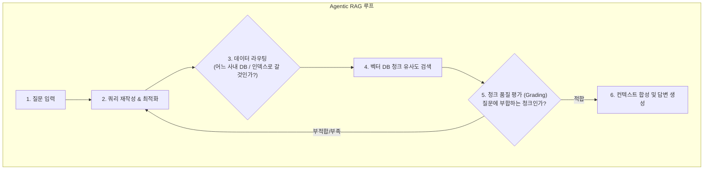
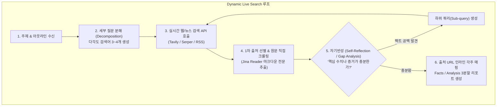

# Dynamic Live Search vs Agentic RAG 비교 분석서

> **작성일**: 2026-10-04  
> **문서 버전**: v1.0  
> **프로젝트**: `c_1003_dyanmic_research`  
> **관련 문서**: [Dynamic Live Search 설계서](file:///Users/boon/Dropbox/03_code/c_1003_dyanmic_research/docs/dls_design_20261003.md), [DLS 가이드](file:///Users/boon/Dropbox/03_code/c_1003_dyanmic_research/docs/%E1%84%8E%E1%85%A1%E1%86%B7%E1%84%8C%E1%85%A9/dynamic_live_search_guide.md)

---

## 1. 개요 및 한 줄 요약 (TL;DR)

Dynamic Live Search(DLS)와 Agentic RAG는 모두 LLM의 1회성 호출(Single-shot) 한계를 극복하고, **"AI 에이전트의 자율적 판단, 도구 활용 및 피드백 루프(Loop)"**를 적용한다는 공통점을 가집니다.

그러나 **"탐색 대상이 되는 데이터 원천(Data Source)"**, **"사전 인프라(Vector DB) 필요 여부"**, 그리고 **"맥락을 다루는 단위(Full-page vs Chunk)"**에서 본질적인 아키텍처 차이가 존재합니다.

* **Agentic RAG**: **"사전에 인덱싱해 둔 내부 지식 베이스(Vector DB/사내 문서)"**를 에이전트가 자율적으로 라우팅, 질의 재작성, 청크 적합성 평가를 거쳐 최적의 근거를 찾아내는 기술
* **Dynamic Live Search (DLS)**: **"사전 DB 구축(Zero-indexing) 없이"**, 질문 시점에 에이전트가 **"실시간 개방형 웹(Open Web)과 최신 뉴스"**를 직접 검색·방문·파싱하여 최신 심층 리포트를 작성하는 기술

---

## 2. 핵심 비교 매트릭스

| 비교 항목 | Agentic RAG | Dynamic Live Search (DLS) |
| :--- | :--- | :--- |
| **주요 데이터 원천** | **사내/내부 비공개 데이터**<br>(PDF, Confluence, 사내 DB, 고객 상담록 등) | **개방형 실시간 웹 (Open Web)**<br>(IT 뉴스, 기업 IR 공시, 실시간 속보, 전문 웹페이지) |
| **사전 인프라 구축** | **필수 (Pre-indexing)**<br>(문서 청킹, 임베딩 모델, Vector DB, 메타데이터 필터) | **불필요 (Zero-DB)**<br>(검색 API + 웹 스크래퍼만 즉시 연동) |
| **정보의 신선도** | **수집/인덱싱 시점에 고정**<br>(주기적 배치 업데이트 전까지 오늘 속보 반영 불가) | **초 단위 실시간 (Real-time)**<br>(오늘 발생한 실시간 이벤트 및 최신 팩트 즉시 반영) |
| **데이터 처리 단위** | **청크 (Chunk, 300~1000자)**<br>단위 벡터 임베딩 유사도 검색 | 웹페이지 **원문 전체 (Full-Page Markdown)**<br>통째 분석 및 긴 맥락(Long-context) 이해 |
| **에이전트 루프의 핵심** | **검색 전략 최적화**<br>(DB 라우팅, 쿼리 재작성, 청크 적합성 평가, 재검색) | **심층 자율 탐색 (Deep Exploration)**<br>(아웃라인 질문 분해, 1차 출처 스크래핑, 팩트 갭 분석 재검색) |
| **응답 지연시간 (Latency)** | **수 초 내외**<br>(내부 로컬/클라우드 벡터 DB 조회) | **수십 초 ~ 수 분**<br>(실시간 웹 탐색, 네트워크 HTTP 크롤링 및 다중 루프) |
| **유지보수 비용** | **지속적 관리 필요**<br>(문서 갱신 시 재임베딩, DB 인덱스 동기화 파이프라인) | **유지보수 제로**<br>(구글, Tavily 등 글로벌 검색 엔진이 인덱싱을 전담) |
| **대표 상용 사례** | LlamaIndex Workflows, LangChain Agentic RAG, 사내 챗봇 | OpenAI Deep Research, Perplexity AI, Genspark |

---

## 3. 5대 핵심 차이점 심층 분석

### ① 데이터 원천 및 사전 인프라: Zero-DB vs Pre-indexing
* **Agentic RAG**: 외부 검색 엔진이 접근할 수 없는 기업 보안 문서, 내부 규정, 계약서 등 **닫힌 사내 데이터(Private Data)**를 다룹니다. 이를 위해 사전 파이프라인(문서 수집 → 텍스트 파싱 → 청킹 → 임베딩 모델 추론 → Vector DB 적재)이 사전에 완비되어야 합니다.
* **Dynamic Live Search**: 반도체 시황, 글로벌 공급망 동향, 정책 규제 변화 등 **인터넷에 공개된 열린 데이터(Public Web)**를 다룹니다. 사전 데이터베이스 없이 질문이 들어오는 순간 Google, Tavily, RSS 등의 라이브 엔드포인트를 즉각 탐색합니다.

### ② 맥락 보존력: Full-Page Raw Text vs Chunk Fragmentation
* **Agentic RAG**: 긴 문서를 300~1,000자 단위의 청크로 잘라 보관하기 때문에, 숫자의 전제조건이나 인과관계가 잘려 나가는 **맥락 단절(Context Fragmentation)** 문제가 상존합니다. 이를 보완하기 위해 Parent Document Retrieval이나 GraphRAG 같은 복잡한 기법이 추가됩니다.
* **Dynamic Live Search**: 2~3줄짜리 검색 요약문(Snippet)에 만족하지 않고, Jina Reader나 크롤러를 통해 **해당 웹페이지의 마크다운 원문 전문(Full-Text)을 통째로 읽어옵니다.** 수만 토큰의 최신 LLM Context Window를 활용해 문서 전체 맥락을 온전히 파악합니다.

### ③ 에이전틱 루프 메커니즘의 차이





* **Agentic RAG의 루프**: 에이전트가 주로 **"어디서 가져와야 최적인가(Routing)"**와 **"가져온 청크가 질문에 맞는가(Self-Correction/Grading)"**를 제어합니다.
* **Dynamic Live Search의 루프**: 사람이 리서치하듯 **"1차 출처 원문을 직접 파고들어 읽고(Deep Scraping)"**, **"어떤 팩트가 더 필요한지 파악(Gap Analysis)"**하여 연쇄 탐색(Multi-hop)을 수행합니다.

### ④ 정보의 신선도와 실시간성
* **Agentic RAG**: 인덱싱된 시점의 정적 스냅샷입니다. 예를 들어 오늘 오전에 엔비디아의 새로운 퀄 테스트 통과 뉴스가 나왔다면, 정기 배치 인덱싱이 돌기 전까지 시스템은 "아직 모른다"거나 과거 데이터를 반환합니다.
* **Dynamic Live Search**: 질문을 받는 즉시 웹을 두드리므로 5분 전 뉴스, 실시간 주가, 금일 배포된 기업 공식 보도자료를 100% 반영합니다.

### ⑤ 구축 및 유지보수 비용
* **Agentic RAG**: 임베딩 모델 버전 관리, 청크 사이즈 튜닝, 벡터 인덱스 재구축, 데이터 싱크 오류 해결 등 데이터 엔지니어링 오버헤드가 지속적으로 발생합니다.
* **Dynamic Live Search**: 인덱싱 인프라 운영 비용이 없습니다. 대신 검색 API(Tavily 등) 호출 비용과 크롤링 네트워크 지연(Latency)이 비용으로 작용합니다.

---

## 4. 유스케이스 선택 가이드 (Decision Framework)

| 상황 (Scenario) | 추천 아키텍처 | 이유 |
| :--- | :---: | :--- |
| 우리 회사 인사 규정, 보안 코드, 회계 매뉴얼 질의응답 | **Agentic RAG** | 외부 웹에 공개되지 않은 사내 비공개 데이터 기반이어야 함 |
| 마이크론 12단 HBM3E 엔비디아 퀄 승인 및 최신 시장 영향 분석 | **Dynamic Live Search** | 최근 속보, 외신, 최신 시장 리서치 기관 전망 등 초단위 최신성 필수 |
| 고객 지원(CS) 챗봇 (기존 매뉴얼 기반 즉각 답변) | **Agentic RAG** | 수 초 이내의 빠른 Latency와 정형화된 정책 답변 필요 |
| 산업 트렌드 심층 보고서 (Deep Research Paper) 생성 | **Dynamic Live Search** | 다각도의 웹 소스 전문을 교차 검증하고 각주를 달아야 함 |

---

## 5. 미래 발전 방향: 하이브리드 결합 모델 (Hybrid Architecture)

실제 엔터프라이즈 환경에서 두 기술은 배타적인 관계가 아니라 상호보완적입니다.

```
[사용자 복합 질문]
"우리 회사의 작년 HBM 투자 계획 대비, 오늘 발표된 경쟁사의 최신 수율 동향은 어떠한가?"
                           │
                 [Agent Router / Orchestrator]
                ┌──────────┴──────────┐
                ▼                     ▼
        [Agentic RAG 도구]     [Dynamic Live Search 도구]
        사내 비공개 회의록/투자계획      최신 외신 및 경쟁사 뉴스 크롤링
                └──────────┬──────────┘
                           ▼
                 [최종 통합 리포트 작성]
```

* **내부 과거 데이터**: Agentic RAG를 통해 고속 검색
* **외부 최신 데이터**: Dynamic Live Search를 통해 실시간 웹 크롤링
* **통합 에이전트**: 두 결과를 취합하여 비교 분석 보고서 완성

---

## 6. 결론: 본 프로젝트(`c_1003_dyanmic_research`)의 정체성

본 프로젝트는 사내 문서 검색(RAG)이 아니라, **"사전 DB 없이 100% 실시간 웹을 탐색하여 최신 팩트를 검증하고 고품질 마크다운 리포트를 자율 생성하는 Dynamic Live Search 플랫폼"**입니다. 

이를 통해 인프라 구축 비용을 최소화하고, 정보의 시점 한계를 원천 제거하며, 인간(Human)이 승인한 아웃라인을 심층 웹 데이터로 완벽히 채워 넣는 워크플로우를 구현합니다.
