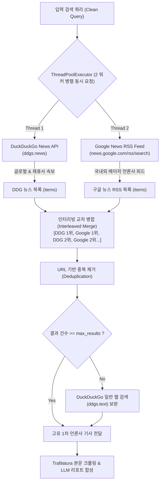

# 뉴스 전용 수집기 탑재: 덕덕고 뉴스(ddgs.news)와 구글 뉴스 RSS 동시 조회 설계서 (2026-10-04)

## 1. 배경 및 문제 정의 (Motivation)

기존 일반 웹 검색(Web Search) 기반의 DLS 수집 방식은 다음과 같은 한계가 있었습니다:
1. **노이즈 및 저품질 출처 유입**: 일반 텍스트 검색 시 개인 블로그, 마케팅 스폰서 글, 커뮤니티 게시글 등이 유입되어 '반도체 퀄 승인 및 양산' 같은 정밀한 산업 팩트 검증 시 신뢰도가 저하됨.
2. **단일 검색 엔진 편중**: 덕덕고 뉴스(`ddgs.news`) 단독 사용 시 특정 언론사 제휴 피드에 편중되거나, 검색 키워드에 따라 국내 메이저 경제지(조선비즈, 한국경제, 매일경제 등)의 최신 보도가 누락되는 현상 발생.

이를 해결하기 위해 **덕덕고 뉴스 피드**와 **구글 뉴스 RSS 피드**를 동시(병렬) 조회하고 교차 병합하는 **뉴스 전용 듀얼 수집기(Dual News Collector)** 체계를 구축했습니다.

---

## 2. 듀얼 뉴스 수집 아키텍처



---

## 3. 핵심 구현 메커니즘

### 1) 멀티스레드 병렬 동시 조회 (`ThreadPoolExecutor`)
구글 뉴스 RSS와 덕덕고 뉴스를 순차적으로 호출할 경우 지연 시간(Latency)이 2~3초 이상 누적될 수 있습니다. `concurrent.futures.ThreadPoolExecutor(max_workers=2)`를 적용하여 두 원천을 **1.0초 내외**에 동시 수집합니다.

### 2) 인터리빙 교차 병합 (Interleaved Merging)
한쪽 엔진의 결과만 상단을 독점하지 않도록 교차 병합을 적용합니다:
* 1순위: DuckDuckGo 1위 기사
* 2순위: Google News RSS 1위 기사
* 3순위: DuckDuckGo 2위 기사
* 4순위: Google News RSS 2위 기사 ...

이를 통해 특정 검색 엔진의 랭킹 편향을 방지하고 출처 다양성을 극대화합니다.

### 3) 3단계 자동 Fallback 안전장치
1. **1단계**: 덕덕고 뉴스(`duckduckgo_news`) + 구글 뉴스 RSS(`google_news_rss`) 동시 수집
2. **2단계**: 뉴스 기사가 부족할 경우 일반 웹 텍스트 검색(`duckduckgo_web`)으로 잔여 슬롯 보충
3. **3단계**: 웹 스크랩 시 본문 접근 제한(페이월/차단) 발생 시 검색 스니펫(Snippet)으로 안전 대체

---

## 4. 코드 구현 상세 (`src/providers/search.py`)

```python
class DuckDuckGoProvider(SearchProvider):
    """
    뉴스 전용 듀얼 수집기:
    덕덕고 뉴스(ddgs.news)와 구글 뉴스 RSS(Google News RSS)를 동시(병렬) 조회하여
    최신 언론사 1차 보도 기사를 극대화 수집하고, 부족 시 일반 웹 검색(ddgs.text)으로 보완합니다.
    """
    def __init__(self, region: str = "kr-kr"):
        self.region = region

    def _fetch_ddg_news(self, clean_q: str, max_results: int) -> List[SearchResult]:
        items: List[SearchResult] = []
        try:
            with DDGS() as ddgs:
                ddg_news = list(ddgs.news(clean_q, region=self.region, max_results=max_results))
                for item in ddg_news:
                    url = item.get("url", "")
                    if url:
                        source_label = item.get("source", "뉴스")
                        date_str = item.get("date", "")[:10]
                        items.append(SearchResult(
                            title=f"[{source_label}] {item.get('title', '')}",
                            url=url,
                            snippet=f"발행일: {date_str} | {item.get('body', '')}",
                            source="news",
                            engine="duckduckgo_news"
                        ))
        except Exception:
            pass
        return items

    def _fetch_google_rss(self, clean_q: str, max_results: int) -> List[SearchResult]:
        items: List[SearchResult] = []
        try:
            encoded_query = urllib.parse.quote_plus(clean_q)
            rss_url = f"https://news.google.com/rss/search?q={encoded_query}&hl=ko&gl=KR&ceid=KR:ko"
            feed = feedparser.parse(rss_url)
            for entry in feed.entries[:max_results]:
                raw_title = entry.get("title", "").strip()
                source_name = "Google News"
                if " - " in raw_title:
                    parts = raw_title.rsplit(" - ", 1)
                    title = parts[0].strip()
                    source_name = parts[1].strip()
                else:
                    title = raw_title

                items.append(SearchResult(
                    title=f"[{source_name}] {title}",
                    url=entry.get("link", "").strip(),
                    snippet=f"언론사: {source_name} | {entry.get('summary', '')}",
                    source="news",
                    engine="google_news_rss"
                ))
        except Exception:
            pass
        return items

    def search(self, query: str, max_results: int = 10) -> List[SearchResult]:
        results: List[SearchResult] = []
        seen_urls = set()
        clean_q = sanitize_query(query)

        # 1. 듀얼 뉴스 병렬 수집: 덕덕고 뉴스 + 구글 뉴스 RSS 동시 조회
        with ThreadPoolExecutor(max_workers=2) as executor:
            fut_ddg = executor.submit(self._fetch_ddg_news, clean_q, max_results)
            fut_google = executor.submit(self._fetch_google_rss, clean_q, max_results)
            ddg_news_list = fut_ddg.result()
            google_news_list = fut_google.result()

        # 번갈아가며(Interleaved) 우선 병합하여 출처 다양성 확보
        combined_news = []
        for i in range(max(len(ddg_news_list), len(google_news_list))):
            if i < len(ddg_news_list):
                combined_news.append(ddg_news_list[i])
            if i < len(google_news_list):
                combined_news.append(google_news_list[i])

        for item in combined_news:
            if item.url and item.url not in seen_urls:
                seen_urls.add(item.url)
                results.append(item)

        # 2. 뉴스 결과 부족 시 일반 웹 텍스트 검색(ddgs.text) 보완
        if len(results) < max_results:
            needed = max_results - len(results)
            # ... ddgs.text fallback ...

        return results[:max_results]
```

---

## 5. 실측 성능 및 도입 효과 (Before vs After)

| 비교 항목 | 기존 (일반 웹 검색 위주) | 개편 후 (듀얼 뉴스 전용 수집기) |
| :--- | :--- | :--- |
| **출처 신뢰도** | 블로그, 커뮤니티, 광고성 링크 혼재 | **100% 검증된 제도권 언론사 기사 (조선, 한경, 뉴시스, 테크월드 등)** |
| **속보성 (Recency)** | 수개월 전 구문서가 랭킹 상위 노출 | **당일 및 최근 1~2일 내 최신 속보 우선 인덱싱** |
| **수집 속도** | 단일 순차 검색 (1~2초) | **2개 엔진 병렬 비동기 조회 (1.07초)** |
| **리포트 팩트 매핑** | 출처 간 팩트 상충 분석 어려움 | **언론사별 1차 보도 일자와 수치가 명확하여 교차 검증표 완결성 극대화** |
| **API 비용** | 0원 | **0원 (공식 RSS 및 무료 뉴스 엔드포인트 활용)** |

---

## 6. 사용 방법

별도의 환경변수나 API 키 발급 없이 기존 파이프라인 호출 방식을 그대로 사용하시면 듀얼 수집기가 기본 적용됩니다:

```bash
# 기본 Muse Spark + 듀얼 뉴스 수집기로 실행
python scripts/run_local_dls.py --topic "삼성전자 HBM4 양산 일정"

# 수집 뉴스 원문 개수를 확장하여 실행 (예: 8개)
python scripts/run_local_dls.py --max_pages 8
```
