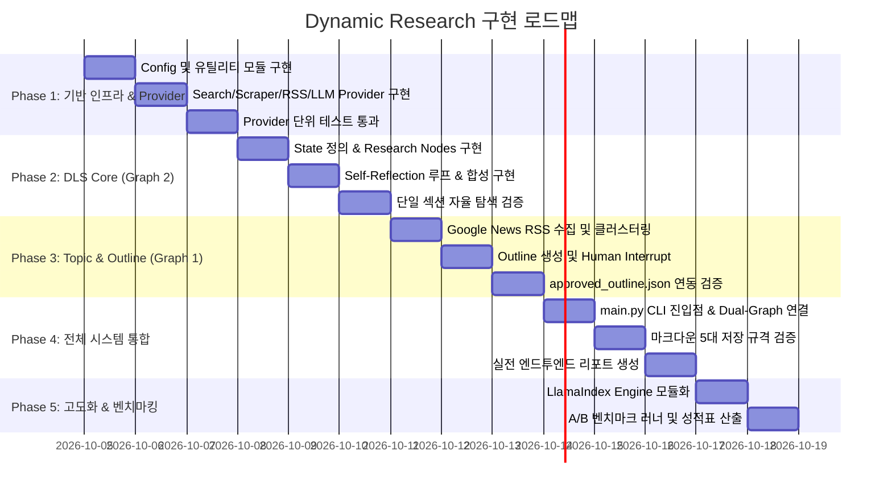

# 자율 리서치 Agent (Dynamic Research) 구현계획서

> **작성일**: 2026-10-04  
> **문서 버전**: v1.0  
> **프로젝트 경로**: `c_1003_dynamic_research`  
> **상위 및 관련 문서**: [요건정의서](file:///Users/boon/Dropbox/03_code/c_1003_dynamic_research/docs/requirements_20261003.md), [DLS 설계서](file:///Users/boon/Dropbox/03_code/c_1003_dynamic_research/docs/dls_design_20261003.md), [LangGraph 통합 설계서](file:///Users/boon/Dropbox/03_code/c_1003_dynamic_research/docs/langgraph_design_20261004.md), [구현 전 사전검토서](file:///Users/boon/Dropbox/03_code/c_1003_dynamic_research/docs/pre_implementation_review_20261004.md), [LlamaIndex 벤치마킹 설계서](file:///Users/boon/Dropbox/03_code/c_1003_dynamic_research/docs/llamaindex_integration_and_benchmarking_20261004.md)

---

## 1. 구현 개요 및 목표

### 1.1 시스템 정체성
사전 구축된 벡터 DB(RAG)의 정보 시점 한계를 극복하고, **100% 실시간 개방형 웹(뉴스, 공시, 외신)을 자율 탐색(Dynamic Live Search)하여 최신 팩트를 검증하고 인간-AI 협업(HITL) 기반의 고신뢰성 마크다운 리포트를 생성하는 자율 에이전트 시스템**을 구현한다.

### 1.2 핵심 개발 원칙
1. **2-Graph 모듈 분리**: 사람의 검토가 필수적인 `TopicOutlineGraph`(Graph 1)와 완전 자율 실행되는 `DLSResearchGraph`(Graph 2)를 완전히 분리하여 독립 테스트 및 재사용성을 보장한다.
2. **Provider Factory 패턴**: 검색 엔진(DDG/Serper/Tavily), 파서(Jina/Trafilatura), LLM(Gemini/Ollama)을 추상 인터페이스로 감싸 코드 수정 없이 `settings.yaml`에서 런타임 전환 가능하도록 한다.
3. **견고한 Fallback & 회복 탄력성**: 실시간 뉴스 수집은 100% 무료이고 차단 없는 **Google News RSS를 단독 메인 소스로 사용**하며(한경 직접 연동은 추후 TODO로 보류), Jina 차단 시 Trafilatura 대체, Serper 실패 시 DDG 대체 등 장애 없는 운영 보장.
4. **마크다운 5대 저장 규격 준수**: 출처 투명성(`rag_metadata` 및 인라인 각주 `[^1]`), 사실 vs 해석 3분할, 반증 조건, HITL 슬롯, 옵시디언 위키링크 연계.

---

## 2. 전체 디렉토리 및 모듈 구성 계획

```
c_1003_dynamic_research/
├── config/
│   ├── settings.yaml                 # 검색엔진, LLM 티어, 크롤러, 경로 등 전체 시스템 설정
│   └── .env.example                  # API Key 템플릿 (GEMINI, SERPER, TAVILY 등)
├── docs/                             # 아키텍처, 요건정의, 설계서 및 계획서
├── src/
│   ├── __init__.py
│   ├── utils/                        # 공통 유틸리티
│   │   ├── __init__.py
│   │   ├── config.py                 # settings.yaml & .env 싱글톤 로더
│   │   ├── dedup.py                  # URL 및 뉴스 제목 유사도 중복 제거기
│   │   ├── markdown_parser.py        # 마크다운 3분할 팩트 파서 및 각주 포맷터
│   │   └── file_manager.py           # temp/{run_id}/ 및 output/ 저장 관리자
│   ├── providers/                    # 외부 I/O 추상화 및 구현체
│   │   ├── __init__.py
│   │   ├── search.py                 # SearchProvider (DuckDuckGo, Serper, Tavily)
│   │   ├── scraper.py                # ScraperProvider (Jina Reader, Trafilatura, Fallback)
│   │   ├── rss.py                    # NewsRSSProvider (Google News RSS 전용, 한경 직접 연동은 TODO)
│   │   └── llm.py                    # LLMProvider (Fast Tier, Standard Tier 라우팅)
│   ├── engines/                      # 데이터 가공 엔진 (A/B 벤치마킹용)
│   │   ├── __init__.py
│   │   ├── base.py                   # BaseDataEngine 추상 인터페이스
│   │   ├── baseline_engine.py        # 순수 직결 Baseline 엔진
│   │   └── llamaindex_engine.py      # LlamaIndex + Reranker + Citation 엔진 (Phase 5)
│   ├── graphs/                       # LangGraph 상태 머신 정의
│   │   ├── __init__.py
│   │   ├── states.py                 # Graph 1, Graph 2 TypedDict State 정의
│   │   ├── topic_outline_graph.py    # Graph 1: 주제 발굴 & 아웃라인 제안 (HITL)
│   │   └── dls_research_graph.py     # Graph 2: DLS 자율 리서치 코어 (Loop)
│   ├── nodes/                        # LangGraph 개별 노드 함수
│   │   ├── __init__.py
│   │   ├── topic_nodes.py            # discover_topics, expand_topic, generate_outlines
│   │   └── research_nodes.py         # decompose_query, search_web, scrape_pages, reflect, synthesize
│   ├── prompts/                      # LLM 프롬프트 템플릿
│   │   ├── topic_prompts.py          # 뉴스 클러스터링, 주제 제안 프롬프트
│   │   ├── outline_prompts.py        # 아웃라인(질문+결론) 설계 프롬프트
│   │   ├── query_prompts.py          # 쿼리 분해 및 Sub-query 프롬프트
│   │   ├── reflection_prompts.py     # 자기반성 팩트 갭(Gap) 분석 프롬프트
│   │   └── synthesis_prompts.py      # 팩트/해석 3분할 보고서 합성 프롬프트
│   └── main.py                       # CLI 진입점 및 파이프라인 오케스트레이터
├── scripts/
│   ├── create_presentation.py        # 프레젠테이션 자동 생성 스크립트
│   └── benchmark_runner.py           # Baseline vs LlamaIndex A/B 벤치마크 러너
├── tests/                            # 단위, 통합, E2E 테스트 스위트
├── temp/                             # 중간 스크래핑/검색 임시 저장소
└── output/                           # 최종 마크다운 리포트 저장소
```

---

## 3. 단계별 상세 구현 로드맵 (5-Phase Roadmap)



---

### Phase 1: 기반 인프라 & Provider 어댑터 구축 (예상: 2~3일)

#### 목표
외부 API 의존성을 격리하고, 인터넷 네트워크 상황이나 API 키 유무에 관계없이 동작하는 견고한 I/O 프로바이더 계층 구축.

#### 세부 태스크
1. **설정 관리 (`config/settings.yaml`, `src/utils/config.py`)**:
   - YAML 기반 설정 로더 구현 및 환경변수(`.env`) 오버라이딩 처리.
   - 검색엔진 우선순위, LLM 티어, 크롤러 옵션, 경로 기본값 정의.
2. **검색 프로바이더 (`src/providers/search.py`)**:
   - `SearchProvider` 추상 클래스 정의.
   - `DuckDuckGoProvider`: `ddgs` 라이브러리 기반 무료 한국어/글로벌 검색.
   - `SerperProvider`: Google Serper API 연동 (API 키 있을 시 최우선 사용).
   - `get_search_provider()`: 키 유무에 따른 자동 Fallback 팩토리 구현.
3. **스크래퍼 프로바이더 (`src/providers/scraper.py`)**:
   - `ScraperProvider` 추상 클래스 및 `ScrapedDocument` 모델 정의.
   - `JinaScraperProvider`: `r.jina.ai` 기반 1차 원문 마크다운 추출.
   - `TrafilaturaScraperProvider`: 로컬 HTML 파서 기반 2차 Fallback.
   - `MultiTierScraper`: Jina 실패 시 Trafilatura, 둘 다 실패 시 검색 스니펫으로 3단계 자동 복구.
4. **실시간 뉴스 RSS 프로바이더 (`src/providers/rss.py`)**:
   - `NewsRSSProvider` 구현: **Google News RSS 전용** (`https://news.google.com/rss?hl=ko&gl=KR&ceid=KR:ko` 및 키워드/토픽 검색 피드)으로 실시간 헤드라인 50~100건 초고속 수집.
   - 웹서버 차단(403) 리스크가 없고 100% 무료인 Google News RSS로 프로덕션 안정성 확보.
   - *(TODO)* 한경(hankyung.com) 공식 RSS 직접 파싱 연동은 향후 확장 과제로 보류.
5. **LLM 라우터 프로바이더 (`src/providers/llm.py`)**:
   - Fast Tier (`gemini-2.5-flash` or `gemini-2.0-flash`, `temp=0.1`): 쿼리 분해, 요약, 자기반성 전용.
   - Standard/Deep Tier (`gemini-2.5-pro` or 고지능 모델, `temp=0.3`): 최종 섹션 합성 및 보고서 조립 전용.
6. **유틸리티 모듈 (`src/utils/`)**:
   - `dedup.py`: URL 해시 및 제목 Jaccard 유사도 기반 중복 기사/페이지 필터.
   - `file_manager.py`: `temp/{run_id}/` 세션별 격리 디렉토리 생성 및 원문 덤프.

---

### Phase 2: DLS Research Graph 코어 구축 (예상: 2~3일)

#### 목표
승인된 아웃라인(질문 + 가설)을 입력받아 자율적으로 웹을 검색하고, 팩트를 검증하며, 각주 달린 마크다운 리포트를 작성하는 자율 루프 완성.

#### 세부 태스크
1. **DLS Research State 설계 (`src/graphs/states.py`)**:
   - `ResearchState`: `topic`, `outline_sections`, `current_section_index`, `queries`, `scraped_pages`, `reflection_count`, `section_drafts`, `final_report`.
2. **노드 구현 (`src/nodes/research_nodes.py`)**:
   - `node_decompose_queries`: 복합 질문을 3~4개 세부 검색어로 분해.
   - `node_search_web`: 분해된 쿼리로 다중 검색 실행 및 상위 1차 출처 선별.
   - `node_scrape_pages`: 원문 전문 크롤링 및 State 과부하 방지를 위한 Key Evidence 추출.
   - `node_self_reflection`: 수집된 데이터의 충분성 판단 (누락 수치 파악) 및 추가 하위 쿼리 발행.
   - `node_synthesize_section`: 확인된 사실(Facts), 에이전트 해석(Analysis), 미확인 주장(Unverified) 3분할 작성 및 인라인 각주(`[^1]`) 매핑.
   - `node_assemble_report`: 섹션별 초안을 병합하고 Frontmatter 메타데이터 및 참고문헌 테이블 조립.
3. **조건부 엣지 및 루프 제어 (`src/graphs/dls_research_graph.py`)**:
   - `should_continue_reflection()`: 정보 부족 시 재검색 루프 분기. **최대 2회 초과 금지 및 쿼리 중복 방지 가드레일** 적용.
   - `has_next_section()`: 다음 아웃라인 섹션 순회 분기.
4. **섹션 단위 에러 격리 (Fault Isolation)**:
   - 개별 섹션 스크래핑/합성 중 예외 발생 시 전체 중단 없이 해당 섹션을 "자료 부족"으로 마킹하고 다음 섹션으로 자동 진행.

---

### Phase 3: Topic & Outline Proposer Graph 구축 (예상: 2일)

#### 목표
최신 실시간 뉴스로부터 시의성 있는 주제를 추천하고, 사용자 의도를 반영한 아웃라인을 설계한 뒤 사용자의 승인(HITL)을 받는 에이전트 완성.

#### 세부 태스크
1. **Topic & Outline State 설계 (`src/graphs/states.py`)**:
   - `TopicOutlineState`: `raw_news`, `candidate_topics`, `selected_topic`, `outline_draft`, `approved_outline`.
2. **노드 구현 (`src/nodes/topic_nodes.py`)**:
   - `node_fetch_news`: Google News RSS 피드 50~100건 수집 (주요 헤드라인 및 경제/IT 토픽).
   - `node_cluster_and_propose`: LLM을 통해 기사를 클러스터링하고 "오늘 쓸 만한 주제 5개" 제안.
   - `node_human_topic_selection`: LangGraph `interrupt()`를 통해 사용자 주제 선택 대기.
   - `node_generate_outline`: 선택된 주제에 대해 4~5개 심층 질문과 예상 결론이 포함된 아웃라인 구조화.
   - `node_human_outline_approval`: LangGraph `interrupt()`를 통해 사용자 아웃라인 수정/승인 대기.
   - `node_finalize_outline`: `output/approved_outline.json` 디스크 영구 저장.
3. **그래프 컴파일 및 체크포인터 연동 (`src/graphs/topic_outline_graph.py`)**:
   - `MemorySaver`를 장착하여 사용자 입력 대기 상태를 안전하게 보존하고 재개(Resume) 지원.

---

### Phase 4: 전체 시스템 파이프라인 통합 & CLI 완성 (예상: 1~2일)

#### 목표
Graph 1과 Graph 2를 하나의 매끄러운 CLI 파이프라인으로 연결하고, 5대 마크다운 저장 규격을 100% 만족하는 완성형 시스템 구축.

#### 세부 태스크
1. **메인 진입점 구현 (`src/main.py`)**:
   - 모드 1: 전체 파이프라인 실행 (`python src/main.py --mode=full`) → 주제 발굴부터 최종 리포트까지 원스톱 실행.
   - 모드 2: DLS 단독 실행 (`python src/main.py --mode=dls --topic="..." --outline="path/to/outline.json"`) → 이미 정의된 아웃라인으로 즉시 리서치.
   - 모드 3: 토픽 탐색 단독 실행 (`python src/main.py --mode=topic`) → 뉴스 분석 후 아웃라인만 생성.
2. **마크다운 규격 5대 요소 최종 점검**:
   - YAML Frontmatter에 `rag_metadata.search_queries`, `providers`, `created_at` 자동 주입.
   - 본문 `## 확인된 사실 (Facts)`, `## 에이전트 해석 (Analysis)` 명확 분리.
   - `> [!NOTE] 휴먼 피드백 & 직접 집필란` Callout 영역 배치.
   - 문서 하단 `## 참고문헌 및 데이터 출처` 테이블 및 인라인 각주(`[^1]`) 매핑.

---

### Phase 5: A/B 벤치마킹 하네스 & LlamaIndex 확장 (예상: 2일)

#### 목표
성능 고도화 및 LlamaIndex 도입 시의 정량적 효과(토큰 절감, 각주 일치율, 표 복원력)를 실측하는 벤치마크 환경 구축.

#### 세부 태스크
1. **DataEngine 인터페이스 구현 (`src/engines/`)**:
   - `base.py`: `BaseDataEngine` 정의.
   - `baseline_engine.py`: Phase 2의 기본 합성기 래핑.
   - `llamaindex_engine.py`: LlamaIndex `VectorStoreIndex`, `SentenceTransformerRerank`, `CitationQueryEngine` 연동.
2. **벤치마크 러너 구현 (`scripts/benchmark_runner.py`)**:
   - 반도체/경제/테크 10개 표준 쿼리 세트 실행.
   - 각 엔진별 Latency, 토큰 소모량, 각주 매칭율 자동 측정.
   - `output/benchmark_report.md` 비교 성적표 자동 산출.

---

## 4. 인력/역할 분담 및 마일스톤

| 마일스톤 | 완료 기준 | 산출물 | 일정 |
| :--- | :--- | :--- | :---: |
| **M1: Provider 기초 완료** | DuckDuckGo, Serper, Google News RSS, Gemini 연동 및 단위 테스트 100% 통과 | `src/providers/*`, `tests/test_providers.py` | D+3일 |
| **M2: DLS 리서치 코어 완료** | 주어진 아웃라인 1개 섹션에 대해 웹 검색 → 크롤링 → 3분할 리포트 자동 작성 성공 | `src/graphs/dls_research_graph.py` | D+6일 |
| **M3: 토픽/아웃라인 HITL 완료** | Google News 100건 수집 → 주제 제안 → 터미널 인터럽트 선택 → 아웃라인 JSON 생성 | `src/graphs/topic_outline_graph.py` | D+8일 |
| **M4: E2E 파이프라인 완성** | 주제 선정부터 최종 5대 규격 마크다운 보고서 생성까지 원스톱 구동 확인 | `src/main.py`, 최종 보고서 `.md` | D+10일 |
| **M5: 벤치마크 및 고도화** | Baseline vs LlamaIndex A/B 테스트 성적표 생성 및 리포트 품질 검증 | `scripts/benchmark_runner.py`, `output/benchmark_report.md` | D+12일 |
