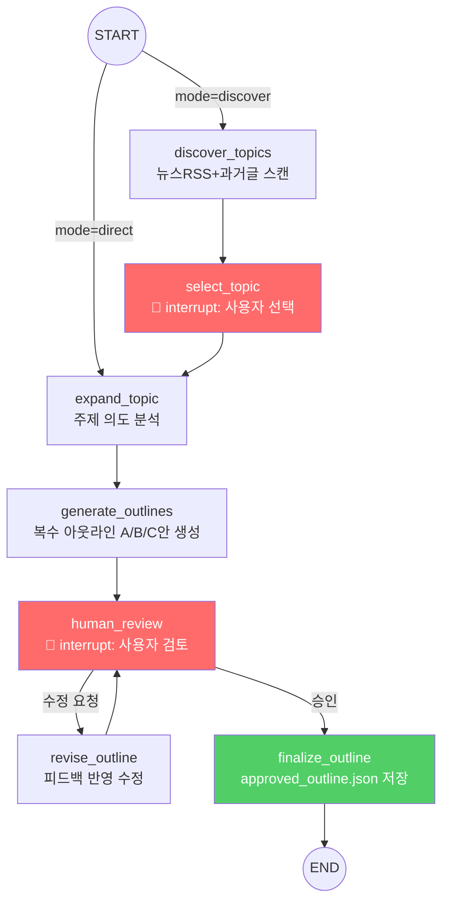
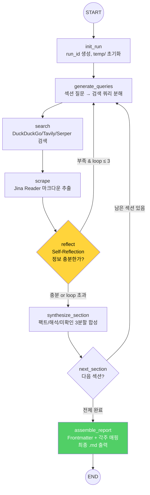

# ****LangGraph 에이전트 통합 설계서

> **작성일**: 2026-10-04
> **문서 버전**: v1.0
> **관련 문서**: [dls_design](./dls_design_20261003.md) · [topic_outline_agent_design](./topic_outline_agent_design_20261004.md) · [requirements](./requirements_20261003.md)

---

## 1. 전체 시스템 구조 — 2개의 LangGraph

전체 시스템은 **2개의 독립 LangGraph**로 구성한다.
각 그래프는 독립 실행이 가능하며, **approved_outline.json**을 매개로 느슨하게 결합된다.

```
┌──────────────────────────────────────────────────────────────┐
│                                                              │
│  Graph 1: TopicOutlineGraph                                  │
│  ─────────────────────────                                   │
│  역할: 주제 발굴 → 아웃라인 생성 → 인간 승인                    │
│  실행 주기: 사용자가 "새 리서치" 시작할 때 1회                   │
│                                                              │
│  discover_topics → expand_topic → generate_outlines          │
│       → human_review (interrupt) → finalize_outline          │
│                                                              │
│  출력: approved_outline.json                                  │
│                                                              │
└──────────────────────────┬───────────────────────────────────┘
                           │ approved_outline.json
                           ▼
┌──────────────────────────────────────────────────────────────┐
│                                                              │
│  Graph 2: DLSResearchGraph                                   │
│  ─────────────────────────                                   │
│  역할: 아웃라인 기반 실시간 검색 → 크롤링 → 반성 → 합성         │
│  실행 주기: 승인된 아웃라인 수신 후 자율 실행                    │
│                                                              │
│  generate_queries → search → scrape → reflect                │
│       ↻ (Self-Reflection 루프)                                │
│       → synthesize_section → (다음 섹션 루프) → assemble       │
│                                                              │
│  출력: final_report.md + temp/ 중간 산출물                     │
│                                                              │
└──────────────────────────────────────────────────────────────┘
```

### 왜 2개로 분리하는가?


| 이유                 | 설명                                                                    |
| :------------------- | :---------------------------------------------------------------------- |
| **실행 패턴이 다름** | Graph 1은 사람 대기(interrupt)가 필수, Graph 2는 승인 후 완전 자율 실행 |
| **독립 테스트**      | Graph 2만 단독으로 아웃라인 JSON을 넣어 테스트 가능                     |
| **재사용성**         | 같은 아웃라인으로 Graph 2를 검색 엔진만 바꿔 재실행 가능                |

---

## 2. Graph 1: TopicOutlineGraph — 주제 발굴 & 아웃라인 제안

### 2.1 State 정의

```python
from typing import TypedDict, Literal, Annotated
from langgraph.graph import add_messages

class TopicOutlineState(TypedDict):
    # ── 입력 ──
    user_input: str                          # 사용자 원문 입력 (키워드 or 문장)
    mode: Literal["discover", "direct"]      # 주제 발굴 모드 vs 직접 입력 모드

    # ── Topic Discovery ──
    news_headlines: list[dict]               # 수집된 뉴스 헤드라인
    past_reports: list[dict]                  # 과거 리포트 메타정보
    suggested_topics: list[dict]             # AI 추천 주제 리스트
    selected_topic: str                      # 사용자가 선택한 주제

    # ── Outline Generation ──
    topic_analysis: dict                     # 의도 분석 결과 (독자, 깊이, 논쟁점)
    outline_proposals: list[dict]            # 복수 아웃라인 안 (A/B/C)

    # ── Human Review ──
    human_feedback: str                      # 사용자 피드백 텍스트
    approved_outline: dict | None            # 최종 승인된 아웃라인

    # ── 메시지 히스토리 (대화형 수정용) ──
    messages: Annotated[list, add_messages]
```

### 2.2 노드 상세 설계

#### Node: `discover_topics`

```python
def discover_topics(state: TopicOutlineState) -> dict:
    """
    뉴스 RSS + 과거 리포트를 스캔하여 추천 주제 생성
    - Google News RSS 파싱 (API 키 불필요)
    - output/ 폴더의 과거 리포트 스캔 (선택)
    - LLM으로 클러스터링 → 주제 5~10개 추천
    """
    # 1. Google News RSS 수집
    headlines = fetch_google_news_rss(
        keywords=extract_keywords(state["user_input"]),
        max_per_keyword=15
    )

    # 2. 과거 리포트 분석 (있는 경우)
    past_reports = scan_past_reports("output/")

    # 3. LLM 주제 추천
    suggested = llm.generate(
        prompt=TOPIC_DISCOVERY_PROMPT.format(
            headlines=headlines,
            past_reports=past_reports,
            user_hint=state["user_input"]
        ),
        system_prompt="트렌드 분석가. 헤드라인을 클러스터링하고 가치 있는 리서치 주제를 제안."
    )

    return {
        "news_headlines": headlines,
        "past_reports": past_reports,
        "suggested_topics": parse_topics(suggested)
    }
```

#### Node: `select_topic` (Human Interrupt)

```python
from langgraph.types import interrupt

def select_topic(state: TopicOutlineState) -> dict:
    """
    사용자에게 추천 주제를 보여주고 선택을 받음
    LangGraph의 interrupt()로 실행을 중단하고 사용자 입력 대기
    """
    topics_display = format_topics_for_display(state["suggested_topics"])

    # ── interrupt: 사용자 선택 대기 ──
    selection = interrupt({
        "type": "topic_selection",
        "message": "아래 주제 중 하나를 선택하거나 직접 입력하세요.",
        "options": topics_display
    })

    return {"selected_topic": selection}
```

#### Node: `expand_topic`

```python
def expand_topic(state: TopicOutlineState) -> dict:
    """
    선택된 주제를 다각도로 분석
    - 대상 독자 추론
    - 리서치 깊이 판단
    - 핵심 논쟁점 파악
    """
    analysis = llm.generate(
        prompt=TOPIC_EXPANSION_PROMPT.format(
            topic=state["selected_topic"],
            user_input=state["user_input"]
        ),
        system_prompt="리서치 기획 전문가. 주제를 분석하여 최적의 리서치 프레임을 설계."
    )

    return {"topic_analysis": parse_analysis(analysis)}
```

#### Node: `generate_outlines`

```python
def generate_outlines(state: TopicOutlineState) -> dict:
    """
    서로 다른 관점의 아웃라인 2~3개를 생성
    각 아웃라인은 섹션별 target_questions + expected_takeaway 포함
    """
    outlines = llm.generate(
        prompt=OUTLINE_GENERATION_PROMPT.format(
            topic=state["selected_topic"],
            analysis=state["topic_analysis"]
        ),
        system_prompt="복수의 관점(비즈니스/기술/실무)에서 아웃라인을 제안."
    )

    return {"outline_proposals": parse_outlines(outlines)}
```

#### Node: `human_review` (Human Interrupt)

```python
def human_review(state: TopicOutlineState) -> dict:
    """
    복수 아웃라인을 사용자에게 제시 → 선택/수정/승인
    대화형으로 수정 요청을 반복할 수 있음
    """
    feedback = interrupt({
        "type": "outline_review",
        "message": "아웃라인을 검토하세요. 선택·수정 후 승인해주세요.",
        "proposals": state["outline_proposals"]
    })

    return {"human_feedback": feedback}
```

#### Node: `revise_outline`

```python
def revise_outline(state: TopicOutlineState) -> dict:
    """
    사용자 피드백을 반영하여 아웃라인 수정
    """
    revised = llm.generate(
        prompt=OUTLINE_REVISION_PROMPT.format(
            original=state["outline_proposals"],
            feedback=state["human_feedback"]
        )
    )
    return {"outline_proposals": parse_outlines(revised)}
```

#### Node: `finalize_outline`

```python
def finalize_outline(state: TopicOutlineState) -> dict:
    """
    승인된 아웃라인을 approved_outline.json 규격으로 변환·저장
    """
    approved = build_approved_outline(
        topic=state["selected_topic"],
        outline=state["outline_proposals"],
        analysis=state["topic_analysis"]
    )

    # JSON 파일 저장
    save_json(f"temp/{run_id}/approved_outline.json", approved)

    return {"approved_outline": approved}
```

### 2.3 Graph 구성 코드

```python
from langgraph.graph import StateGraph, START, END
from langgraph.checkpoint.memory import MemorySaver

# ── Graph 빌드 ──
topic_graph = StateGraph(TopicOutlineState)

# 노드 등록
topic_graph.add_node("discover_topics", discover_topics)
topic_graph.add_node("select_topic", select_topic)           # interrupt
topic_graph.add_node("expand_topic", expand_topic)
topic_graph.add_node("generate_outlines", generate_outlines)
topic_graph.add_node("human_review", human_review)           # interrupt
topic_graph.add_node("revise_outline", revise_outline)
topic_graph.add_node("finalize_outline", finalize_outline)

# ── 엣지 연결 ──

# 시작: 모드에 따라 분기
topic_graph.add_conditional_edges(
    START,
    lambda s: s["mode"],
    {
        "discover": "discover_topics",   # 주제 발굴 모드
        "direct": "expand_topic",        # 직접 입력 모드
    }
)

topic_graph.add_edge("discover_topics", "select_topic")
topic_graph.add_edge("select_topic", "expand_topic")
topic_graph.add_edge("expand_topic", "generate_outlines")
topic_graph.add_edge("generate_outlines", "human_review")

# Human Review 분기: 수정 요청 or 승인
topic_graph.add_conditional_edges(
    "human_review",
    route_human_feedback,        # "revise" | "approve"
    {
        "revise": "revise_outline",
        "approve": "finalize_outline",
    }
)

# 수정 후 다시 Human Review
topic_graph.add_edge("revise_outline", "human_review")

# 최종 승인 → 종료
topic_graph.add_edge("finalize_outline", END)

# ── 체크포인터 (interrupt 복원용) ──
checkpointer = MemorySaver()
topic_outline_app = topic_graph.compile(checkpointer=checkpointer)
```

### 2.4 Graph 시각화



---

## 3. Graph 2: DLSResearchGraph — 검색·크롤링·합성 자율 실행

### 3.1 State 정의

```python
from typing import TypedDict

class DLSState(TypedDict):
    # ── 입력 (Graph 1의 출력) ──
    topic: str
    outline: list[dict]                     # approved_outline.json의 sections
    config: dict                            # settings.yaml 로드 결과

    # ── 섹션 루프 제어 ──
    current_section_idx: int                # 현재 처리 중인 섹션 인덱스
    current_section: dict                   # 현재 섹션 데이터

    # ── Step 1: 쿼리 분해 ──
    queries: list[str]                      # 생성된 검색 쿼리 목록

    # ── Step 2: 실시간 검색 ──
    search_results: list[dict]              # URL + 스니펫 목록

    # ── Step 3: 웹 크롤링 ──
    scraped_pages: list[dict]               # 크롤링된 마크다운 원문

    # ── Step 4: Self-Reflection ──
    reflection_count: int                   # 현재 섹션의 반성 루프 횟수
    max_reflection_loops: int               # 최대 허용 루프 (기본 3)
    is_sufficient: bool                     # 정보 충분성 판단
    gap_description: str                    # 부족한 정보 설명
    sub_queries: list[str]                  # 추가 검색을 위한 서브 쿼리

    # ── Step 5: 합성 ──
    section_drafts: dict[str, str]          # 섹션별 완성된 마크다운 초안
    all_sources: list[dict]                 # 전체 출처 목록 (각주 매핑용)

    # ── 최종 출력 ──
    final_report: str                       # 최종 조립된 마크다운 리포트

    # ── 실행 메타데이터 ──
    run_id: str                             # 실행 고유 ID
    errors: list[dict]                      # 에러 로그
```

### 3.2 노드 상세 설계

#### Node: `init_run`

```python
def init_run(state: DLSState) -> dict:
    """
    실행 초기화: run_id 생성, temp 디렉토리 생성, 첫 번째 섹션 설정
    """
    run_id = f"run_{datetime.now().strftime('%Y%m%d_%H%M%S')}"
    os.makedirs(f"temp/{run_id}", exist_ok=True)

    # 승인된 아웃라인 저장
    save_json(f"temp/{run_id}/outline.json", state["outline"])

    return {
        "run_id": run_id,
        "current_section_idx": 0,
        "current_section": state["outline"][0],
        "reflection_count": 0,
        "max_reflection_loops": state["config"].get("max_reflection_loops", 3),
        "section_drafts": {},
        "all_sources": [],
        "errors": []
    }
```

#### Node: `generate_queries`

```python
def generate_queries(state: DLSState) -> dict:
    """
    Step 1: 현재 섹션의 질문을 다각도 검색 쿼리로 분해
    - 한국어 + 영어 혼합 쿼리 생성
    - 1차 출처(IR, 공시, 보도자료) 타겟팅 포함
    """
    section = state["current_section"]

    prompt = QUERY_DECOMPOSITION_PROMPT.format(
        topic=state["topic"],
        section_title=section["title"],
        target_questions="\n".join(section["target_questions"]),
        expected_takeaway=section.get("expected_takeaway", "")
    )

    # 반성 루프에서 재진입한 경우: 서브쿼리 우선 사용
    if state.get("sub_queries"):
        return {"queries": state["sub_queries"], "sub_queries": []}

    result = llm_query.generate(prompt=prompt, system_prompt=QUERY_GEN_SYSTEM)
    queries = parse_queries(result)

    # temp 저장
    save_json(f"temp/{state['run_id']}/queries/section_{section['section_id']}.json", queries)

    return {"queries": queries}
```

#### Node: `search`

```python
def search(state: DLSState) -> dict:
    """
    Step 2: 생성된 쿼리로 실시간 웹 검색 수행
    - SearchProvider 인터페이스 (DDG/Tavily/Serper) 사용
    - 쿼리당 상위 10개 결과
    """
    search_provider = get_search_provider(state["config"])
    all_results = []

    for query in state["queries"]:
        try:
            results = search_provider.search(query, max_results=10)
            all_results.extend(results)
        except Exception as e:
            state["errors"].append({"step": "search", "query": query, "error": str(e)})

    # 중복 URL 제거 + 관련도 정렬
    deduplicated = deduplicate_and_rank(all_results)

    # temp 저장
    section_id = state["current_section"]["section_id"]
    save_json(
        f"temp/{state['run_id']}/search_results/{section_id}_loop{state['reflection_count']}.json",
        deduplicated
    )

    return {"search_results": deduplicated}
```

#### Node: `scrape`

```python
def scrape(state: DLSState) -> dict:
    """
    Step 3: 검색 결과 상위 URL을 방문하여 마크다운 원문 추출
    - 쿼리당 상위 3개 URL 크롤링 (설정으로 변경 가능)
    - 실패 시 스킵 + 에러 로그
    """
    scraper = get_scraper_provider(state["config"])
    urls_per_query = state["config"].get("urls_per_query", 3)

    top_urls = state["search_results"][:urls_per_query * len(state["queries"])]
    scraped = []

    for result in top_urls:
        try:
            page = scraper.scrape(result["url"])
            if page.status == "success":
                scraped.append(page)
                # temp 저장
                url_hash = hashlib.md5(result["url"].encode()).hexdigest()[:12]
                save_text(f"temp/{state['run_id']}/scraped_pages/{url_hash}.md", page.markdown_content)
        except Exception as e:
            state["errors"].append({"step": "scrape", "url": result["url"], "error": str(e)})

    return {"scraped_pages": scraped}
```

#### Node: `reflect`

```python
def reflect(state: DLSState) -> dict:
    """
    Step 4: Self-Reflection — 수집된 정보의 충분성 자율 평가
    - 핵심 수치 존재 여부
    - 출처 다양성
    - 시점 최신성
    - 부족 시 gap_description + sub_queries 생성
    """
    section = state["current_section"]
    evidence_summary = compile_evidence(state["scraped_pages"])

    result = llm_reflect.generate(
        prompt=REFLECTION_PROMPT.format(
            section_title=section["title"],
            target_questions="\n".join(section["target_questions"]),
            evidence=evidence_summary,
            loop_count=state["reflection_count"]
        ),
        system_prompt=REFLECTION_SYSTEM
    )

    reflection = parse_reflection(result)

    # 반성 로그 temp 저장
    save_json(
        f"temp/{state['run_id']}/reflections/{section['section_id']}_loop{state['reflection_count']}.json",
        reflection
    )

    return {
        "is_sufficient": reflection["sufficient"],
        "gap_description": reflection.get("gap_description", ""),
        "sub_queries": reflection.get("sub_queries", []),
        "reflection_count": state["reflection_count"] + 1
    }
```

#### Node: `synthesize_section`

```python
def synthesize_section(state: DLSState) -> dict:
    """
    Step 5: 현재 섹션의 최종 마크다운 합성
    - 팩트/해석/미확인 3분할 구조
    - 인라인 각주 [^n] 매핑
    """
    section = state["current_section"]
    evidence = compile_evidence(state["scraped_pages"])

    draft = llm_synth.generate(
        prompt=SYNTHESIS_PROMPT.format(
            section_title=section["title"],
            target_questions="\n".join(section["target_questions"]),
            expected_takeaway=section.get("expected_takeaway", ""),
            evidence=evidence
        ),
        system_prompt=SYNTHESIS_SYSTEM
    )

    # 출처 수집
    sources = extract_sources(state["scraped_pages"])

    # temp 저장
    save_text(f"temp/{state['run_id']}/drafts/{section['section_id']}.md", draft)

    updated_drafts = dict(state["section_drafts"])
    updated_drafts[section["section_id"]] = draft

    updated_sources = list(state["all_sources"]) + sources

    return {
        "section_drafts": updated_drafts,
        "all_sources": updated_sources
    }
```

#### Node: `next_section`

```python
def next_section(state: DLSState) -> dict:
    """
    다음 섹션으로 이동. 상태 초기화 (쿼리, 검색결과, 반성 카운터)
    """
    next_idx = state["current_section_idx"] + 1
    outline = state["outline"]

    if next_idx < len(outline):
        return {
            "current_section_idx": next_idx,
            "current_section": outline[next_idx],
            "queries": [],
            "search_results": [],
            "scraped_pages": [],
            "reflection_count": 0,
            "is_sufficient": False,
            "gap_description": "",
            "sub_queries": []
        }
    else:
        return {}  # 모든 섹션 완료
```

#### Node: `assemble_report`

```python
def assemble_report(state: DLSState) -> dict:
    """
    전체 섹션 초안 + 각주 매핑 → 최종 마크다운 리포트 조립
    Frontmatter 메타데이터 포함
    """
    frontmatter = build_frontmatter(state)
    body_sections = []

    for section in state["outline"]:
        sid = section["section_id"]
        if sid in state["section_drafts"]:
            body_sections.append(state["section_drafts"][sid])

    footnotes = build_footnotes(state["all_sources"])

    final = f"{frontmatter}\n\n{'---'.join(body_sections)}\n\n{footnotes}"

    # 최종 리포트 저장
    report_path = f"output/{state['topic'][:30]}_{state['run_id']}.md"
    save_text(report_path, final)

    return {"final_report": final}
```

### 3.3 조건 분기 함수

```python
def should_continue_searching(state: DLSState) -> str:
    """
    Reflection 결과에 따른 분기 판단
    - 충분 → synthesize_section
    - 부족 & 루프 여유 → generate_queries (재검색)
    - 부족 & 루프 초과 → synthesize_section (강제 합성)
    """
    if state["is_sufficient"]:
        return "sufficient"

    if state["reflection_count"] >= state["max_reflection_loops"]:
        # 최대 루프 도달 → 가진 정보로 강제 합성
        return "sufficient"

    return "insufficient"


def has_more_sections(state: DLSState) -> str:
    """
    다음 섹션 존재 여부 판단
    """
    next_idx = state["current_section_idx"] + 1
    if next_idx < len(state["outline"]):
        return "more"
    return "done"
```

### 3.4 Graph 구성 코드

```python
from langgraph.graph import StateGraph, START, END

# ── Graph 빌드 ──
dls_graph = StateGraph(DLSState)

# 노드 등록
dls_graph.add_node("init_run", init_run)
dls_graph.add_node("generate_queries", generate_queries)
dls_graph.add_node("search", search)
dls_graph.add_node("scrape", scrape)
dls_graph.add_node("reflect", reflect)
dls_graph.add_node("synthesize_section", synthesize_section)
dls_graph.add_node("next_section", next_section)
dls_graph.add_node("assemble_report", assemble_report)

# ── 엣지 연결 ──
dls_graph.add_edge(START, "init_run")
dls_graph.add_edge("init_run", "generate_queries")
dls_graph.add_edge("generate_queries", "search")
dls_graph.add_edge("search", "scrape")
dls_graph.add_edge("scrape", "reflect")

# Reflection 조건 분기
dls_graph.add_conditional_edges(
    "reflect",
    should_continue_searching,
    {
        "insufficient": "generate_queries",     # 부족 → 재검색
        "sufficient": "synthesize_section",      # 충분 → 합성
    }
)

# 섹션 루프
dls_graph.add_edge("synthesize_section", "next_section")
dls_graph.add_conditional_edges(
    "next_section",
    has_more_sections,
    {
        "more": "generate_queries",    # 다음 섹션
        "done": "assemble_report",     # 전체 완료
    }
)

dls_graph.add_edge("assemble_report", END)

# ── 컴파일 ──
dls_research_app = dls_graph.compile()
```

### 3.5 Graph 시각화



---

## 4. 두 Graph 연결 — 실행 진입점

```python
# main.py — 전체 파이프라인 실행 진입점

import asyncio

async def run_full_pipeline(user_input: str, mode: str = "discover"):
    """
    Phase 1: Topic & Outline (사용자 대화)
    Phase 2: DLS Research (자율 실행)
    """

    # ── Phase 1: 주제 & 아웃라인 ──
    config_1 = {
        "configurable": {"thread_id": f"session_{uuid4().hex[:8]}"}
    }

    result_1 = await topic_outline_app.ainvoke(
        {
            "user_input": user_input,
            "mode": mode,
            "messages": []
        },
        config=config_1
    )

    approved_outline = result_1["approved_outline"]
    print(f"✅ 아웃라인 승인 완료: {len(approved_outline['sections'])}개 섹션")

    # ── Phase 2: DLS 리서치 ──
    settings = load_yaml("config/settings.yaml")

    result_2 = await dls_research_app.ainvoke({
        "topic": approved_outline["topic"],
        "outline": approved_outline["sections"],
        "config": settings
    })

    print(f"✅ 리포트 생성 완료")
    return result_2["final_report"]


# --- 단축 실행: 아웃라인을 이미 가지고 있는 경우 ---
async def run_dls_only(outline_path: str):
    """
    Graph 2만 단독 실행 (이미 승인된 아웃라인이 있는 경우)
    """
    outline = load_json(outline_path)
    settings = load_yaml("config/settings.yaml")

    result = await dls_research_app.ainvoke({
        "topic": outline["topic"],
        "outline": outline["sections"],
        "config": settings
    })

    return result["final_report"]
```

---

## 5. 프로젝트 디렉토리 구조

```
c_1003_dyanmic_research/
├── docs/                                    ← 설계 문서
│   ├── project_overview_20261003.md
│   ├── requirements_20261003.md
│   ├── dls_design_20261003.md
│   ├── topic_outline_agent_design_20261004.md
│   ├── langgraph_design_20261004.md         ← 본 문서
│   └── summary_20261004.md
│
├── src/                                     ← 소스 코드
│   ├── providers/                           ← Provider 인터페이스 & 구현체
│   │   ├── __init__.py
│   │   ├── search.py                        ← DuckDuckGo, Tavily, Serper
│   │   ├── scraper.py                       ← Jina Reader
│   │   └── llm.py                           ← Ollama, Gemini, OpenAI
│   │
│   ├── graphs/                              ← LangGraph 그래프 정의
│   │   ├── __init__.py
│   │   ├── topic_outline_graph.py           ← Graph 1: TopicOutlineGraph
│   │   ├── dls_research_graph.py            ← Graph 2: DLSResearchGraph
│   │   └── states.py                        ← State 타입 정의
│   │
│   ├── nodes/                               ← 각 노드의 구현 함수
│   │   ├── __init__.py
│   │   ├── topic_discovery.py               ← discover_topics, select_topic
│   │   ├── outline_generator.py             ← expand_topic, generate_outlines
│   │   ├── query_generator.py               ← generate_queries
│   │   ├── searcher.py                      ← search
│   │   ├── scraper.py                       ← scrape
│   │   ├── reflector.py                     ← reflect
│   │   ├── synthesizer.py                   ← synthesize_section
│   │   └── assembler.py                     ← assemble_report
│   │
│   ├── prompts/                             ← 프롬프트 템플릿
│   │   ├── query_decomposition.py
│   │   ├── reflection.py
│   │   ├── synthesis.py
│   │   └── topic_discovery.py
│   │
│   ├── utils/                               ← 유틸리티
│   │   ├── file_io.py                       ← JSON/YAML/MD 읽기쓰기
│   │   └── dedup.py                         ← URL 중복제거, 해시 등
│   │
│   └── main.py                              ← 실행 진입점
│
├── config/
│   ├── settings.yaml                        ← Provider 설정
│   └── .env.example                         ← API 키 템플릿
│
├── temp/                                    ← 실행별 중간 결과물
│   └── {run_id}/
│
├── output/                                  ← 최종 리포트 출력
│
├── tests/                                   ← 테스트
│   ├── test_providers.py
│   ├── test_graph_1.py
│   └── test_graph_2.py
│
└── requirements.txt
```

---

## 6. 핵심 의존성

```
# requirements.txt
langgraph>=0.4.0
langchain-core>=0.3.0
pydantic>=2.0
duckduckgo-search>=6.0
requests>=2.31
pyyaml>=6.0
feedparser>=6.0         # Topic Discovery (뉴스 RSS)
python-dotenv>=1.0      # .env 파일 로드
```

---

## 7. 구현 로드맵


|    Phase    | 작업                                              | 산출물                                      | 예상 기간 |
| :---------: | :------------------------------------------------ | :------------------------------------------ | :-------: |
| **Phase 1** | Provider 모듈 구현 + 단위 테스트                  | `src/providers/`, `tests/test_providers.py` |    1일    |
| **Phase 2** | Graph 2 (DLS) 구현 + 단일 섹션 E2E 테스트         | `src/graphs/dls_research_graph.py`          |    2일    |
| **Phase 3** | Graph 1 (Topic & Outline) 구현 + interrupt 테스트 | `src/graphs/topic_outline_graph.py`         |    1일    |
| **Phase 4** | 두 Graph 연결 + 전체 E2E 파이프라인 테스트        | `src/main.py`                               |    1일    |
| **Phase 5** | Topic Discovery 뉴스 RSS 연동                     | `src/nodes/topic_discovery.py`              |   0.5일   |

> **다음 단계**: Phase 1 — `src/providers/` 디렉토리 생성 및 SearchProvider (DDG) 구현 착수
