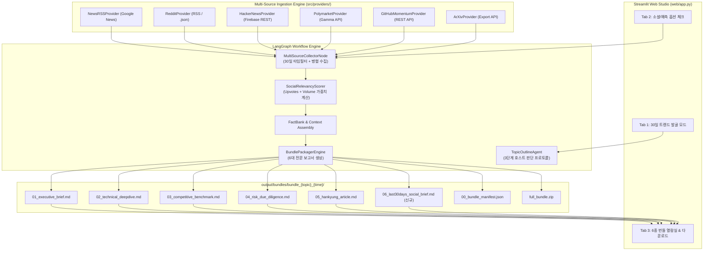

# 요건정의서 — `last30days-skill` 기반 소셜·예측시장 인텔리전스 확장 (Social & Prediction Market Intelligence Integration)

> **문서 버전**: v1.0  
> **작성일자**: 2026-10-06  
> **상태**: 구현 승인 및 요건 확정 (Approved for Implementation)  
> **관련 프로젝트**: `c_1003_dynamic_research`  
> **벤치마크 리포지토리**: [mvanhorn/last30days-skill](https://github.com/mvanhorn/last30days-skill)  
> **관련 문서**:  
> - [docs/multi_report_generation_requirements_20261005.md](file:///Users/boon/Dropbox/03_code/c_1003_dynamic_research/docs/multi_report_generation_requirements_20261005.md) (다각화 보고서 요건정의서)  
> - [docs/report_taxonomies_and_expansion_20261005.md](file:///Users/boon/Dropbox/03_code/c_1003_dynamic_research/docs/report_taxonomies_and_expansion_20261005.md) (보고서 분류 체계)  
> - [docs/hankyung_article_generation_requirements_20261006.md](file:///Users/boon/Dropbox/03_code/c_1003_dynamic_research/docs/hankyung_article_generation_requirements_20261006.md) (한경 기사 요건정의서)  
> - [docs/ask.md](file:///Users/boon/Dropbox/03_code/c_1003_dynamic_research/docs/ask.md) (프로젝트 질의응답 히스토리)  

---

## 1. 추진 배경 및 목적

### 1.1 배경: 전통 언론 데이터의 한계
현재 DLS(Dynamic Live Search) 시스템은 Google News RSS, DuckDuckGo 뉴스 웹 검색, 한국경제 기사 아카이브(`/Users/boon/a_0504_hanky/articles`)를 통해 고품질의 팩트를 수집·검증하고 있습니다.

그러나 **전통 언론사 및 포털 검색 기반 리서치는 다음과 같은 본질적 맹점**을 지닙니다:
1. **PR 배포자료 편향 (PR Bias)**: 언론 기사는 기업 홍보실(PR)의 공식 보도자료에 크게 의존하여 실제 제품의 치명적 결함, 사용자 불만, 개발자 현장 평가를 은폐하기 쉽습니다.
2. **보도 시점의 후행성 (Lagged Information)**: 기술/시장 트렌드가 커뮤니티(Hacker News, Reddit, GitHub, X)에서 폭발하고 2~4주가 지난 후에야 기사화됩니다.
3. **군중 확신도(Conviction)의 부재**: 전문가 개인의 의견만 나열될 뿐, 실제 돈이 걸린 베팅 시장(Prediction Market)이나 수천 명의 엔지니어 집단지성 추천(Upvotes)에 기반한 확률적 검증이 불가능합니다.

### 1.2 `last30days-skill`의 핵심 철학과 혁신
`mvanhorn/last30days-skill`은 다음 선언으로 시작합니다:
> **"Google aggregates editors. /last30days searches people, scored by upvotes, likes, and real money."**  
> (구글은 편집장을 집계하지만, last30days는 추천수·좋아요·실제 돈으로 채점된 진짜 사람들을 검색한다.)

- **시간의 엄격성 (Strict 30-Day Window)**: 지난 30일 이내에 발생한 데이터만을 엄격하게 타임스탬프 필터링하여 SEO 낚시성 고전 문서나 2023년 데이터의 오염을 차단.
- **다중 소셜 & 예측 시장 병렬 수집**: Reddit, Hacker News, Polymarket(예측시장 오즈 및 거래대금), GitHub(PR 속도/스타 모멘텀), arXiv(30일 신규 논문), X/Twitter, YouTube 트랜스크립트.
- **군중 참여도 가중치 랭킹 (Social Relevancy Ranking)**: 단순 키워드 유사도가 아닌, 실제 엔지니어 추천수(Upvotes/Points), 베팅 자본금($ Volume)을 기반으로 팩트의 가중치를 계산.
- **생생한 육성 인용 (Weaving Community Voice)**: 툴 내부의 메타 동작을 장황하게 설명하지 않고, 실제 커뮤니티 작성자(`u/name`, `@handle`)의 위트 있고 날카로운 한줄평을 본문에 유기적으로 결합.

### 1.3 목적
`last30days-skill`의 소셜·예측시장 인텔리전스 수집 엔진 및 랭킹 알고리즘을 DLS 플랫폼에 이식하여:
1. **Tab 1 주제 발굴 기능 혁신**: 언론 보도 전 폭발 직전의 트렌드를 감지하는 **"30일 급상승 폭발 주제 발굴 모드 (Velocity-Ranked Discovery)"** 제공.
2. **기존 5대 보고서 번들의 질적 도약**: 정량 수치 표에 Polymarket 확률 및 GitHub 엔지니어링 모멘텀을 주입.
3. **신규 6호 전문 보고서 신설**: **`06_last30days_social_brief.md` (소셜 & 예측시장 여론 브리프)** 자동 발행.

---

## 2. 벤치마크 분석: `last30days-skill` 핵심 메커니즘

| 기능 축 | `last30days-skill` 구현 방식 | DLS 플랫폼 적용 방향 |
|---|---|---|
| **수집 원천** | Reddit, HN, Polymarket, GitHub, arXiv, Digg, Techmeme, X, YouTube | **Keyless 무료 API 우선 연동** (Reddit RSS/JSON, HN Firebase, Polymarket Gamma API, GitHub API, arXiv API) |
| **시간 창 (Time-box)** | 30일 절대 상한선 (`synced YYYY-MM-DD`) | `published_at >= now - 30d` 하드 제약 필터 적용 |
| **랭킹 메커니즘** | $Score = f(\text{Upvotes}, \text{Comments}, \text{USD Volume})$ | **소셜 인게이지먼트 복합 가중 스코어러 (Social Relevancy Scorer)** |
| **발굴 모드 (Discovery)** | 3단계 프로토콜 (Nominate → Judge → Finalize) | **Tab 1: AI Topic Discovery에 "30일 급상승 트렌드 모드" 통합** |
| **인용 원칙 (Voice/LAW)** | 인라인 하이퍼링크, 상위 코멘트 2건 이상 직접 인용, 툴 메타서술 금지 | DLS 합성 프롬프트에 커뮤니티 육성 및 예측 오즈 인용 지침 하달 |
| **메모리 저장소** | 로컬 SQLite (`research.db`) + FTS5 검색 | 기존 DLS `output/` 매니페스트 및 JSON 벡터 DB와 상호 보완 |

---

## 3. 기능 요건 정의 (Functional Requirements)

### [영역 1] 멀티플랫폼 소셜·예측 데이터 수집 엔진 (Ingestion Engine)

#### FR-L30-01. Reddit & Hacker News 실시간 커뮤니티 수집기
* **설명**: 고비용 유료 API 키 없이도 동작하는 키리스(Keyless) 수집기 구현.
* **상세 규격**:
  * **Hacker News**: Firebase Public REST API (`https://hacker-news.firebaseio.com/v0/`) 및 Algolia Search API 연동.
    * 30일 이내 등록된 스토리 중 점수(`score >= 50`) 및 댓글 수 상위 20개 추출.
    * 최상위 추천 댓글(Top comments with high points) 추출.
  * **Reddit**: 공식 Search RSS 피드 및 `.json` 엔드포인트 파싱.
    * 관련 서브레딧(r/technology, r/artificial, r/stocks, r/LocalLLaMA, r/Semiconductor 등) 필터링.
    * 추천수(`ups`), 댓글 수(`num_comments`), 상위 추천 댓글 본문 수집.

#### FR-L30-02. Polymarket 예측시장 오즈 & 거래량 수집기
* **설명**: 세계 최대 탈중앙화 예측 시장 Polymarket의 공개 Gamma API (`https://gamma-api.polymarket.com/events`) 연동.
* **상세 규격**:
  * 리서치 주제 관련 활성 마켓(Active Markets) 자동 매칭.
  * 이벤트별 **실시간 베팅 성공 확률(Odds %)** 및 **누적 거래대금($ Volume)** 추출.
  * 예: "Nvidia Rubin ships in 2026: 74% (Volume: $1,240,000)", "Fed rate cut in next meeting: 68% (Volume: $45,000,000)".

#### FR-L30-03. GitHub 엔지니어링 모멘텀 수집기
* **설명**: 기술·소프트웨어·오픈소스 AI 주제에 대한 실질 개발 가속도 추적.
* **상세 규격**:
  * GitHub Public REST API (`api.github.com/search/repositories`) 연동.
  * 최근 30일 스타 증가율(`stars_in_30d`), 커밋 빈도, 최근 릴리즈(Release Notes), 해결된 이슈/PR 수집.

#### FR-L30-04. arXiv 최신 논문 수집기
* **설명**: 30일 이내에 arXiv에 등록된 프리프린트 논문 메타데이터 수집.
* **상세 규격**:
  * arXiv Open API (`export.arxiv.org/api/query`) 연동.
  * 논문 제목, 저자, 발표일, 요약문(Abstract), PDF 링크 수집.

---

### [영역 2] 30일 시계열 필터링 및 소셜 인게이지먼트 랭킹 (Scoring Layer)

#### FR-L30-05. 엄격한 30일 시계열 한정 (30-Day Bounded Filter)
* **설명**: 수집된 모든 기사, 포스트, 코멘트, 마켓 데이터의 `published_at` 또는 `created_at` 타임스탬프를 검증.
* **규격**:
  $$\text{Timestamp} \ge \text{Execution\_Date} - 30\text{ days}$$
  기준을 충족하지 못하는 과거 문서는 즉각 배제하여 최신성 보장.

#### FR-L30-06. 소셜 인게이지먼트 복합 가중치 랭킹 (Social Relevancy Scorer)
* **설명**: 검색 엔진의 단순 텍스트 유사도(TF-IDF/Vector Distance)를 넘어서 대중의 참여도(Engagement)를 점수화.
* **산출 공식**:
  $$\text{Score} = w_{\text{sim}} \cdot S_{\text{semantic}} + w_{\text{reddit}} \cdot \log(1 + \text{Upvotes}) + w_{\text{hn}} \cdot \log(1 + \text{Points}) + w_{\text{poly}} \cdot \log(1 + \text{Volume}_{\text{USD}}) + \text{Decay}(\Delta t)$$
* **결과 산출**: 점수 상위 팩트와 베스트 코멘트를 `Ranked Evidence Clusters`로 구조화.

---

### [영역 3] Tab 1 주제 발굴 기능 혁신: 30일 급상승 폭발 주제 발굴 모드

#### FR-L30-07. 미디어 보도 전 폭발 직전 트렌드 감지 (Pre-Media Breakout Discovery)
* **설명**: 기존 Tab 1의 뉴스 헤드라인 기반 추천을 넘어서, Hacker News / Reddit / GitHub / arXiv를 아우르는 **"30일 급상승 폭발 주제 발굴 모드"**를 추가.
* **3단계 호스트 판단 프로토콜 (Host-Judged 3-Command Protocol)**:
  1. **1단계 (Nominate)**: HN 베스트, Reddit 인기 스레드, arXiv 최신작을 스윕하여 10~20개 후보군 선정.
  2. **2단계 (Judge)**: 노이즈/스팸 필터링, 엔터티 이름 정제, 콘텐츠 가치(Content-worthiness) 채점.
  3. **3단계 (Finalize & Angles)**: 성장 가속도(Velocity) 순위화 및 3대 콘텐츠 앵글 자동 생성:
     * **핵심 대립각 (Debate/Conflict)**: 개발자/투자자 간 찬반 격론 쟁점
     * **팟캐스트/유튜브 토론 앵글**: 구어체 대담용 논점
     * **한경 심층 기획 기사 앵글**: 비즈니스 파급 효과 및 주가/산업 영향 분석

---

### [영역 4] 기존 5대 보고서 번들 고도화 및 신규 6호 번들 신설

#### FR-L30-08. 기존 5대 보고서 번들 내 소셜·예측 인텔리전스 주입
1. **01. 경영진 전략 1-Pager (`01_executive_brief.md`)**:
   * 섹션 2 '핵심 정량 지표'에 **Polymarket 예측 확률 및 거래대금(Market Conviction)** 반영.
   * 언론 PR과 실제 시장 베팅 확률 간 괴리(Variant Perception) 경영진 보고.
2. **02. 심층 기술·산업 보고서 (`02_technical_deepdive.md`)**:
   * GitHub 30일 PR 모멘텀 및 arXiv 신규 논문 분석 반영.
   * 엔지니어들이 Reddit/HN에서 지적한 실제 현장 병목(Engineering Bottlenecks) 상세 수록.
3. **03. 경쟁사 벤치마크 매트릭스 (`03_competitive_benchmark.md`)**:
   * '커뮤니티 평판 및 실사용자 선호도(Community Verdict)' 비교 축 추가.
   * r/LocalLLaMA, r/MachineLearning 등 실제 사용자 투표 결과 대조.
4. **04. 리스크 진단 & Due-Diligence (`04_risk_due_diligence.md`)**:
   * 소셜 미디어 내 불만(Backlash), 폭로(Silent Bugs), 집단 소송 조짐, 부정적 Polymarket 오즈를 리스크 체크리스트로 편성.
5. **05. 한경 심층 기획 기사 (`05_hankyung_article.md`)**:
   * 기사 본문에 월가 전문가 코멘트뿐 아니라 **"현장 개발자 및 시장 참여자의 생생한 반응"**을 직접 인용구로 서술 (`u/engineer_lee는 '...'라고 지적했습니다`).

#### FR-L30-09. 신규 6호 전용 보고서 신설: `06_last30days_social_brief.md`
* **파일 명칭**: `06_last30days_social_brief.md`
* **아이콘 및 표시명**: `🌐 6. 소셜 & 예측시장 여론 브리프 (Social & Prediction Brief)`
* **표준 구조**:
  ```markdown
  # 🌐 [Social & Prediction Intelligence] {topic}
  > **최근 30일 집단지성 분석: 추천수, 예측시장 오즈, 개발자 합의**  
  > *조사 기준일: 2026-10-06 (최근 30일 윈도우 엄격 적용)*

  ## 1. 🎲 예측 시장(Polymarket) 실거래 확률 & 시장 컨센서스
  | 예측 마켓 질문 | 베팅 확률 (Odds) | 30일 누적 거래대금 | 시장의 확신도 평가 |
  |---|---|---|---|
  | {마켓 A} | **{XX}%** | ${XXX,XXX} | 강한 확신 (High Conviction) |

  ## 2. 👥 커뮤니티 합의(Consensus) vs 회의론(Bearish Sentiment)
  ### 🟢 군중 지지 논리 (The Bull Consensus)
  - {Reddit/HN 상위 추천 논거 요약}

  ### 🔴 현장 회의론 및 불만 (The Practitioner Skepticism)
  - {실사용자가 지적하는 한계와 버그}

  ## 3. 💬 화제의 베스트 한줄평 (Top Attributed Community Takes)
  1. **u/{작성자}** (r/{서브레딧}, {XXX} upvotes):
     > "{실제 인용 코멘트 원문/번역}"
  2. **@{트위터핸들}** ({XXX} likes):
     > "{실제 인용 코멘트}"

  ## 4. 📈 30일 엔지니어링 & 관심도 모멘텀 (Velocity Metrics)
  - **GitHub 속도**: 최근 30일 신규 스타 +{XXX}개, PR 머지율 {XX}%
  - **Hacker News 토론 지수**: 관련 스레드 총 {XX}개, 누적 댓글 {XXX}개
  - **종합 시사점**: 언론 보도 대비 실제 현장 온도는 {과열 / 냉정 / 잠복기} 상태임.
  ```

---

### [영역 5] Web UI (Streamlit) 확장 사양

#### FR-L30-10. Tab 1 주제 발굴 UI 확장
* **추가 컨트롤**: `[라디오 버튼] 주제 발굴 모드 선택`:
  * 🔘 `표준 뉴스 기반 발굴 (Google News RSS)`
  * 🔘 `🔥 30일 급상승 폭발 트렌드 발굴 (last30days Multi-Source)`
* **결과 표시**: 30일 급상승 모드 선택 시 **모멘텀 지수(Velocity)**, **추천수(Upvotes)**, **3대 앵글(대립각/팟캐스트/기사)** 카드 형태로 출력.

#### FR-L30-11. Tab 2 리서치 실행 UI 확장
* **옵션 토글**: `[체크박스] 🌐 최근 30일 소셜(Reddit/HN) 및 예측시장(Polymarket) 데이터 통합 수집`
* 활성화 시 리서치 노드에서 소셜 파이프라인이 병렬 실행되어 Fact Bank에 병합.

#### FR-L30-12. Tab 3 보고서 번들 뷰어 확장
* 서브탭에 **`🌐 6. 소셜·예측 브리프`** 추가 (총 6개 탭 구성).
* `00_bundle_manifest.json` 및 `full_bundle.zip`에 6개 보고서가 일괄 패키징되도록 연동.

---

## 4. 시스템 아키텍처 및 데이터 흐름 설계



---

## 5. 비기능 요건 (Non-Functional Requirements)

1. **무비용 및 키리스 기본 원칙 (Zero-Cost / Keyless by Default)**:
   * 유료 구독(X Pro API 등)이 없어도 시스템의 100% 기능이 동작하도록 설계.
   * Reddit RSS, Hacker News Firebase, Polymarket Public Gamma, arXiv, GitHub Public은 별도 과금 없이 즉시 사용 가능한 엔드포인트를 기본으로 채택.
2. **엄격한 툴 메타서술 금지 (No Tool-Narrative / LAW 9 준수)**:
   * 생성된 보고서 문장에 "검색 결과에 따르면", "last30days 엔진이 수집한 바에 따르면", "X 컬럼은 노이즈였으나"와 같은 시스템 내부 동작 서술을 엄격히 배제하고 사실(Fact)과 사람들의 의견 자체만을 서술.
3. **인용 신뢰도 및 출처 명시 (Verbatim Attribution)**:
   * 커뮤니티 코멘트 인용 시 임의로 글을 지어내지 않고, 실제 수집된 본문과 작성자 ID(`u/username`, `@handle`)를 정확히 매핑.
4. **회복 탄력성 (Graceful Degradation)**:
   * 특정 외부 소스(예: Polymarket에 관련 토픽 없음, Reddit 접속 지연 등)가 비어있더라도 전체 파이프라인이 중단되지 않고 가용 소스만으로 브리프를 완성.

---

## 6. 단계별 구현 로드맵 (Phased Roadmap)

| 단계 | 추진 과제 | 상세 내역 | 산출물 |
|---|---|---|---|
| **Phase 1** | **수집기 모듈 구축** | Reddit RSS, HN Firebase, Polymarket Gamma API 프로바이더 구현 | `src/providers/social_providers.py` |
| **Phase 2** | **프롬프트 & 번들 확장** | 소셜 브리프 프롬프트 작성 및 번들 패키저 6종 확장 | `src/prompts/bundle_prompts.py`<br/>`src/utils/bundle_packager.py` |
| **Phase 3** | **Tab 1 발굴 모드 통합** | 30일 급상승 트렌드 발굴 노드 및 3단계 프로토콜 구현 | `src/nodes/topic_nodes.py` |
| **Phase 4** | **Streamlit UI 연동 & 검증** | 웹 UI 6개 서브탭, 토글 스위치, 단위 테스트 작성 | `web/app.py`<br/>`tests/unit/test_last30days_integration.py` |

---

## 7. 기대 효과

1. **언론 PR 필터를 걷어낸 '날것의 팩트(Raw Truth)' 확보**:
   * 기업의 일방적 홍보를 넘어 현장 엔지니어와 사용자의 생생한 목소리를 반영.
2. **자본 기반 예측 시장(Polymarket) 데이터의 리서치 도입**:
   * 전문가의 막연한 전망 대신 실제 돈이 걸린 거래 확률과 거래대금을 C-Level 및 투자자에게 보고.
3. **독보적인 6종 인텔리전스 완결 번들 완성**:
   * 전략(경영진 1-Pager), 엔지니어링(기술 심층), 경쟁(벤치마크), 컴플라이언스(리스크 DD), 대중 미디어(한경 기사), **여론·예측(소셜 & 예측시장 브리프)**의 완전체 인텔리전스 체계 확립.
