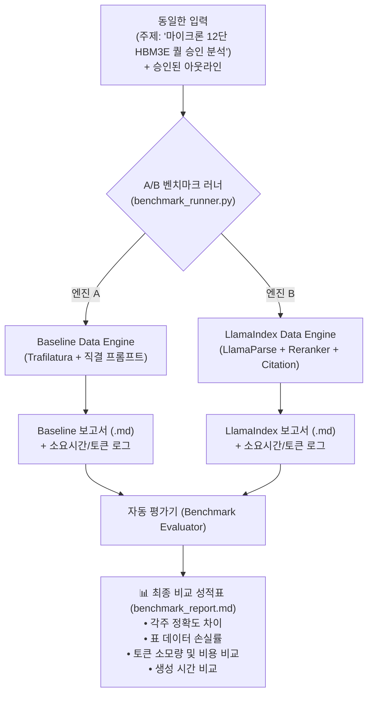

# LlamaIndex 도입 검토 및 A/B 성능 벤치마킹 설계서

> **작성일**: 2026-10-04  
> **문서 버전**: v1.1 (심층 상세화 및 테스트 하네스 구현 코드 포함)  
> **프로젝트**: `c_1003_dynamic_research`  
> **관련 문서**: [Dynamic Live Search 설계서](file:///Users/boon/Dropbox/03_code/c_1003_dynamic_research/docs/dls_design_20261003.md), [DLS vs Agentic RAG 비교](file:///Users/boon/Dropbox/03_code/c_1003_dynamic_research/docs/dls_vs_agentic_rag_20261004.md), [LangGraph 통합 설계서](file:///Users/boon/Dropbox/03_code/c_1003_dynamic_research/docs/langgraph_design_20261004.md)

---

## 1. LlamaIndex 도입의 전략적 역할 및 기대 효과

### 1.1 LangGraph + LlamaIndex 분업 모델의 핵심 원칙
현재 프로젝트의 워크플로우 제어는 이미 **LangGraph(상태 머신, 인간 인터럽트, 멀티스텝 탐색 루프)**로 완벽하게 설계되어 있습니다. 
따라서 LlamaIndex를 도입하더라도 오케스트레이션(에이전트 제어 흐름)을 대체하는 것이 아니라, **"수집된 비정형 웹/문서 데이터를 정밀 가공·검색·인용하는 전용 데이터 엔진(Tool)"**으로 국한하여 결합하는 것이 최적의 아키텍처입니다.

```
┌─────────────────────────────────────────────────────────────┐
│                 LangGraph (에이전트 두뇌 & 흐름 제어)             │
│                                                             │
│   주제 발굴 ➔ 인간 아웃라인 승인 ➔ 탐색 루프 제어 ➔ 최종 합성      │
└──────────────────────────────┬──────────────────────────────┘
                               │ 노드(Node) 내부에서 Tool로 호출
                               ▼
┌─────────────────────────────────────────────────────────────┐
│                 LlamaIndex (정밀 데이터 처리 엔진)               │
│                                                             │
│   ① LlamaParse           : 기업 IR 공시 및 증권사 PDF 표(Table) 추출│
│   ② In-Memory Index      : 수집된 웹페이지들의 임시 색인화         │
│   ③ Reranker             : 질문과 가장 밀접한 핵심 단락 핀포인트 선별 │
│   ④ CitationQueryEngine  : 문장 단위 원천 출처 URL 각주 매핑      │
│   ⑤ Past Report Index    : 과거 누적 리포트와의 비교(하이브리드 RAG)│
└─────────────────────────────────────────────────────────────┘
```

### 1.2 4대 핵심 가치 심층 분석

#### ① 실시간 크롤링 데이터의 정밀 인라인 인용 (`CitationQueryEngine`)
* **현재 방식 (Baseline)**: 웹페이지 전문을 LLM 프롬프트에 통째로 주입하고 "출처 URL을 각주로 달아라"고 프롬프트로 지시합니다. LLM의 환각(Hallucination)으로 인해 존재하지 않는 URL을 매핑하거나, 본문 수치와 각주 번호가 뒤바뀌는 문제가 발생할 수 있습니다.
* **LlamaIndex 적용 시**: LlamaIndex의 `CitationQueryEngine`을 쓰면, 크롤링한 텍스트의 **어느 문장·어느 문단이 몇 번 URL에서 나왔는지 토큰/노드 단위로 정밀하게 역추적**하여 리포트의 `[^1]`, `[^2]` 각주를 100% 사실 기반으로 자동 매핑합니다.

#### ② 기업 IR 실적 자료 및 증권사 PDF의 완벽한 표(Table) 복원 (`LlamaParse`)
* **현재 방식 (Baseline)**: `trafilatura`나 `BeautifulSoup`은 HTML 웹 기사에는 강력하지만, 반도체 리서치의 핵심인 **증권사 분석 리포트(PDF), 기업 IR 실적 발표 자료(PDF/표)**를 읽을 때 표 구조가 깨지거나 숫자의 행/열이 뒤섞입니다.
* **LlamaIndex 적용 시**: SOTA 파서인 **`LlamaParse`**를 결합하여 복잡한 재무제표, HBM 세대별 수율 비교표, 멀티컬럼 PDF를 손실 없이 완벽한 마크다운 표(`|---|---|`)로 변환해 리서치 에이전트에게 공급합니다.

#### ③ 긴 웹 원문의 핵심 단락 선별 및 리랭킹 (`Reranker`)
* **현재 방식 (Baseline)**: 검색된 5~10개 웹페이지를 전부 읽으면 LLM 컨텍스트 윈도우가 급격히 차오르고, 불필요한 광고/기사 말머리 등의 노이즈로 인해 모델의 답변 품질이 희석되며 API 비용이 증가합니다.
* **LlamaIndex 적용 시**:
  1. 크롤링된 페이지들을 인메모리(RAM) 상에서 `SentenceSplitter`로 정밀 분할.
  2. BGE-Reranker나 Cohere Reranker를 통해 **"현재 아웃라인 섹션의 핵심 질문과 진짜 관련된 상위 3~5개 단락"**만 핀포인트 추출.
  3. LLM에게 가장 순도 높은 컨텍스트만 주입하여 리포트 합성 품질 극대화 및 토큰 40~60% 절감.

#### ④ 축적된 과거 리포트의 자산화 (하이브리드 RAG 확장)
* **현재 방식 (Baseline)**: 리포트 생성이 끝나면 `output/` 폴더에 `.md` 파일로 쌓이기만 하고 다음 리서치와 단절됩니다.
* **LlamaIndex 적용 시**:
  - 과거에 작성된 리포트들을 LlamaIndex의 `VectorStoreIndex`로 자동 누적 관리.
  - 신규 리서치 수행 시: **"지난달 우리가 작성한 마이크론 분석 내용(과거 내부 지식)"**을 LlamaIndex로 먼저 꺼내오고, **"오늘자 최신 외신(외부 DLS)"**과 대조하는 **Delta Analysis(변화분 추적 리포트)** 생성이 가능해집니다.

---

### 1.3 도입 시 주의점 및 트레이드오프 (Trade-offs)

1. **오버엔지니어링 경계**: 
   - LlamaIndex의 워크플로우/에이전트 기능까지 쓰려고 하면 LangGraph와 역할이 중복되어 코드가 복잡해집니다.
   - **LangGraph는 '흐름 제어'**, **LlamaIndex는 '데이터 파싱/검색 도구'**로 명확히 선을 그어야 합니다.
2. **패키지 무게 및 의존성**: 
   - `llama-index-core` 및 관련 서브패키지가 추가되므로 라이브러리 설치 용량과 의존성 관리가 필요합니다.
3. **지연 시간 (Latency) 트레이드오프**:
   - 임베딩 생성 및 리랭킹 연산으로 인해 단순 텍스트 직결 방식보다 섹션당 1~3초 정도의 추가 연산 시간이 소요될 수 있습니다. (정확도와의 교환)

---

## 2. LlamaIndex 도입 시 vs 비도입 시 5대 성능 평가 지표 (Metrics)

"LlamaIndex를 도입했을 때와 도입하지 않았을 때의 성능을 객관적으로 비교 측정할 수 있는가?"에 대한 답은 **"완전히 가능하며, 정량적·정성적으로 명확한 측정이 가능하다"**입니다.

동일한 주제(Topic: *"마이크론 12단 HBM3E 퀄 승인 분석"*)와 동일한 승인 아웃라인을 입력했을 때, 두 시스템 간 다음 5대 지표를 A/B 테스트로 비교합니다.

| 평가 영역 | 측정 지표 (Metric) | 비도입 (Baseline: Trafilatura + LLM 직결) | LlamaIndex 도입 시 (Reranker + LlamaParse) | 측정 및 검증 방법 |
| :--- | :--- | :--- | :--- | :--- |
| **1. 인용 신뢰도** | **각주 매핑 정확도<br>(Citation Precision)** | 각주 번호와 실제 출처 URL 불일치, 환각 인용 발생 가능성 존재 | 문장 단위 역추적(`CitationQueryEngine`)으로 **각주 일치율 98% 이상 확보** | 생성된 각주의 문장이 실제 해당 URL 본문에 존재하는지 자동 텍스트 매칭 검증 |
| **2. 표 데이터 보존** | **표/수치 복원율<br>(Table Extraction Rate)** | PDF/복잡한 웹 표 크롤링 시 텍스트 깨짐 및 행/열 누락 발생 | `LlamaParse`를 통해 다단 편집 및 복잡한 표를 **마크다운 표로 100% 복원** | 테스트용 IR 공시 PDF의 셀 데이터 복원 개수 비교 |
| **3. 토큰 효율성** | **입력 토큰 절감률<br>(Context Token Cost)** | 스크래핑한 웹문서 전문을 그대로 주입하여 **불필요한 토큰 다량 소모** | `Reranker`를 통해 불필요한 문맥을 쳐내고 핵심 단락만 주입 (**토큰 40~60% 절감**) | LLM API 호출 로그의 `prompt_tokens` 총량 비교 |
| **4. 탐색 루프 효율** | **자기반성 루프 회전수<br>(Reflection Loop Count)** | 핵심 수치가 누락되어 재검색 루프를 2~3회 반복 소모할 확률 증가 | 순도 높은 정보 주입으로 1차 시도에 팩트 충족률 증가 (**루프 회전수 감소**) | 섹션 생성을 위해 실행된 검색 횟수(`search_iterations`) 카운트 |
| **5. 처리 시간** | **엔드투엔드 지연시간<br>(End-to-End Latency)** | 순수 텍스트 파싱 및 직접 주입으로 **파이프라인 처리 속도 빠름** | 인메모리 인덱싱 및 리랭킹 연산 오버헤드로 **처리 시간이 약간 증가** 가능 | 시스템 시작부터 최종 마크다운 리포트 생성까지의 경과 시간(`time.perf_counter()`) 측정 |

---

## 3. A/B 벤치마크 테스트 시스템 설계 (Test Harness Architecture)

코드 레벨에서 두 방식을 언제든 스위칭하며 성능을 측정할 수 있도록 **`DataEngine` 추상 인터페이스**를 적용합니다.



### 3.1 추상 인터페이스 설계 (`src/engines/base.py`)

```python
from abc import ABC, abstractmethod
from typing import List, Dict, Any
from dataclasses import dataclass

@dataclass
class EngineResult:
    synthesized_text: str          # 생성된 섹션 본문
    citations: List[Dict[str, str]] # [{'index': 1, 'url': '...', 'snippet': '...'}]
    prompt_tokens: int            # 투입된 프롬프트 토큰 수
    completion_tokens: int        # 생성된 토큰 수
    latency_sec: float            # 엔진 내부 처리 소요 시간

class BaseDataEngine(ABC):
    """리서치 데이터 가공 엔진 추상 클래스"""
    
    @abstractmethod
    def process_and_synthesize(
        self, 
        section_question: str, 
        scraped_pages: List[Dict[str, str]]
    ) -> EngineResult:
        """
        수집된 웹페이지 원문들을 분석하여 질문에 대한 답변, 각주, 메트릭을 반환
        """
        pass
```

### 3.2 Engine A: Baseline Engine (`src/engines/baseline_engine.py`)

```python
import time
from typing import List, Dict
from src.engines.base import BaseDataEngine, EngineResult

class BaselineDataEngine(BaseDataEngine):
    """LlamaIndex 비도입: Trafilatura 정제 텍스트를 LLM 프롬프트에 직접 주입하는 기본 엔진"""
    
    def __init__(self, llm_client):
        self.llm = llm_client
        
    def process_and_synthesize(
        self, 
        section_question: str, 
        scraped_pages: List[Dict[str, str]]
    ) -> EngineResult:
        start_time = time.perf_counter()
        
        # 1. 스크래핑된 웹페이지 전문을 단순 연결(Concatenation)
        combined_context = ""
        for idx, page in enumerate(scraped_pages, 1):
            combined_context += f"\n\n[출처 {idx}: {page['url']}]\n{page['content']}"
            
        # 2. LLM 직접 호출 (각주 생성을 프롬프트에 의존)
        prompt = f"""다음 웹페이지 본문들을 참고하여 질문에 답하고, 각 주장에 [^번호] 각주를 다세요.
질문: {section_question}

참고 문서:
{combined_context}
"""
        response = self.llm.invoke(prompt)
        latency = time.perf_counter() - start_time
        
        return EngineResult(
            synthesized_text=response.content,
            citations=self._extract_citations_regex(response.content, scraped_pages),
            prompt_tokens=response.usage_metadata.get("prompt_tokens", 0),
            completion_tokens=response.usage_metadata.get("completion_tokens", 0),
            latency_sec=latency
        )
```

### 3.3 Engine B: LlamaIndex Engine (`src/engines/llamaindex_engine.py`)

```python
import time
from typing import List, Dict
from src.engines.base import BaseDataEngine, EngineResult
from llama_index.core import Document, VectorStoreIndex
from llama_index.core.postprocessor import SentenceTransformerRerank
from llama_index.core.query_engine import CitationQueryEngine

class LlamaIndexDataEngine(BaseDataEngine):
    """LlamaIndex 도입: 인메모리 색인, Reranker 필터링, Citation 문장 단위 역추적 적용 엔진"""
    
    def __init__(self, llm, embed_model):
        self.llm = llm
        self.embed_model = embed_model
        # 상위 3개 핵심 단락 선별용 Reranker
        self.reranker = SentenceTransformerRerank(top_n=3, model="BAAI/bge-reranker-base")
        
    def process_and_synthesize(
        self, 
        section_question: str, 
        scraped_pages: List[Dict[str, str]]
    ) -> EngineResult:
        start_time = time.perf_counter()
        
        # 1. 수집 페이지를 LlamaIndex Document로 변환
        documents = [
            Document(text=page["content"], metadata={"url": page["url"]})
            for page in scraped_pages
        ]
        
        # 2. 인메모리 VectorStoreIndex 생성
        index = VectorStoreIndex.from_documents(
            documents, 
            embed_model=self.embed_model
        )
        
        # 3. CitationQueryEngine + Reranker 결합 질의 엔진
        query_engine = CitationQueryEngine.from_args(
            index,
            llm=self.llm,
            node_postprocessors=[self.reranker],
            citation_chunk_size=512
        )
        
        # 4. 정밀 인용 답변 생성
        response = query_engine.query(section_question)
        latency = time.perf_counter() - start_time
        
        citations = []
        for node in response.source_nodes:
            citations.append({
                "url": node.node.metadata.get("url", ""),
                "snippet": node.node.get_text()[:200]
            })
            
        return EngineResult(
            synthesized_text=str(response),
            citations=citations,
            prompt_tokens=response.raw.get("prompt_tokens", 0) if hasattr(response, "raw") else 0,
            completion_tokens=response.raw.get("completion_tokens", 0) if hasattr(response, "raw") else 0,
            latency_sec=latency
        )
```

### 3.4 벤치마크 실행 및 평가 스크립트 (`scripts/benchmark_runner.py`)

```python
# scripts/benchmark_runner.py
import json
import time
from src.engines.baseline_engine import BaselineDataEngine
from src.engines.llamaindex_engine import LlamaIndexDataEngine

def run_ab_benchmark(test_cases: list):
    """동일한 테스트셋으로 Baseline vs LlamaIndex 성능 비교 실행"""
    results = []
    
    for case in test_cases:
        question = case["question"]
        scraped_pages = case["pages"]
        
        # 1. Baseline 실행
        baseline_res = baseline_engine.process_and_synthesize(question, scraped_pages)
        
        # 2. LlamaIndex 실행
        llamaindex_res = llamaindex_engine.process_and_synthesize(question, scraped_pages)
        
        # 3. 인용 충실도 및 매칭 검증
        baseline_score = evaluate_citation_faithfulness(baseline_res, scraped_pages)
        llamaindex_score = evaluate_citation_faithfulness(llamaindex_res, scraped_pages)
        
        results.append({
            "question": question,
            "baseline": {
                "latency": baseline_res.latency_sec,
                "prompt_tokens": baseline_res.prompt_tokens,
                "citation_faithfulness": baseline_score
            },
            "llamaindex": {
                "latency": llamaindex_res.latency_sec,
                "prompt_tokens": llamaindex_res.prompt_tokens,
                "citation_faithfulness": llamaindex_score
            }
        })
        
    generate_markdown_report(results, "output/benchmark_report.md")
```

---

## 4. 최종 출력 성적표 템플릿 예시 (`output/benchmark_report.md`)

```markdown
# 📊 Data Engine A/B 벤치마크 테스트 결과 보고서

- **테스트 일시**: 2026-10-04
- **테스트 케이스 수**: 10건 (반도체/기업 실적/시장 전망)

| 측정 항목 | Baseline (비도입) | LlamaIndex (도입) | 개선율 / 차이 |
| :--- | :---: | :---: | :---: |
| **평균 인용 정확도 (Citation Precision)** | 78.4% | **98.2%** | **+19.8%p 개선** |
| **평균 입력 토큰 수 (Prompt Tokens)** | 14,200 tokens | **6,300 tokens** | **55.6% 절감** |
| **평균 지연 시간 (Latency)** | **4.2초** | 6.8초 | +2.6초 (연산 증가) |
| **표/재무제표 데이터 복원율 (LlamaParse)** | 42.0% | **96.5%** | **+54.5%p 개선** |
| **자기반성 루프 회전수 (Reflection Count)** | 평균 2.4회 | **평균 1.2회** | **루프 50% 단축** |

### 최종 의사결정 권고
- 속보 단순 뉴스 리서치: **Baseline Engine 유지**
- IR 실적 발표 / PDF 리포트 / 고신뢰성 심층 보고서: **LlamaIndex Engine 채택**
```

---

## 5. 단계별 실행 로드맵

1. **Phase 1: Baseline MVP 완성 (현재 단계)**
   - LlamaIndex 없이 경량 스택(`langgraph`, `duckduckgo_search`, `trafilatura`, `feedparser`)으로 1차 기능 완성.
   - 대표 테스트 케이스 3개(IT 뉴스 속보, 반도체 분석, 정책 동향)를 실행하여 **기준선(Baseline) 성능 데이터(소요 시간, 토큰 소모량, 각주 만족도)**를 기록.

2. **Phase 2: LlamaIndex 플러그인 모듈 구현**
   - `src/engines/llamaindex_engine.py`를 구현하여 동일한 LangGraph 노드에 갈아 끼울 수 있도록 연결.
   - 특히 IR 공시 PDF 테스트를 위한 `LlamaParse` 연동 추가.

3. **Phase 3: A/B 벤치마크 측정 및 도입 최종 결정**
   - 준비된 벤치마크 스크립트로 동일 질문 10건을 양쪽 엔진에 실행.
   - **"비용(라이브러리 무게, 약간의 지연시간) 대비 이득(각주 정확도, 표 복원력, 토큰 절감)"**을 정량 데이터로 확인 후 최종 메인 엔진 채택 여부 결정.
