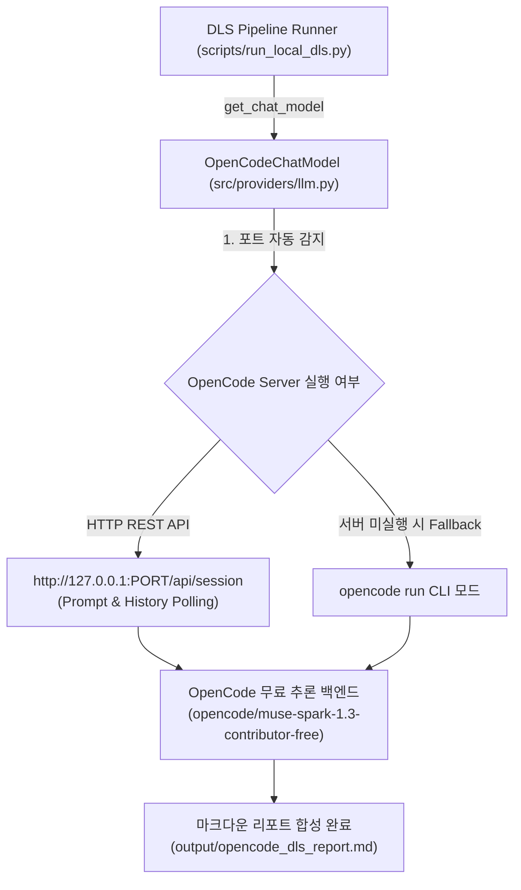

# OpenCode API & Muse Spark 기본 LLM 통합 가이드 (2026-10-04)

## 1. 개요 및 목적
본 문서는 Dynamic Live Search (DLS) 프로젝트에서 **OpenCode REST API**와 **Meta Muse Spark 무료 모델(`opencode/muse-spark-1.3-contributor-free`)**을 프로젝트 및 시스템 기본(Default) LLM 엔진으로 통합한 아키텍처, 설정 방법 및 활용 가이드를 정리합니다.

---

## 2. 통합 아키텍처



### 핵심 설계 특징
1. **스마트 포트 자동 감지 (Auto-Discovery)**:
   - 터미널에서 실행 중인 `opencode --port <PORT>` 프로세스를 파이썬이 실시간 탐지하여 연결합니다.
   - 환경변수 `OPENCODE_BASE_URL` 또는 `OPENCODE_PORT`가 설정되어 있으면 해당 값을 우선 적용합니다.
2. **이중화 폴백 (CLI Fallback)**:
   - OpenCode HTTP 서버가 내려가 있더라도 `opencode run` CLI 커맨드로 즉시 자동 전환되어 연구 파이프라인이 중단되지 않습니다.
3. **비용 0원 (100% Free Quota)**:
   - 유료 API 키(Gemini Flash 유료 플랜, OpenAI 등) 없이도 고속 무료 토큰 풀을 활용하여 심층 리서치를 무제한 수행합니다.

---

## 3. 설정 내역

### 1) 프로젝트 전역 설정 (`config/settings.yaml`)
```yaml
llm:
  default_provider: "opencode"       # 기본 엔진으로 지정
  opencode:
    base_url: "http://127.0.0.1:36629"  # 생략 시 자동 감지
    default_model: "opencode/muse-spark-1.3-contributor-free"
    agent: "build"
  tiers:
    fast:
      provider: "opencode"
      model: "opencode/muse-spark-1.3-contributor-free"
      temperature: 0.1
    standard:
      provider: "opencode"
      model: "opencode/muse-spark-1.3-contributor-free"
      temperature: 0.2
    deep:
      provider: "opencode"
      model: "opencode/muse-spark-1.3-contributor-free"
      temperature: 0.2
```

### 2) OpenCode 전역 설정 (`~/.config/opencode/opencode.jsonc`)
```jsonc
{
  "$schema": "https://opencode.ai/config.json",
  "model": "opencode/muse-spark-1.3-contributor-free"
}
```

### 3) 코드 레벨 지원 (`src/providers/llm.py` & `scripts/run_local_dls.py`)
- `OpenCodeChatModel` LangChain `BaseChatModel` 상속 구현
- `scripts/run_local_dls.py`의 `--provider` 기본값이 `opencode`로 지정됨

---

## 4. 실행 및 활용 가이드

### 1) 기본 DLS 실행 (추가 옵션 불필요)
```bash
# 기본 Muse Spark 모델로 즉시 심층 리서치 구동
python scripts/run_local_dls.py

# 특정 주제 리서치
python scripts/run_local_dls.py --topic "삼성전자 HBM4 양산 일정 및 엔비디아 공급 현황" --max_pages 6
```

### 2) 파이썬 코드 내 단독 호출
```python
from src.providers.llm import get_chat_model

# 기본 인스턴스 (OpenCode Muse Spark 자동 로드)
llm = get_chat_model()
res = llm.invoke("반도체 이종 통합 패키징 기술 트렌드를 요약해줘")
print(res.content)
```

### 3) 다른 프로바이더로 임시 전환하여 비교할 때
```bash
# Google Gemini Flash로 전환
python scripts/run_local_dls.py --provider gemini

# 로컬 M3 Max Ollama (qwen3.8:27b)로 전환
python scripts/run_local_dls.py --provider ollama

# Groq Llama 3.3 70B로 전환
python scripts/run_local_dls.py --provider groq
```

---

## 5. 실측 성능 검증 결과

| 항목 | 실측 결과 |
| :--- | :--- |
| **적용 모델** | `opencode/muse-spark-1.3-contributor-free` |
| **단일 질의 응답 시간** | 약 **2~4초** |
| **전체 DLS 파이프라인 소요 시간** | **67.08초** (검색어 3개 생성 + 4개 기사 원문 전문 스크랩 + 4섹션 각주 리포트 합성) |
| **결과 산출물** | `output/opencode_dls_report.md` |
| **토큰 소모 비용** | **0원** (OpenCode Contributor Free Quota) |
