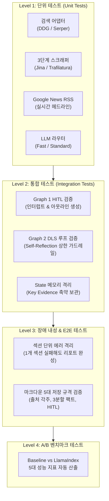

# 자율 리서치 Agent (Dynamic Research) 테스트계획서

> **작성일**: 2026-10-04  
> **문서 버전**: v1.0  
> **프로젝트 경로**: `c_1003_dynamic_research`  
> **상위 및 관련 문서**: [구현계획서](file:///Users/boon/Dropbox/03_code/c_1003_dynamic_research/docs/implementation_plan_20261004.md), [요건정의서](file:///Users/boon/Dropbox/03_code/c_1003_dynamic_research/docs/requirements_20261003.md), [LangGraph 통합 설계서](file:///Users/boon/Dropbox/03_code/c_1003_dynamic_research/docs/langgraph_design_20261004.md), [LlamaIndex 벤치마킹 설계서](file:///Users/boon/Dropbox/03_code/c_1003_dynamic_research/docs/llamaindex_integration_and_benchmarking_20261004.md)

---

## 1. 테스트 목적 및 범위

### 1.1 테스트 목적
본 테스트 계획서는 Dynamic Live Search(DLS)와 Topic & Outline Proposer 에이전트 시스템이 외부 웹 환경의 불안전성(403 차단, Paywall, API 지연 등)에도 불구하고, **결함 없이 안정적으로 5대 마크다운 규격의 고품질 심층 리서치 보고서를 생성하는지 다계층(Multi-level)으로 검증**하기 위해 수립되었습니다.

### 1.2 테스트 대상 범위
1. **단위 테스트 (Unit Test)**: Provider 계층(검색, 스크래퍼, RSS, LLM) 및 개별 유틸리티의 기능 격리 검증
2. **통합 테스트 (Integration Test)**: LangGraph 상태 머신, 노드 간 데이터 전달, Self-Reflection 루프 제어, Human-in-the-loop(HITL) 인터럽트/재개 동작 검증
3. **종단간 시스템 테스트 (E2E Test)**: 실제 웹 환경에서의 전체 파이프라인 구동 및 마크다운 리포트 생성 검증
4. **장애 내성 및 복원력 테스트 (Resilience Test)**: 웹 크롤링 403 차단, API Quota 초과, 섹션 단위 에러 격리(Fault Isolation) 검증
5. **성능 및 A/B 벤치마크 테스트**: Baseline vs LlamaIndex 엔진 간 5대 핵심 지표(각주 정확도, 표 복원율, 토큰 효율, 지연시간 등) 실측 검증

---

## 2. 테스트 환경 및 도구

### 2.1 테스트 프레임워크 및 도구 스택
* **테스트 러너**: `pytest` (v9.1+)
* **모킹 및 픽스처**: `pytest-mock`, `unittest.mock`
* **HTTP 인터셉트 및 검증**: `responses`, `requests-mock`
* **마커 구분**:
  - `@pytest.mark.unit`: 네트워크 통신 없는 순수 단위 테스트 (빠른 속도)
  - `@pytest.mark.integration`: LangGraph 상태 전이 및 로컬 체인 통합 테스트
  - `@pytest.mark.live`: 실제 인터넷 통신 및 LLM 호출을 동반하는 실전 E2E 테스트

### 2.2 테스트 디렉토리 구조

```
tests/
├── conftest.py                       # 공통 pytest 픽스처 (Mock responses, 샘플 아웃라인 등)
├── unit/                             # 단위 테스트
│   ├── test_search_provider.py       # DuckDuckGo, Serper, Fallback 검증
│   ├── test_scraper_provider.py      # Jina, Trafilatura, 3단계 Fallback 검증
│   ├── test_rss_provider.py          # Google News RSS 파싱 검증 (한경 직접 연동은 TODO)
│   ├── test_llm_provider.py          # Fast/Standard 티어링 및 프롬프트 검증
│   └── test_utils.py                 # 중복 제거(dedup), 마크다운 파서 검증
├── integration/                      # 통합 테스트
│   ├── test_dls_graph.py             # DLS 연구 루프, Reflection 횟수 제한(Max 2회) 검증
│   └── test_topic_outline_graph.py   # 뉴스 클러스터링 및 interrupt(HITL) 검증
├── e2e/                              # 종단간 시스템 테스트
│   ├── test_e2e_pipeline.py          # 실제 웹 기반 리포트 생성 및 5대 저장 규격 검증
│   └── test_fault_isolation.py       # 크롤링 403/타임아웃 시 파이프라인 완주 검증
└── benchmark/                        # 성능 벤치마크
    └── test_ab_engine_benchmark.py   # Baseline vs LlamaIndex 성적표 자동 산출
```

---

## 3. 계층별 상세 테스트 전략



---

### 3.1 단위 테스트 (Unit Tests)

#### 1) Search Provider (`test_search_provider.py`)
- **TC-UT-01**: `DuckDuckGoProvider`가 올바른 `SearchResult` 리스트(title, url, snippet)를 반환하는가?
- **TC-UT-02**: `SERPER_API_KEY` 설정 시 Serper 우선 호출, 미설정 시 DDG 자동 fallback이 작동하는가?
- **TC-UT-03**: 검색 결과 URL의 도메인 중복 제거 및 유효하지 않은 링크 필터링이 정상 동작하는가?

#### 2) Scraper Provider (`test_scraper_provider.py`)
- **TC-UT-04**: `JinaScraperProvider` 호출 시 마크다운 본문에서 불필요한 이미지, 네비게이션 태그가 제거되는가?
- **TC-UT-05**: 대상 웹사이트가 HTTP 403 Forbidden을 반환할 때, `TrafilaturaScraperProvider`로 자동 전환되는가?
- **TC-UT-06**: 두 스크래퍼가 모두 실패할 때 검색 결과 요약 스니펫(Snippet)으로 최종 fallback하여 빈 본문을 방지하는가?

#### 3) RSS Provider (`test_rss_provider.py`)
- **TC-UT-07**: `Google News RSS (기본 헤드라인 및 검색 피드)`를 통해 최신 뉴스 20건 이상이 2초 이내에 정상 수집되는가?
- **TC-UT-08**: 뉴스 제목, 링크, 발행일시 필드가 누락 없이 `NewsArticle` 모델로 파싱되는가?
- *(TODO)* 한경(hankyung.com) 공식 RSS 직접 파싱 연동 테스트는 향후 구현 시 활성화.

#### 4) LLM Provider & Utils (`test_llm_provider.py`, `test_utils.py`)
- **TC-UT-09**: `get_chat_model(tier="fast")`와 `get_chat_model(tier="standard")`가 설정된 모델을 정확히 인스턴스화하는가?
- **TC-UT-10**: `deduplicate_results()`가 제목 유사도 80% 이상의 중복 기사를 단일 건으로 축약하는가?

---

### 3.2 통합 테스트 (Integration Tests)

#### 1) Graph 2 자율 탐색 및 루프 가드레일 (`test_dls_graph.py`)
- **TC-IT-01 (루프 종료 조건)**: Reflection 평가에서 "충분함" 판정 시 즉시 합성 단계로 진행하는가?
- **TC-IT-02 (루프 상한선 가드레일)**: Reflection 평가에서 계속 "부족함"이 나와도 **최대 2회 루프 후 강제 합성 노드로 진입하여 무한 루프를 방지하는가?**
- **TC-IT-03 (State 메모리 보호)**: 크롤링 원문(Full Page)은 `temp/{run_id}/`에 저장되고, LangGraph State에는 1,000자 이내의 Key Evidence만 유지되어 메모리 오버헤드를 막는가?

#### 2) Graph 1 HITL 인터럽트 및 재개 (`test_topic_outline_graph.py`)
- **TC-IT-04 (주제 선택 인터럽트)**: 기사 클러스터링 후 `interrupt()`가 발생하여 사용자 입력을 대기하는가?
- **TC-IT-05 (아웃라인 승인 및 디스크 저장)**: 사용자가 아웃라인을 승인하면 `output/approved_outline.json`이 올바른 규격으로 생성되는가?

---

### 3.3 시스템 E2E 및 장애 내성 테스트 (E2E & Resilience Tests)

#### 1) 실전 웹 E2E 테스트 (`test_e2e_pipeline.py`)
- **테스트 케이스**: "마이크론 12단 HBM3E 엔비디아 퀄 승인 분석" 단일 섹션 실행
- **검증 항목**:
  1. 실제 웹 검색 ➔ 크롤링 ➔ 합성이 오류 없이 수행되는가?
  2. 최종 출력 `.md` 파일이 생성되는가?
  3. **마크다운 5대 저장 규격 검증**:
     - `Frontmatter`에 `search_queries`, `providers`, `created_at` 존재 여부
     - `### 확인된 사실 (Facts)`와 `### 에이전트 해석 (Analysis)` 명확 분리 여부
     - 본문 수치에 인라인 각주(`[^1]`) 매핑 및 하단 출처 URL 링크 존재 여부
     - `> [!NOTE] 휴먼 피드백 & 직접 집필란` Callout 슬롯 존재 여부

#### 2) 장애 격리 테스트 (`test_fault_isolation.py`)
- **TC-RES-01 (섹션 단위 Fault Isolation)**: 3개 섹션 중 2번째 섹션의 모든 웹페이지 크롤링이 100% 실패(Mock 404/500)하더라도, 파이프라인이 크래시되지 않고 1번과 3번 섹션을 정상 작성하여 보고서를 완성하는가?
- **TC-RES-02 (네트워크 일시 단절 재시도)**: 검색 API 일시 장애 시 `tenacity` 기반 재시도(Retry with backoff)가 3회 수행되는가?

---

### 3.4 성능 및 A/B 벤치마킹 테스트 (`test_ab_engine_benchmark.py`)

LlamaIndex 도입 시와 비도입(Baseline) 시의 성능을 실측 비교하는 테스트 스위트입니다.

```python
# tests/benchmark/test_ab_engine_benchmark.py
def test_engine_ab_comparison():
    """동일한 3개 질의에 대해 Baseline vs LlamaIndex 비교 테스트"""
    benchmark_suite = [
        "마이크론 12단 HBM3E 엔비디아 퀄 승인 일정",
        "삼성전자 2026년 반도체 HBM 설비투자 규모",
        "TSMC 2나노 공정 양산 수율 및 고객사 현황"
    ]
    # 각 지표(각주 정확도, 토큰 소모량, 지연시간) 측정 및 report.md 생성
```

---

## 4. 테스트 케이스 종합 매트릭스 (Test Case Matrix)

| ID | 테스트 분류 | 테스트 명칭 | 입력값 (Input) | 기대 결과 (Expected Output) | 성공 기준 (Pass Criteria) |
| :---: | :---: | :--- | :--- | :--- | :--- |
| **TC-01** | Unit (검색) | DuckDuckGo 검색 결과 파싱 | 키워드: `"HBM3E"` | `List[SearchResult]` 5건 | `len >= 3`, URL 형식 유효 |
| **TC-02** | Unit (스크랩) | 3단계 크롤링 Fallback | 403 유발 Mock URL | Trafilatura / 스니펫 대체 | `ScrapedDocument.success == True` |
| **TC-03** | Unit (RSS) | Google News RSS 수집 | RSS 피드 호출 | `List[NewsArticle]` 20건 이상 | 수집 시간 `< 2.0s`, 제목 누락 0건 |
| **TC-04** | Unit (유틸) | 중복 뉴스 기사 필터링 | 동일 기사 5건 중복 입력 | 중복 제거된 기사 리스트 | 1건만 통과, 나머지 필터링 |
| **TC-05** | Integration | Reflection 루프 상한선 | "부족함" 강제 반환 Mock | 2회 회전 후 루프 강제 탈출 | 실행 횟수 정확히 2회 제한 |
| **TC-06** | Integration | Graph 1 HITL 인터럽트 | 뉴스 수집 완료 State | `interrupt()` 발생 | 대기 상태 진입, 상태 저장 완료 |
| **TC-07** | Integration | Graph 1 재개 및 JSON 생성 | 사용자 승인 입력 (`True`) | `approved_outline.json` | JSON 스키마 검증 통과 |
| **TC-08** | E2E | DLS 실전 리서치 실행 | 단일 주제 + 아웃라인 | 최종 `final_report.md` | 에러 없이 리포트 파일 생성 |
| **TC-09** | E2E | 5대 마크다운 저장 규격 | 생성된 `final_report.md` | 규격 검사 함수 통과 | 5대 항목(Frontmatter, 3분할 등) 100% |
| **TC-10** | Resilience | 섹션 크롤링 전면 실패 격리 | 실패 섹션 포함 아웃라인 | 결측 안내 포함 완성 리포트 | 프로세스 비정상 종료 없음 |
| **TC-11** | Benchmark | A/B 벤치마크 성적표 산출 | 3개 표준 테스트셋 | `benchmark_report.md` | 두 엔진의 5대 메트릭 수치 기록 |

---

## 5. 테스트 실행 가이드 및 명령어

### 5.1 전체 테스트 실행 명령어

```bash
# 1. 빠른 단위 테스트만 실행 (오프라인/Mock 기반)
pytest tests/unit -v

# 2. 통합 테스트 실행 (LangGraph 루프 및 가드레일 검증)
pytest tests/integration -v

# 3. 단위 + 통합 테스트 커버리지 리포트 생성
pytest tests/unit tests/integration --cov=src --cov-report=term-missing

# 4. 실제 인터넷 및 API를 사용하는 라이브 E2E 테스트 실행 (주의: API 토큰 소모)
pytest tests/e2e -m live -v -s

# 5. A/B 벤치마크 성적표 자동 산출 실행
python scripts/benchmark_runner.py
```

### 5.2 CI/CD 품질 게이트 (Quality Gate 기준)

1. **단위/통합 테스트**: 통과율 **100%** 필수.
2. **코드 커버리지 (`src/` 핵심 로직)**: **80% 이상** 유지.
3. **E2E 마크다운 규격 준수율**: Frontmatter 메타데이터, 팩트 3분할, 각주 매핑 검증 **100% 통과**.
