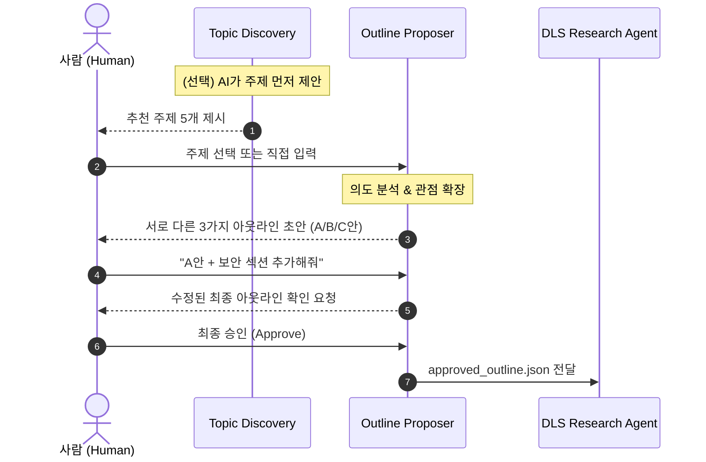

# Topic & Outline Proposer Agent 설계서

> **작성일**: 2026-10-04  
> **관련 문서**: [project_overview](./project_overview_20261003.md) · [requirements](./requirements_20261003.md) · [dls_design](./dls_design_20261003.md)

---

## 1. 에이전트 개요

### 1.1 역할 정의

**Topic & Outline Proposer Agent**는 자율 리서치 파이프라인의 **가장 앞단(기획 단계)**을 전담하는 에이전트다.

- 사람이 주제를 직접 떠올리지 않아도 **AI가 주제를 먼저 발굴·제안**
- 선택된 주제에 대해 **복수의 아웃라인(질문·가설 구조)**을 생성
- 사람의 피드백을 반영하여 **최종 아웃라인을 확정** → DLS Research Agent에 전달

### 1.2 왜 별도 에이전트로 분리하는가?

| 이유 | 설명 |
|:---|:---|
| **리서치 품질의 80%는 "좋은 질문"에서 결정** | 모호한 주제로 바로 검색을 돌리면 DLS가 수백 개의 무관한 웹페이지를 크롤링하여 비용·토큰이 낭비됨 |
| **Human-in-the-Loop의 핵심 제어판** | AI가 알아서 결론까지 내버리는 블랙박스가 아니라, 기획 단계에서 사람이 방향타를 잡는 통제권 제공 |
| **단일 책임 원칙 (SRP)** | 기획 에이전트 = 창의적 사고·구조화·사용자 대화 / DLS 에이전트 = 사실 수집·크롤링·합성 |

---

## 2. 전체 파이프라인에서의 위치

```
┌─────────────────────────────────────────────────────┐
│           Topic & Outline Proposer Agent             │
│                                                     │
│  ┌─────────────┐  ┌─────────────┐  ┌─────────────┐ │
│  │   Topic      │  │   Topic     │  │   Topic     │ │
│  │   Discovery  │  │   Expansion │  │   Outline   │ │
│  │  (주제 발굴)  │  │  (주제 확장) │  │  (목차 생성) │ │
│  └──────┬──────┘  └──────┬──────┘  └──────┬──────┘ │
│         └────────────────┼────────────────┘         │
│                          ▼                          │
│               추천 주제 + 복수 아웃라인               │
└──────────────────────────┬──────────────────────────┘
                           ▼
                    ┌─────────────┐
                    │  사람 (Human) │ ← 주제 선택 · 아웃라인 수정 · 승인
                    └──────┬──────┘
                           ▼
              ┌────────────────────────┐
              │ DLS Research Agent     │ ← 승인된 아웃라인으로 리서치 실행
              └────────────────────────┘
```

---

## 3. Topic Discovery — AI 주제 발굴

> **핵심 아이디어**: "주제를 사람이 직접 떠올려야 한다"는 전제를 깨고, AI가 다양한 소스를 스캔하여 **"지금 쓸 만한 주제"**를 선제적으로 제안한다.

### 3.1 소스별 전략

#### 소스 ① 실시간 뉴스/트렌드 스캔

```
[뉴스 API / Google Trends] → AI 분석 → "이 주제가 지금 뜨고 있습니다" 제안
```

| 소스 | 구현 방법 | 비용 |
|:---|:---|:---|
| **Google News RSS** | `https://news.google.com/rss/search?q=키워드&hl=ko` 파싱 | **완전 무료** |
| **Google Trends** | `pytrends` 라이브러리 (비공식 API) | **완전 무료** |
| **NewsAPI.org** | REST API, 월 100건 무료 | 무료 티어 있음 |
| **Reddit / Hacker News** | 공개 API (JSON) | **완전 무료** |

**AI 개입 방식**: 최근 24~72시간 뉴스 헤드라인 50개를 수집 → LLM이 **클러스터링 + 트렌드 요약** → "지금 쓸 만한 주제 5개" 제안

```
예시 출력:
━━━━━━━━━━━━━━━━━━━━━━━━━━━━━━━━━━━━
🔥 오늘의 추천 주제 (2026-10-04 기준)
━━━━━━━━━━━━━━━━━━━━━━━━━━━━━━━━━━━━
1. [급상승] Apple이 온디바이스 AI 에이전트 발표 — 개인정보 전략의 전환점
   ↳ 근거: 지난 12시간 관련 기사 23건, HN 댓글 400+
   ↳ 각도: 클라우드 AI vs 온디바이스 AI의 기업 도입 비교

2. [지속 화제] EU AI Act 2단계 시행 — 한국 기업 대응 현황
   ↳ 근거: 이번 주 한국 뉴스 15건, 규제 시행일 D-30
   ↳ 각도: 국내 AI 스타트업의 규제 대응 전략 실태 조사
```

#### 소스 ② 지난 글(과거 리포트) 기반 후속 주제 제안

```
[사용자의 과거 output/ 리포트들] → AI 분석 → "이 글의 후속편을 쓸 타이밍입니다" 제안
```

**AI 개입 방식**:
- `output/` 폴더에 쌓인 과거 리포트의 **주제·결론·미해결 질문**을 인덱싱
- 새 뉴스와 교차 분석하여 **"3개월 전에 쓴 글의 전제가 바뀌었습니다"** 감지
- 사실상 **"자기 글의 유통기한을 AI가 모니터링"**하는 개념

```
예시:
━━━━━━━━━━━━━━━━━━━━━━━━━━━━━━━━━━━━
📎 과거 글 기반 후속 주제
━━━━━━━━━━━━━━━━━━━━━━━━━━━━━━━━━━━━
• 2026-07-15에 "Ollama vs vLLM 성능 비교"를 작성하셨습니다.
  → 이후 Ollama 0.8 릴리스로 벤치마크 수치가 크게 변동됨
  → 추천: "Ollama 0.8 업데이트 후 재벤치마크 — 달라진 것과 남은 과제"
```

#### 소스 ③ 블로그 / X(Twitter) / 커뮤니티 트렌드 감지

```
[X API / 블로그 RSS / 커뮤니티 크롤링] → AI 분석 → "이 논쟁이 글감이 됩니다" 제안
```

| 소스 | 구현 | 비고 |
|:---|:---|:---|
| **X (Twitter)** | 공식 API v2 (무료 읽기 제한적) 또는 `nitter` RSS | 실시간 논쟁/밈 감지 |
| **기술 블로그 RSS** | 주요 블로그 10~20개 RSS 구독 목록 관리 | 업계 심층 트렌드 |
| **한국 커뮤니티** | GeekNews, 디시인사이드 AI갤, 클리앙 등 RSS/크롤링 | 한국 시장 특화 |

**AI 개입 방식**: "논쟁이 있는 곳에 글감이 있다"
- 트위터 인용/반박 트레드가 50+ 이상 달린 주제를 자동 감지
- **찬반 양측의 핵심 논점을 요약**한 뒤 "이 논쟁을 정리하는 분석 글" 제안

### 3.2 Topic Discovery 통합 아키텍처

```
┌─────────────────────────────────────────────────┐
│           Topic Discovery Layer                 │
│                                                 │
│  ┌──────────┐  ┌──────────┐  ┌──────────────┐  │
│  │ 뉴스/트렌드│  │ 과거 글   │  │ 소셜/블로그  │  │
│  │ Scanner  │  │ Analyzer │  │ Monitor      │  │
│  └────┬─────┘  └────┬─────┘  └──────┬───────┘  │
│       └──────────────┼───────────────┘          │
│                      ▼                          │
│          ┌───────────────────┐                  │
│          │ Topic Ranker (LLM)│                  │
│          │ 중복 제거 + 우선순위│                  │
│          └─────────┬─────────┘                  │
│                    ▼                            │
│          추천 주제 리스트 (5~10개)                │
└────────────────────┬────────────────────────────┘
                     ▼
              ┌─────────────┐
              │  사람 (Human) │ ← 주제 선택 or "더 찾아줘"
              └─────────────┘
```

### 3.3 MVP 구현 — Google News RSS + Ollama

API 키 없이 **완전 무료**로 동작하는 최소 구현:

```python
import feedparser
from providers.llm import OllamaLLMProvider

class TopicDiscovery:
    """뉴스 RSS를 수집하고 LLM으로 주제를 추천하는 최소 구현"""

    NEWS_RSS_TEMPLATE = "https://news.google.com/rss/search?q={keyword}&hl=ko&gl=KR&ceid=KR:ko"

    def __init__(self, llm: OllamaLLMProvider = None):
        self.llm = llm or OllamaLLMProvider(model="qwen3.8:27b")

    def fetch_headlines(self, keywords: list[str], max_per_keyword: int = 15) -> list[dict]:
        """Google News RSS에서 키워드별 헤드라인을 수집"""
        headlines = []
        for kw in keywords:
            feed = feedparser.parse(self.NEWS_RSS_TEMPLATE.format(keyword=kw))
            for entry in feed.entries[:max_per_keyword]:
                headlines.append({
                    "title": entry.get("title", ""),
                    "link": entry.get("link", ""),
                    "published": entry.get("published", ""),
                    "source": entry.get("source", {}).get("title", ""),
                    "keyword": kw
                })
        return headlines

    def suggest_topics(self, keywords: list[str], num_topics: int = 5) -> str:
        """헤드라인을 수집한 뒤 LLM으로 클러스터링 → 주제 제안"""
        headlines = self.fetch_headlines(keywords)
        headlines_text = "\n".join(
            f"- [{h['source']}] {h['title']} ({h['published']})"
            for h in headlines
        )

        prompt = f"""아래는 최근 뉴스 헤드라인 목록입니다.

{headlines_text}

위 헤드라인을 분석하여 다음 작업을 수행하세요:
1. 관련 기사끼리 클러스터링하여 주요 트렌드를 파악
2. 각 트렌드에서 심층 분석 리포트로 작성할 만한 주제 {num_topics}개를 제안
3. 각 주제에 대해:
   - 제목 (구체적이고 흥미를 끄는 형태)
   - 근거 (관련 기사 수, 왜 지금 이 주제인지)
   - 추천 분석 각도 (어떤 관점에서 접근하면 좋은지)

형식: 번호. [태그] 제목 + 근거 + 각도
"""
        return self.llm.generate(
            prompt=prompt,
            system_prompt="당신은 전문 리서치 기획자입니다. 트렌드를 파악하고 가치 있는 리서치 주제를 제안합니다."
        )
```

---

## 4. Outline Proposer — 아웃라인 생성

### 4.1 동작 프로세스 (3단계)



#### Step 1. 주제 확장 및 의도 파악 (Topic Expansion)

사용자의 짧은 입력을 다각도로 분석:
- **대상 독자**: 경영진용 보고서? 엔지니어용 기술 가이드? 블로그 아티클?
- **리서치 깊이**: 요약형 1,500자 vs 전문 심층 분석 5,000자 이상
- **핵심 충돌/논쟁 지점 파악**

#### Step 2. 복수 아웃라인 (Multi-Outline) 제안

서로 다른 목적을 가진 **2~3가지 관점의 목차**를 제시:

| 안 | 관점 | 예시 |
|:---|:---|:---|
| **A안** | 트렌드 & 비즈니스 | 시장 성장성, ROI, 상용 vs 오픈소스 비용 비교 |
| **B안** | 기술 & 아키텍처 | 서빙 프레임워크, 파이프라인 설계, 레이턴시 벤치마크 |
| **C안** | 실무 도입 & 문제해결 | 보안/망분리, 도입 실패 사례, 단계별 체크리스트 |

#### Step 3. 인간 피드백 반영 및 아웃라인 확정

- 각 섹션은 단순 제목이 아닌 **"DLS가 조사해야 할 핵심 질문(Questions)"** + **"검증할 가설(Hypothesis)"** 포함
- 사용자의 수정 요청을 반영한 뒤 `approved_outline.json` 규격으로 확정

---

## 5. 데이터 입/출력 스키마

### 5.1 사용자 입력 (User Input)

```json
{
  "raw_topic": "2026년 기업용 AI 에이전트 도입 트렌드",
  "target_audience": "기업 IT 의사결정권자",
  "document_type": "deep_report",
  "tone": "객관적, 분석적"
}
```

> `raw_topic`은 한 줄 키워드일 수도 있고, Topic Discovery가 제안한 주제를 선택한 결과일 수도 있다.

### 5.2 아웃라인 제안 출력 (Agent → Human)

```json
{
  "topic": "2026년 기업용 AI 에이전트 도입 트렌드",
  "proposals": [
    {
      "proposal_id": "A",
      "perspective": "트렌드 & 비즈니스",
      "sections": [
        {
          "title": "1. 2026 엔터프라이즈 AI 에이전트 도입 현황",
          "target_questions": [
            "포춘 500대 기업의 실제 AI 에이전트 도입률은?",
            "RAG 챗봇에서 Autonomous Agent로 전환되는 주요 원인은?"
          ],
          "expected_takeaway": "실행형 에이전트로의 전환 추세 데이터 제시"
        }
      ]
    },
    {
      "proposal_id": "B",
      "perspective": "기술 & 아키텍처",
      "sections": ["..."]
    }
  ]
}
```

### 5.3 최종 승인 데이터 (Human → DLS Agent)

```json
{
  "topic": "2026년 기업용 AI 에이전트 도입 트렌드 및 온프레미스 구축 전략",
  "document_type": "deep_report",
  "approved_at": "2026-10-04T08:00:00+09:00",
  "sections": [
    {
      "section_id": "sec_01",
      "title": "1. 2026 엔터프라이즈 AI 에이전트 도입 현황",
      "target_questions": [
        "포춘 500대 기업의 실제 AI 에이전트 도입률과 주요 활용 분야는?",
        "단순 질의응답을 넘어 실행형 에이전트로 전환되는 주요 원인은?"
      ],
      "expected_takeaway": "단순 RAG 챗봇 → 실행형 에이전트 전환 추세 데이터 제시"
    },
    {
      "section_id": "sec_02",
      "title": "2. 클라우드 API vs 로컬 온프레미스 LLM 비교",
      "target_questions": [
        "보안/규제 관점에서 로컬 오픈소스 LLM이 선호되는 이유는?",
        "TCO 측면에서 토큰 과금과 자체 GPU 인프라의 손익분기점은?"
      ],
      "expected_takeaway": "데이터 주권 확보와 비용 최적화 측면의 선택 기준"
    }
  ]
}
```

---

## 6. 구현 우선순위 판단

| 관점 | 판단 |
|:---|:---|
| **Topic Discovery 구현 난이도** | 뉴스 RSS + LLM 요약은 **매우 쉬움** (Google News RSS는 API 키 불필요). 과거 글 분석도 `output/` 폴더 읽기만 하면 됨 |
| **실용적 가치** | ✅ 매우 높음. "주제를 뭘 쓸지 모르겠다"가 리서치 시작의 **가장 큰 병목** |
| **DLS와의 의존 관계** | DLS 코어 파이프라인(검색→크롤링→합성)이 먼저 동작해야 주제 제안 → 리포트 생성 E2E가 완성됨 |

### 권장 순서

```
1단계 (선행): DLS 코어 프로토타입 구현 — 검색 → 크롤링 → 합성 E2E 동작
2단계:        Outline Proposer Agent — 복수 아웃라인 제안 + 승인 프로세스
3단계:        Topic Discovery Layer — 뉴스 RSS + 과거 글 분석 + 소셜 모니터링
```

> **MVP**: 1단계에서 Google News RSS + 로컬 Ollama 요약만으로 **API 키 없이 완전 무료** 주제 발굴 기능 확인 가능

---

> **다음 단계**: DLS 코어 파이프라인 프로토타입 구현 착수 → Outline Proposer 연동 → Topic Discovery 추가
