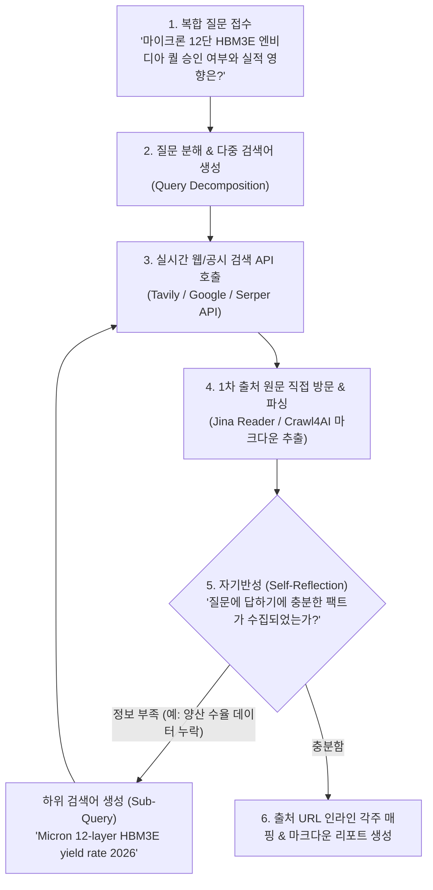

# Dynamic Live Search (동적 실시간 검색 에이전트) 아키텍처 및 구현 가이드

본 문서는 사전에 문서를 청킹(Chunking)하여 벡터 DB에 저장하는 기존 RAG의 한계를 극복하고, **"AI 에이전트가 사람처럼 실시간으로 웹을 검색·탐색하여 최신 팩트를 검증하고 리포트를 생성하는 Dynamic Live Search(동적 실시간 검색 에이전트)"**의 핵심 개념, 작동 원리, 비교 분석 및 구현 스택을 체계적으로 정리한 가이드입니다.

---

## 1. Dynamic Live Search란 무엇인가?

Dynamic Live Search는 정적 데이터베이스(Vector DB)를 사전에 구축하지 않고, **질문이 입력되는 시점에 에이전트가 자율적으로 검색 전략을 수립하여 실시간 웹/뉴스/공시 데이터를 탐색·추출·합성하는 에이전틱 리서치 패러다임**입니다.

* **핵심 철학**: "DB에 미리 쌓아두지 않고, 필요할 때 가장 신선한 1차 출처(웹)를 직접 방문하여 읽는다."
* **대표 상용 사례**: OpenAI Deep Research / SearchGPT, Perplexity AI, Google Gemini with Search Grounding

---

## 2. 전통적 Vector RAG vs Dynamic Live Search 심층 비교

| 비교 항목 | 전통적인 Vector RAG | Dynamic Live Search (검색 에이전트) |
| :--- | :--- | :--- |
| **정보의 신선도** | DB 수집 시점 데이터로 고정 (어제·오늘 속보 반영 불가) | **초 단위 실시간 웹 데이터 반영 (100% 최신성)** |
| **인프라 복잡도** | 임베딩 모델, 청킹 파이프라인, 벡터 DB 관리 필수 | **DB 구축 불필요 (Search API + Web Scraper만 연결)** |
| **맥락 보존력** | 300~500자로 잘게 잘려(Chunking) 인과관계 왜곡 위험 | **웹페이지 원문 전체(Full Page)를 마크다운으로 통째 분석** |
| **질문 대응력** | 사용자가 준 단어로 단순 1회 유사도 검색 (Single-shot) | **에이전트가 쿼리를 쪼개고, 부족하면 재검색 (Multi-hop Loop)** |
| **데이터 범위** | 사전에 인덱싱해 둔 내부 문서에 국한 | **전 세계 웹(기업 IR, 테크 미디어, 표준화 공시 등) 전체** |
| **유지보수 비용** | 문서 업데이트마다 재임베딩/DB 동기화 파이프라인 필요 | **유지보수 비용 제로 (검색 엔진이 인덱싱을 대신 수행)** |

---

## 3. 5단계 에이전틱 탐색 프로세스 (The 5-Step Loop)



### Step 1: 의도 분석 및 쿼리 분해 (Query Decomposition)
사용자의 복합적인 질문을 단일 키워드로 검색하지 않고, **다각도의 전문 검색어 3~4개로 쪼갭니다.**
- *사용자 입력*: "마이크론 12단 HBM3E 엔비디아 퀄 승인 여부와 실적 영향 분석해줘"
- *에이전트 생성 쿼리*:
  1. `Micron FY2026 Q4 earnings call transcript HBM revenue`
  2. `Micron 12-layer HBM3E NVIDIA qualification test pass announcement`
  3. `TrendForce HBM3E 12-hi market share forecast Micron SK Hynix`

### Step 2: 실시간 검색 및 후보 URL 랭킹 (Search & Ranking)
검색 엔진 API를 호출하여 상위 10~20개 결과 중 신뢰도가 높은 **1차 출처(기업 IR, 공식 보도자료, Tier 1 IT 전문지, 규제 기관 공시)** 링크를 선별합니다.

### Step 3: 웹 원문 직접 방문 및 텍스트 파싱 (Deep Web Scraping)
검색 결과의 2~3줄짜리 요약문(Snippet)만 보는 것이 아니라, **웹 크롤러를 통해 해당 페이지를 직접 열어 본문 전체를 순수 마크다운으로 추출(Full-text Extraction)**합니다.
- 광고, 네비게이션 바, 자바스크립트 쓰레기 코드를 제거하고 본문만 온전히 확보합니다.

### Step 4: 자기반성(Self-Reflection) 및 재귀적 재검색
가져온 웹페이지들을 읽은 후, 에이전트는 결론 도출에 필요한 정보가 모두 확보되었는지 자율 평가합니다:
> *"12단 퀄 승인 뉴스는 확인되었으나, 대량 양산 시점(H2 2026)과 수율 관련 데이터가 누락되었음. 2차 검색을 수행함."*
부족한 공백(Gap)을 메우기 위한 **하위 쿼리를 생성하여 추가 검색(보통 2~3회 재귀 루프)**을 진행합니다.

### Step 5: 출처 인라인 각주 매핑 및 최종 합성
모든 수치와 주장에 실제 방문했던 URL 링크(`[^1]`)를 정확히 매핑하여 환각 없는 최종 보고서를 작성합니다.

---

## 4. 추천 기술 스택 및 구현 블루프린트

Dynamic Live Search는 복잡한 인프라 없이 **파이썬 코드 수십 줄과 2개의 도구**만으로 구현 가능합니다:

### 1) 추천 기술 스택
- **LLM 전용 검색 API**:
  - **Tavily Search API**: 에이전트 전용 검색 엔진. 광고를 걷어내고 LLM에 최적화된 마크다운 본문을 직접 반환.
  - **Exa.ai**: 시맨틱 임베딩 기반 검색 엔진으로, 기업 공시나 전문 논문 검색에 최적.
  - **Google / Serper API**: 글로벌 뉴스 및 범용 검색 결과 확보에 용이.
- **웹-투-마크다운 파서 (Scraper)**:
  - **Jina Reader (`r.jina.ai/<URL>`)**: 임의의 URL 앞에 `https://r.jina.ai/`만 붙이면 광고를 제거하고 순수 마크다운 텍스트를 반환하는 경량 오픈 API.
  - **Crawl4AI**: 파이썬 기반 초고속 비동기 크롤러.

### 2) 파이썬 구현 의사코드 (Architecture Blueprint)

```python
import requests

def dynamic_live_search(user_topic: str, outline_sections: list):
    """
    동적 실시간 검색 에이전트 실행 함수
    """
    final_report = {}
    
    for section in outline_sections:
        # 1. 아웃라인별 검색 쿼리 자동 생성
        query = generate_query_with_llm(user_topic, section)
        
        # 2. Tavily API로 실시간 검색
        search_results = call_tavily_search(query, max_results=3)
        
        # 3. 상위 1차 출처 웹페이지 전문 마크다운 추출 (Jina Reader)
        scraped_contents = []
        for res in search_results:
            jina_url = f"https://r.jina.ai/{res['url']}"
            page_md = requests.get(jina_url).text
            scraped_contents.append({"url": res["url"], "text": page_md[:4000]})
            
        # 4. LLM을 통해 사실/해석 분리 및 아웃라인 슬롯 채우기
        section_draft = synthesize_slot(
            section_title=section,
            evidence=scraped_contents,
            template="Fact vs Analysis with Citations"
        )
        
        final_report[section] = section_draft
        
    return assemble_markdown(final_report)
```

---

## 5. 장점, 한계 및 프로덕션 운영 팁

### 장점 (Why Dynamic Live Search Wins)
1. **극강의 애자일성**: 사전 데이터 전처리(Data Pipeline) 없이 오늘 즉시 가동 가능.
2. **환각률 극소화**: 검색된 최신 웹페이지 원문을 Context에 넣고 각주를 달기 때문에 거짓 정보를 지어내지 않음.
3. **토큰 효율성**: 필요한 페이지만 정확히 읽으므로 불필요한 전체 DB 임베딩 비용이 발생하지 않음.

### 한계점 및 해결책
1. **지연시간 (Latency)**: 검색 ➔ 크롤링 ➔ 합성에 약 10~25초가 소요됨.
   - *해결책*: 실시간 채팅보다는 비동기 백그라운드 리포트 생성(배치 태스크)으로 운영.
2. **유료 페이월 (Paywall)**: 블룸버그, WSJ 등 유료 구독 매체는 크롤러가 차단될 수 있음.
   - *해결책*: 검색 쿼리에 `SEC 10-Q`, `Press Release`, `Investor Relations`, `Transcript` 등 오픈된 1차 공식 출처를 우선 타겟팅하도록 시스템 프롬프트 지정.
